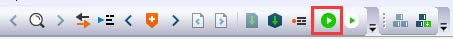
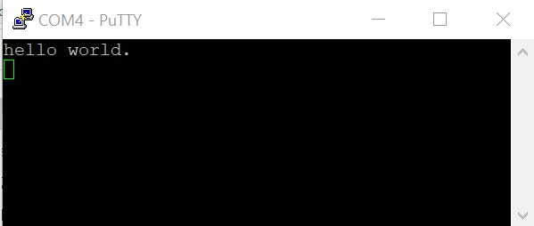

# Run an example application {#topic_wsr_gfx_lvb}

To download and run the application, perform these steps:

1.  See [Table 1](default_debug_interfaces.md#TABLE_UVC_BLB_DR_20REL4) to determine the debug interface that comes loaded on your specific hardware platform.
    -   For boards with CMSIS-DAP/mbed/DAPLink interfaces, visit [developer.mbed.org/handbook/Windows-serial-configuration](http://developer.mbed.org/handbook/Windows-serial-configuration) and follow the instructions to install the Windows operating system serial driver. If running on Linux OS, this step is not required.
    -   For boards with P&E Micro interfaces, visit [www.pemicro.com/support/downloads\_find.cfm](http://www.pemicro.com/support/downloads_find.cfm) and download the P&E Micro Hardware Interface Drivers package.
2.  Connect the development platform to your PC via USB cable.
3.  Open the terminal application on the PC, such as PuTTY or TeraTerm, and connect to the debug COM port \(to determine the COM port number, see [How to determine com port](how_to_determine_com_port.md). Configure the terminal with the MCX-N9XX-EVK settings:

    1.  115200 or 9600 baud rate, depending on your board \(reference `BOARD_DEBUG_UART_BAUDRATE` variable in the `board.h` file\)
    2.  No parity
    3.  8 data bits
    4.  1 stop bit
     configuration")

4.  In IAR, click the **Download and Debug** button to download the application to the target.

    

5.  The application is then downloaded to the target and automatically runs to the `main()` function.

     when running
                            debugging")

6.  Run the code by clicking the **Go** button.

    

7.  The `hello_world` application is now running and a banner is displayed on the terminal. If it does not appear, check your terminal settings and connections.

    

**Parent topic:**[Run a demo application using IAR](../topics/iar_run_a_demo_application.md)

