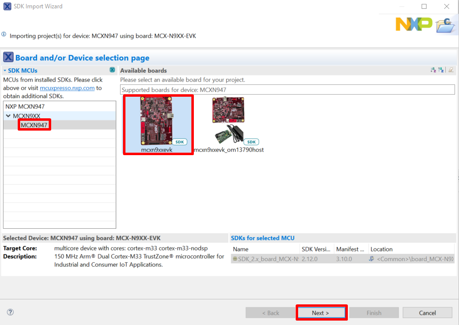
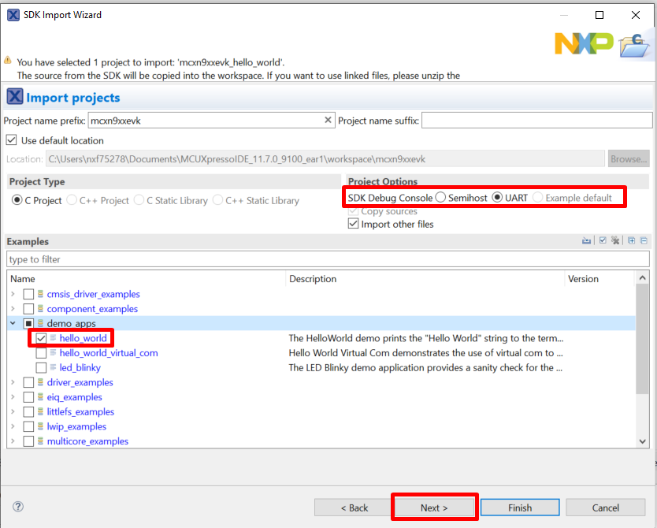
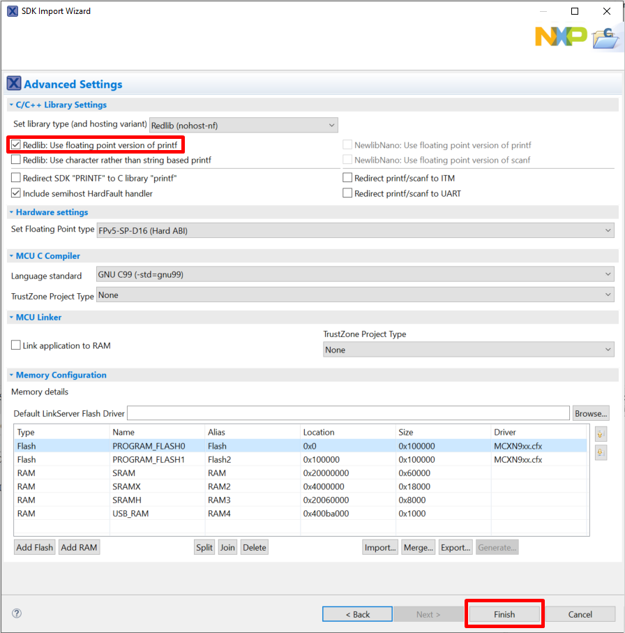

# Build an example application {#topic_tx3_ysw_lvb}

To build an example application, follow these steps.

1.  Drag and drop the SDK zip file into the **Installed SDKs** view to install an SDK. In the window that appears, click **OK** and wait until the import has finished.

    

2.  On the **Quickstart Panel**, click **Import SDK example\(s\)…**.

    

3.  In the window that appears, expand the **MCXN9XX** folder and select **MCXN947** . Then, select **mcxn9xxevk** and click **Next**.

    

4.  Expand the **demo\_apps** folder and select **hello\_world** . Then, click **Next** .

    

5.  Ensure **Redlib: Use floating point version of printf** is selected if the example prints floating point numbers on the terminal for demo applications such as `adc_basic`, `adc_burst`, `adc_dma`, and `adc_interrupt`. Otherwise, it is not necessary to select this option. Then, click **Finish**.

    

**Parent topic:**[Run a demo application using MCUXpresso IDE](../topics/ide_run_a_demo_application.md)

