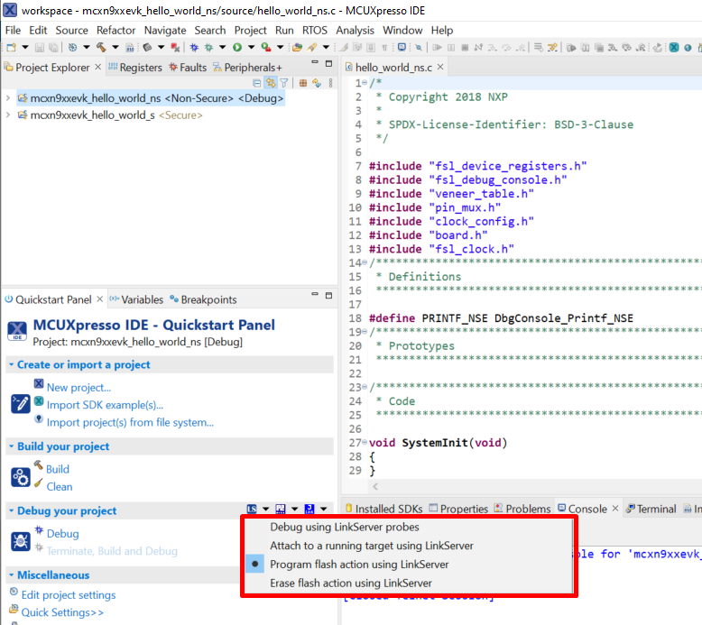
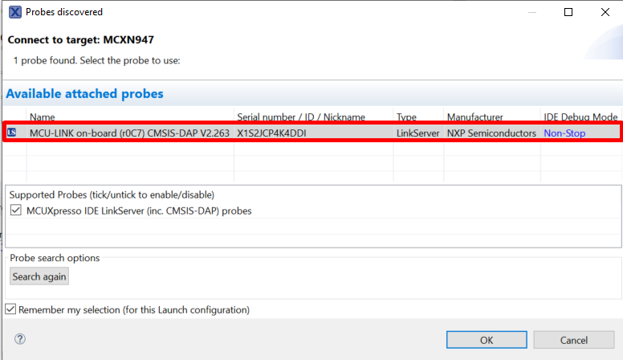
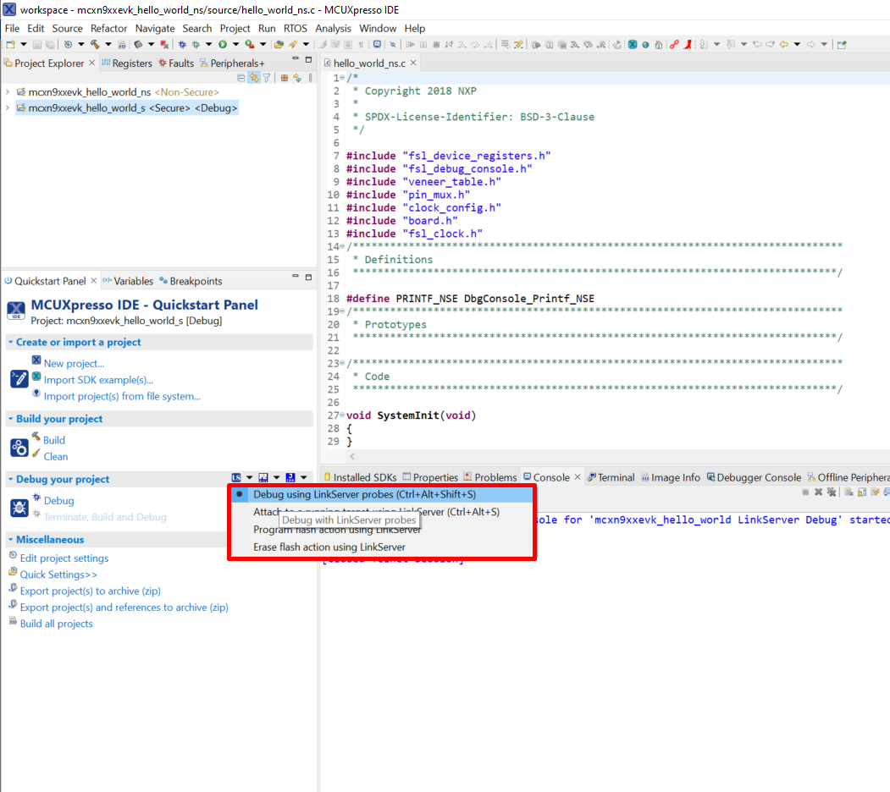
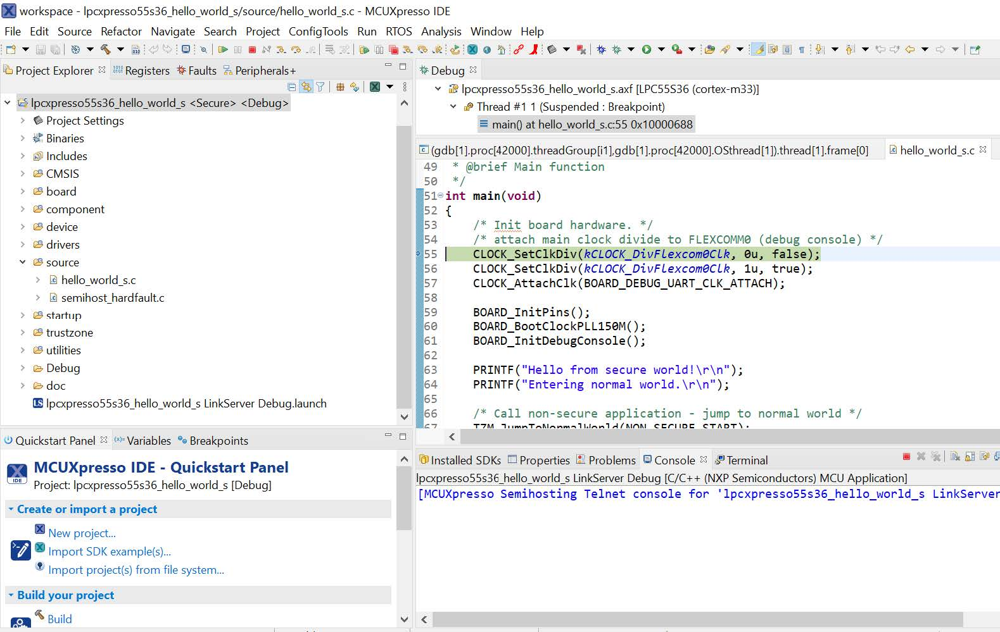
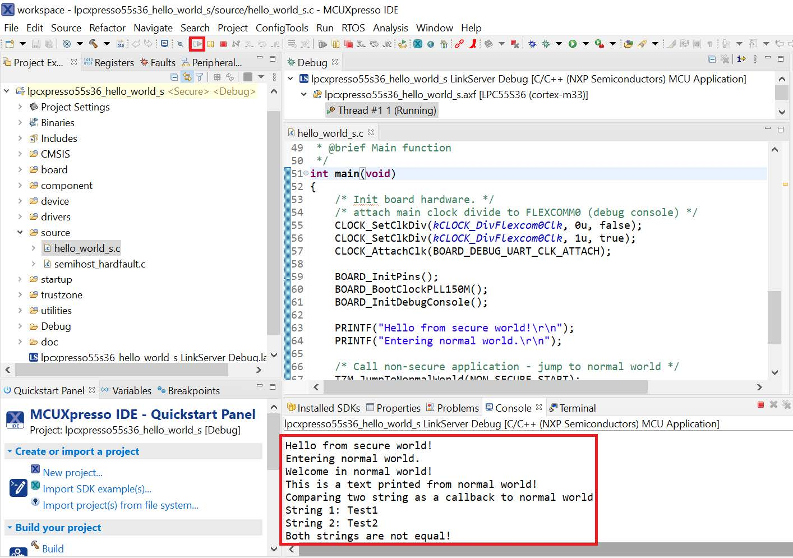

# Run a TrustZone example application 

To download and run the application perform all steps as described in [Run an example application](ide_run_an_example_application.md). These steps are common for single core, dual-core, and TrustZone applications, ensuring both sides of the TrustZone application are properly loaded and started secure application. However, there is one additional dialogue that is specific to TrustZone examples. See [Figure 1](#DEBUGLPC) and [Figure 2](#ATTACHEDPROBES) as reference.

After loading the non-secure application, press **RESET** on board to release the device connect. Then, highlight the `mcxn9xxevk_trustzone_examples_hello_world_s` project \(TrustZone master project\) in the Project Explorer. In the Quickstart Panel, click **mcxn9xxevk\_trustzone\_examples\_hello\_world\_s \[Debug\]** to launch the second debug session.

Start the application by clicking **Resume**. The `hello_world` TrustZone application then starts running, and the secure application starts the non-secure application during run time.

**Parent topic:**[Run a demo application using MCUXpresso IDE](../topics/ide_run_a_demo_application.md)

