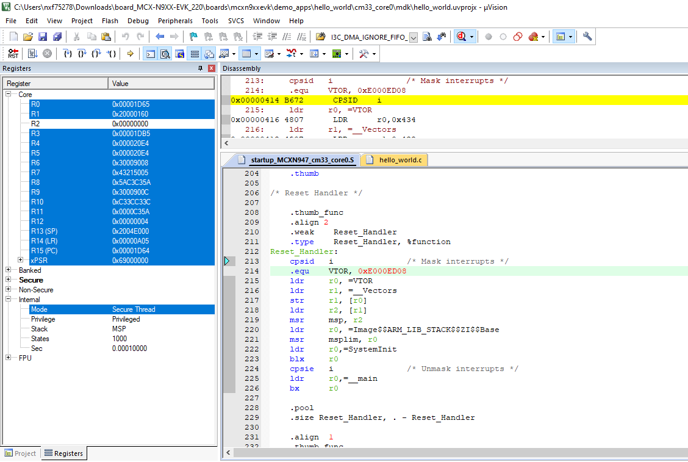

# Run a TrustZone example application {#topic_d3l_tpx_lvb}

The secure project is configured to download both secure and non-secure output files so debugging can be fully managed from the secure project.

To download and run the TrustZone application, switch to the secure application project and perform steps as described in [Run an example application](keil_run_an_example_application.md). These steps are common for single core, dual-core, and TrustZone applications in μVision. After clicking **Download and Debug**, both the secure and non-secure image are loaded into the device flash memory, and the secure application is executed. It stops at the function.

Run the code by clicking **Run** to start the application.

The `hello_world` application is now running and a banner is displayed on the terminal. If this is not the case, check your terminal settings and connections.

**Parent topic:**[Run a demo using Keil MDK/μVision](../topics/keil_run_a_demo_application.md)

