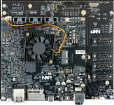

.. _mekmimx8qx:

MEK-MIMX8QX
####################

Overview
********

The i.MX8QX family of boards provides a powerful and flexible development system for NXP's Cortex-M4 MCUs.

MCU device and part on board is shown below:

 - Device: MIMX8QX6
 - PartNumber: MIMX8QX6AVLFZ

