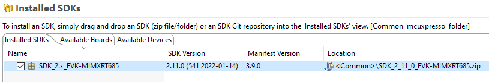
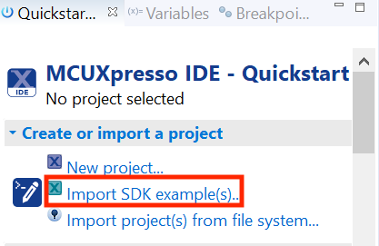
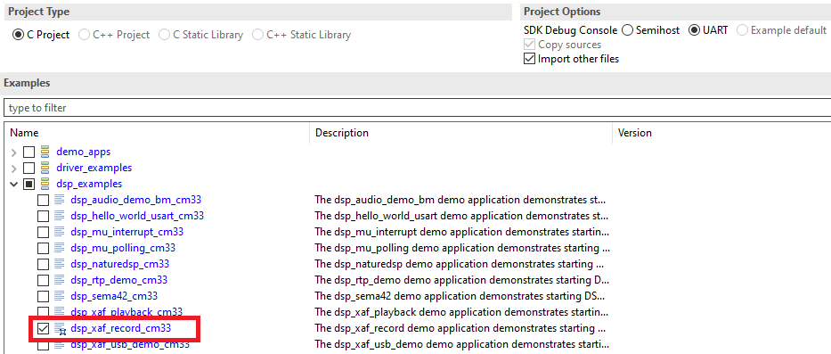
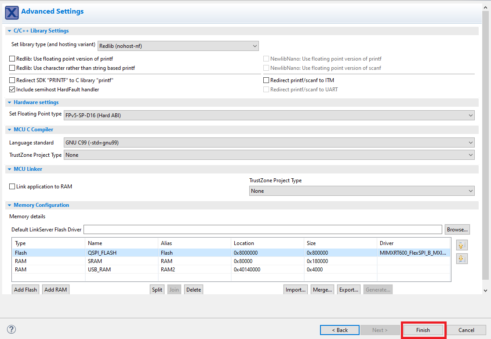
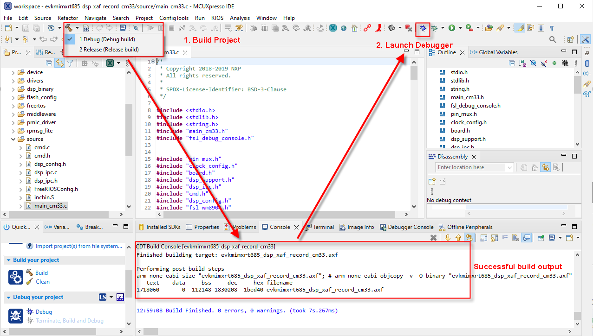
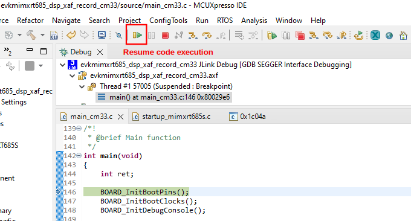
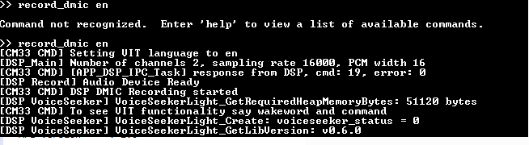
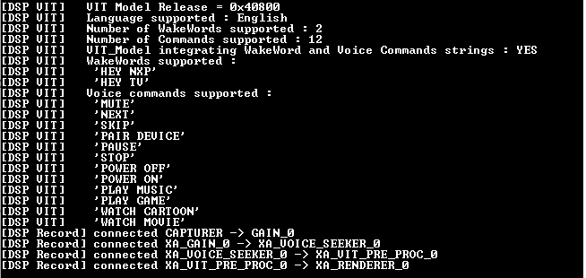
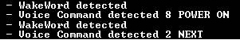

# Debug Audio Demo

To debug this DSP application, set up and execute the Arm application in a desired environment. For more information on Arm development environment options, see ‘Getting Started with MCUXpresso SDK for EVK-MIMXRT685.pdf.

The following example uses the NXP MCUXpresso IDE for the Arm environment.

To debug the audio demo, perform the following steps.

1.  Install the MCUXpresso SDK for RT600 into the MCUXpresso IDE using the Installed SDK panel as shown in

    |

|

2.  To import an example from the installed SDK., use the **Import SDK examples** link in the **Quickstart** panel on the lower left of the screen.

    |

|

3.  Select the ‘*dsp\_xaf\_record\_cm33*’ example for Cortex-M33 core.

    |

|

4.  Click the **Finish** button.

    |

|

5.  Build the project and launch the debugger on success.

    |

|

6.  Use the debug toolbar to resume the code execution.

    |

|

7.  Observe serial terminal output with shell prompt.

    ```
    ******************************
    DSP audio framework demo start
    ******************************
    Configure WM8904 codec
    DSP image copied to DSP TCM
    [APP_DSP_IPC_Task] start
    [APP_Shell_Task] start
    Copyright  2022  NXP
    >>
    ```

8.  Using the Xplorer IDE, load and execute `xaf_record` using the steps described in [Prepare DSP Core for ‘Hello World’](prepare_dsp_core_for_hello_world.md).
9.  After the DSP application runs, use the serial shell to invoke the ‘`record_dmic [language]`’ command.For information on the supported languages, check VIT ReleaseNotes.txt. Using the serial shell creates an audio pipeline that captures microphone audio, perform voice recognition \(VIT\), and playback via the codec speaker line out \(J4 on the EVK\).

    ```
    >> help
    "help": List all the registered commands
    "exit": Exit program
    "version": Query DSP for component versions
    "record_dmic": Record DMIC audio , perform voice recognition (VIT) and playback on codec
    USAGE: record_dmic [language]
    ```

    For voice recognition say supported the wake-word and in 3 s say the frame supported command. If selected model contains strings, then the wake-word and the list of commands appears in the console.

    **Note:** this command does not return to the shell

10. The serial terminal shows the IPC communications to set up an audio device..

    |

|

    The VIT wake-word and supported commands appear in the serial console.

    |

|

    The serial console prints the detected wake-word and commands.

    |

|

    For more information on configuration and using the Audio Framework demo, see the file `<SDK_ROOT>\boards\evkmimxrt685\dsp_examples\xaf_record\cm33\readme.txt.`.

    For more details about VIT which supports English and Mandarin models, see `<SDK_ROOT>\middleware\vit\HIFI4\Doc\VIT_Integration_Guide.pdf`.


**Parent topic:**[Run and Debug DSP Audio Framework](../topics/run_and_debug_dsp_audio_framework.md)

