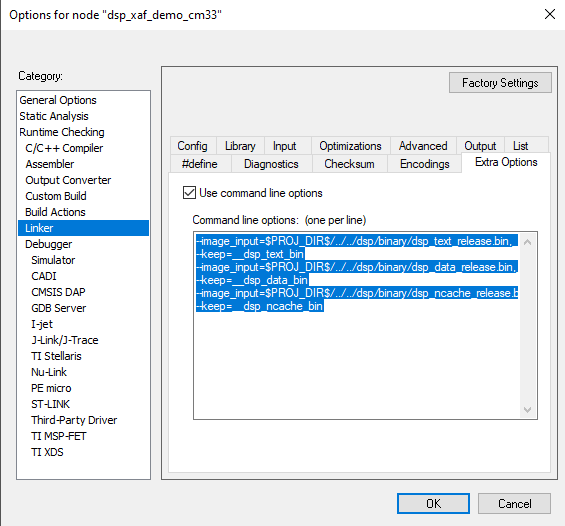

# HiFi4 Boot Loader

For better power efficiency, by default the HiFi4 DSP is powered off when RT6xx powers up. To boot up, Cortex M33 acts as master core to configure DSP local memories, clocks, load DSP images, and so on. SDK has wrapped up this part as HiFi4 Boot Loader or the DSP driver. The essentials are located in: `<SDK path>\devices\MIMXRT685S\drivers\fsl_dsp.h & fsl_dsp.c`.

For each DSP example, it also provides two more implementation files for detailed configurations: `<SDK path>\boards\evkmimxrt685\dsp_examples\<any dsp example>\cm33\dsp_support.h & dsp_support.c`

Below is the DSP boot procedure with more elaborations.

To run DSP at full power, for example, 600 MHz, SoC Vddcore is set to 1.1 V. If full power is not required, for example, to run DSP at the half speed at 300 MHz, then Vddcore only requires 0.8 V. RT6xx EVK integrates NXP PCA9420 PMIC for power management and by default Vddcore is set to 1.0 V.

Therefore, PMIC is initialized for better power management. For details on Vddcore and DSP frequency operating conditions, see any `dsp example\cm33\pmic_support.c BOARD_SetPmicVoltageForFreq()`, or see the data sheet, section 13.1, General Operating Conditions.

```
/* Initialize PMIC PCA9420 */
BOARD_InitPmic();
/* Configure PMIC Vddcore value according to main/dsp clock. */
BOARD_SetPmicVoltageForFreq(CLOCK_GetMainClkFreq(), CLK_600MHZ);
```

It is possible to clock DSP from various clock sources. The DSP PLL for full power and can also run at FFRO low-frequency clocks to save the power.

```
/* Enable DSP PLL clock 594MHz. */
CLOCK_InitSysPfd(kCLOCK_Pfd1, 16);
/*Let DSP run on DSP PLL clock with divider 1 (594Mhz). */
CLOCK_AttachClk(kDSP_PLL_to_DSP_MAIN_CLK);
CLOCK_SetClkDiv(kCLOCK_DivDspCpuClk, 1);
```

As Cortex M33 and SRAM are clocked at lower speed/ max frequency at 300 MHz, set the DSP AHB bus clock divider as 2.

```
CLOCK_SetClkDiv(kCLOCK_DivDspRamClk, 2);
```

If DSP clock is running at 300 MHz or lower, it is more efficient to use divider as 1. For divider as 1, note that an extra register SYSCTL0\_PACKERENABLE is set. For more details, see the user manual section 4.5.2.18 DSP Main Ram Clock Divider and section 4.5.5.3 Packer Enable.

```
/* This is a quick register setting example for secure mode */
/* SYSCTL0->PACKERENABLE = 0x4 */
```

Power up TCM/ DSP local memories and cache, supply clock, and reset peripherals.

```
/* Initializing DSP core */
DSP_Init();
```

For SDK DSP examples, split the DSP images into three parts.

One is for vectors and critical sections sitting on TCM/ DSP local memories. The second one is for normal code and data sections sitting on SRAM, and the final is for non-cached DSP initialized data in SRAM.

Here, Cortex M33 load those binaries to its destination. When the DSP program is debugged, it is possible to load DSP binaries from the Xtensa Xplorer IDE, as described in [Prepare DSP Core for ‘Hello World’](prepare_dsp_core_for_hello_world.md). To load binaries, remove the DSP\_IMAGE\_COPY\_TO\_RAM compilation flag or set it to 0. By default, the compilation flag is set to 1 and always load the DSP images.

```
#if DSP_IMAGE_COPY_TO_RAM
    /* Copy application from RAM to DSP_TCM */
    DSP_CopyImage(&tcm_image);
    /* Copy application from RAM to DSP_RAM */
    DSP_CopyImage(&sram_image);
    /* Copy application from RAM to DSP_Uncached RAM */
    DSP_CopyImage(&ncache_image);
#endif
```

The DSP stall register SYSCTL0\_DSPSTALL controls the HiFi4 operation. Start the DSP and run it.

```
/* Run DSP core */
DSP_Start();
```

The post build scripts create the DSP images. For details, see Makefile.include in any DSP example. To reduce the image size and make image copy more efficient, they are split into SRAM part; TCM part, and uncached SRAM part. DSP images are set and linked into Cortex M33 side. For IAR, the linker is set in **Project Options \> Linker \> Extra Options**. For ArmGCC or Linux environment, set in any `DSP example\cm33\incbin_gcc.S`.

|

|

**Parent topic:**[HiFi4 Boot Loader and Memory Map](../topics/hifi4_boot_loader_and_memory_map.md)

