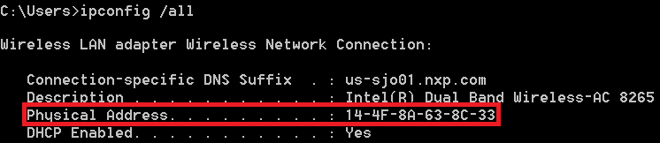

# Identify PC MAC Address

To generate the correct license file, you should first identify the appropriate MAC for the computer you plan to run Xtensa tools on. Remove ‘-‘ or ‘:’ symbols in the MAC address.

**Windows:**

|

|

**Linux:**

|

|

**Note:** **For Linux**: MAC address must be associated with eth0 interface. If not, FLEXlm cannot perform the license checkout, compilation, or simulation of code is not possible. If the host has the MAC address associated with another interface, for example em1, the following approach may be used.

```
# Add udev rule for naming interface
$ sudo vim /etc/udev/rules.d/70-persistent-net.rules
# udev rule (replace ‘XX’ with the MAC address of your PC):
SUBSYSTEM=="net", ACTION=="add", ATTR{address}=="XX:XX:XX:XX:XX:XX", NAME="eth0"
# Change "em1" to "eth0" in your interfaces file.
$ sudo vim /etc/network/interfaces
# Restart udev or reboot machine
$ sudo reboot
```

Alternatively, you can use the approach recommended by your IT team to rename the interface to eth0.

**Parent topic:**[Install License Key](../topics/install_license_key.md)

