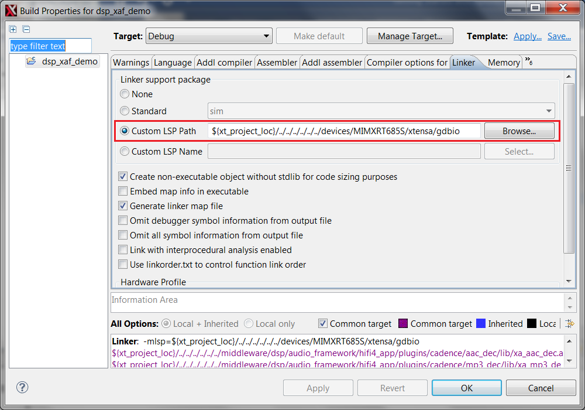

# Link DSP Profiles

The Xtensa Software Tools use the linker support packages \(LSPs\) to link a HiFi4 DSP application for the RT600. An LSP includes both a system memory map and a collection of libraries to include into the final binary. The LSPs are provided in the MCUXpresso SDK and are available at: `<SDK_ROOT>/devices/MIMXRT685S/xtensa/`.

DSP sample applications are configured to link against one of these custom LSPs. By default, *Debug* targets are linked against the gdbio LSP intended for use with an attached debugger and captures I/O requests \(printf\) through gdb. The *Release* target links against the min-rt LSP, which includes minimal runtime support.

To change the LSP used by a project target in the Xplorer IDE, use the **Linker** tab in the project **Build Properties** dialog box.

|

|

The MCUXpresso SDK ships with other standard LSPs for RT600. For more information on LSPs and creating a custom memory map using Xtensa software tools, see the Cadence Linker Support Packages \(LSPs\) Reference Manual.

**Parent topic:**[Install MCUXpresso SDK](../topics/install_mcuxpresso_sdk.md)

