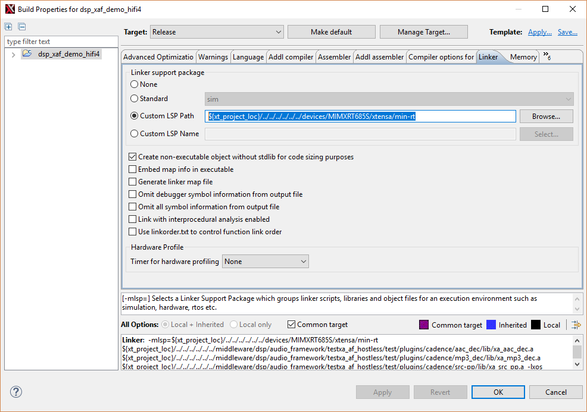

# Linker and Memory Map

When importing the SDK DSP examples, by default the mode is set as Release. The default mode means that the images must be built in Release mode with ‘min-rt’ Linker Support Package/ LSP. To double-check, open **SDK DSP examples \> Build Properties \> Linker**.

|

|

SDK provides three different LSPs.

-   **‘min-rt’ for Release mode** - ‘min-rt’ eliminates all unnecessary debug info and reduces image size.

-   **‘gdbio’ for Debug mode** - gdbio’ support standard ‘printf’/ log output back to Xtensa Xplorer debug console, as well as other debug utilities, perfect for debug purpose but not appropriate for official deployment nor loading directly from Cortex M33 side.

-   **‘sim’ for simulations** - ‘sim’ only works for software simulation and does not fit on device debugging.

The memory map is identical for different LSPs. It sits with linker scripts in `SDK path\devices\MIMXRT685S\xtensa\’LSP name’\ldscripts\elf32xtensa.x`. It specifies how HiFi4 DSP organizes image sections on the memory. For example:

-   0x0020 0000 ~ 0x0048 0000, size 2.5 M bytes, for code and data.
-   Stack and Heap are at the top of the segment and count top down from 0x0048 0000 to lower.
-   0x2400 0000 ~ 0x2400 FFFF, size 64 K bytes, for Data TCM. By default, it is empty.
-   0x2402 0000 ~ 0x2402 FFFF, size 64 K bytes, for instruction TCM. By default it only contains essential vectors and left around 62 K for applications.
-   0x2004 0000 ~ 0x2007 FFFF, size 256 K bytes. This is non-cached area for Cortex M33 and HiFi4 DSP data exchange.

Note that both Cortex M33 and HiFi4 DSP have access to all SRAM partitions. It means that a unified memory map is necessary at system level and both cores must not affect each other's memory map. For SDK examples, see that HiFi4 memory map starts from 0x0020 0000 and Cortex M33 side sits under this address. Using IAR environment, as an example, its memory map sits in `SDK path\boards\evkmimxrt685\dsp_examples\ any example\cm33\iar\MIMXRT685Sxxxx_ram.icf`.

-   0x0008 0000 ~ 0x0017 FFFF, for interrupt vectors and code.
-   0x0018 0000 ~ 0x001F FFFF, for data.

The memory map is flexible and can be adjusted as per the requirement of the application. Note that modifying the core’s memory map might affect another. Changes to both the cores must be made accordingly. For example, when allocating more SRAM partitions to DSP, you must reduce the memory taken at Cortex M33 side. Otherwise, Cortex M33 might not work properly. Also, when loading DSP image directly from Cortex M33 side, the image still sits in Cortex M33 data section before booting up. Therefore, it raises the bar for application data section requirements. You may consider running the application from FLASH.

**Parent topic:**[HiFi4 Boot Loader and Memory Map](../topics/hifi4_boot_loader_and_memory_map.md)

