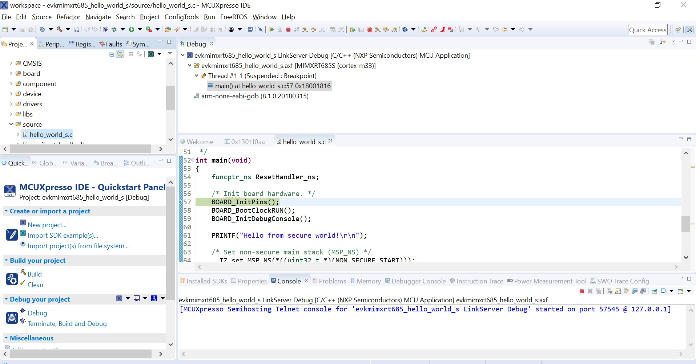

# Run a TrustZone example application

To download and run the application, perform all steps as described in *Section 3.3, "Run an example application"*. These steps are common for single core, and TrustZone applications, ensuring `evkmimxrt685_hello_world_s` is selected for debugging.

In the Quickstart Panel, click **Debug evkmimxrt685\_\_hello\_world\_s \[Debug\]** to launch the second debug session.

|

|

|

|

Now, the TrustZone sesions should be opened. Click **Resume**. The `hello_world` TrustZone application then starts running, and the secure application starts the non-secure application during runtime.

|

|

**Parent topic:**[Run a demo using MCUXpresso IDE](../topics/run_a_demo_using_mcuxpresso_ide.md)

