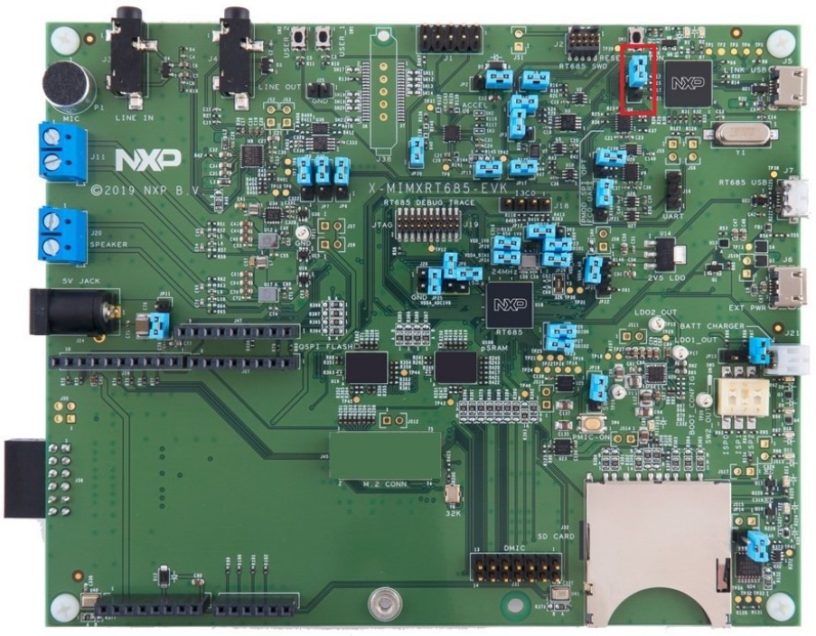
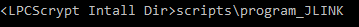
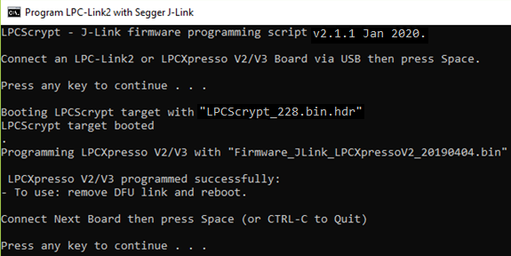
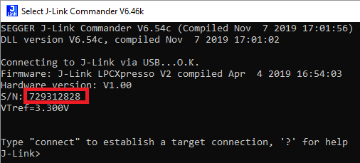
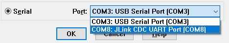

# Program LPC-Link2 with SEGGER J-Link

In addition to standalone probes, the onboard LPC-Link2 debug probe is used to debug HiFi4 DSP over SWD ports. The RT600 EVK has an LPC4300 MCU \(top right corner on EVK\) and by default has been pre-programmed as CMSIS-DAP probe. CMSIS-DAP is not compatible with HiFi4. Therefore, a few extra steps are required to flash it with J-Link firmware and support both Arm CM33 core and HiFi4 DSP core.

The steps are:

1.  Install LPCScrypt, a command-line tool for programming onboard LPC-Link2 debug probe with the latest CMSIS-DAP and J-Link firmware. LPCScrypt is available for download from:[https://www.nxp.com/design/microcontrollers-developer-resources/lpc-microcontroller-utilities/lpcscrypt-v2.1.0:LPCSCRYPT](https://www.nxp.com/design/microcontrollers-developer-resources/lpc-microcontroller-utilities/lpcscrypt-v2.1.0:LPCSCRYPT).
2.  After the download is complete, run the installer.

    **Note:** During the installation, the DFU, and VCOM drivers are automatically installed for all platforms.

3.  To update the LPC-Link2 debug circuit firmware, unplug the USB cable on J5 and then connect to the DFULink jumper. In the MIMXRT685-EVK, JP1 is the LPCXpresso DFU jumper as shown in [Figure 1](program_lpc-link2_with_segger_j-link.md#JUFHSVHCV). 
4.  Connect JP1 using the jumper.

    |

|

5.  Reconnect the board to the host computer over the debug link USB connector J5.
6.  Launch LPCScrypt by double-clicking the *Boot LPCScrypt* file in the LPCScrypt install location: `C:\ProgramData\Microsoft\Windows\Start Menu\Programs\LPCScrypt`.

    |

|

7.  In that command shell, run the program\_JLINK script to install the JLink debug firmware.

    |

|

    **Note:** File paths in this document use the Windows directory separator, on Linux or Mac OSX. The file paths must be replaced with ‘/.’ For Windows users, shortcuts to the scripts are available from the LPCScrypt entry on the Start menu.

8.  Verify once you select the firmware \(in this case J-Link\), LPCScrypt. The console appears as shown in [Figure 4](program_lpc-link2_with_segger_j-link.md#JJEFJHWV).

    |

|

9.  Open/ Disconnect JP1 and power cycle the board. The onboard LPC-Link2 is ready to be used as SEGGER J-Link probe.

    Every EVK/ LPC-Link2 has a different J-Link S/N. Therefore, make sure to write down the S/N for xt-ocd and topology.xml as indicated in [Install Xtensa On Chip Debugger Daemon](install_xtensa_on_chip_debugger_daemon.md#).

    |

|

10. Another benefit is that LPC-Link2 debug probe creates a virtual serial port over USB, so the extra UART2USB cable for debugging is not required.

    |

|

    The download link provides the document, demo videos and details on LPC-Link2. If you have any questions, or have difficulties to program the probe, see [https://www.nxp.com/design/microcontrollers-developer-resources/lpc-microcontroller-utilities/lpcscrypt-v2.1.0:LPCSCRYPT](https://www.nxp.com/design/microcontrollers-developer-resources/lpc-microcontroller-utilities/lpcscrypt-v2.1.0:LPCSCRYPT).

**Parent topic:**[Install Xplorer Toolchains](../topics/install_xplorer_toolchains.md)

