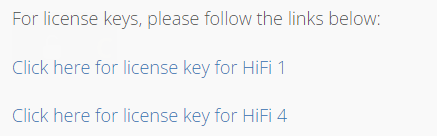
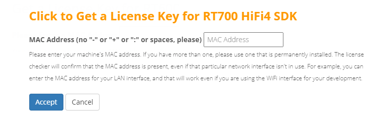
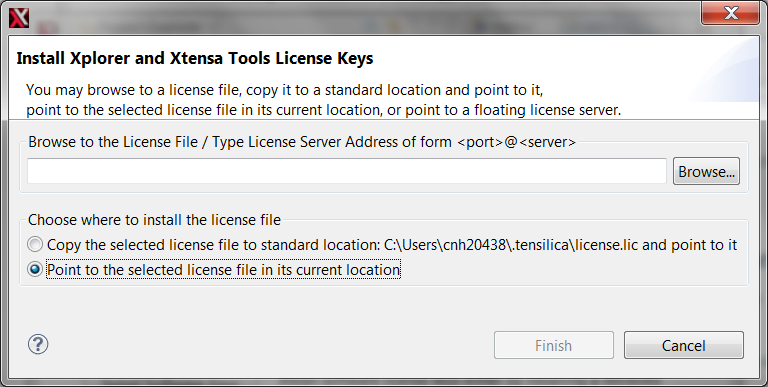

# Download License Key

To download the license key:

1.  Reload or return to the Tensilica URL: [https://tensilicatools.com/download/hifi-dsp-development-tools-for-rt700/](https://tensilicatools.com/download/hifi-dsp-development-tools-for-rt700/).

2.  Click the button and get the license key for RT700 SDK.

    |

|

3.  Provide the address.

    |

|

4.  Once the license file has been generated and downloaded, open your recently installed Xplorer V10.1.11.
5.  Select menu **Help \> Xplorer License Keys \> Install Software Keys**.
6.  Select the license key file.

    |

|

7.  Click the **Finish** button.

    **Note:** The generated license file only supports debug/run on the RT700 device target. It does not support software simulation/Xplorer ISS. If you have special requirements to run the software simulations, contact Cadence directly.

**Parent topic:**[Install License Key](../topics/install_license_key.md)

