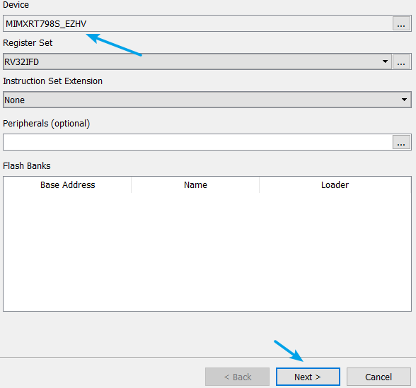
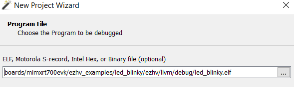
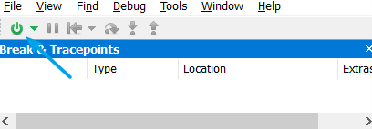

# Run the project 

There are two ways to run the project: Run with primary core, or run independently.

-   Run with primary core.

    After EZHV binary *ezhv\_image.bin* is created, follow the primary core project guide to build the primary core project and run.

-   Debug the EZHV independently.

    Currently [SEGGER Ozone](https://www.segger.com/products/development-tools/ozone-j-link-debugger/) can be used to run and debug the EZHV executable.

    1.  An external J-Link plus is needed, connect JP18 1-2 on the mimxrt700evk board to use external debugger and connect external J-Link to J18.
    2.  Download and install the J-Link.
    3.  Download and install the [SEGGER Ozone](https://www.segger.com/downloads/jlink/#Ozone).
    4.  Open Ozone and create project, click **File** -\> **New** -\> **New Project Wizard**.
    5.  Select the device **MIMXRT798S\_EZHV**.

        

    6.  Select the built EZHV executable.

        

    7.  On the Ozone window, click the button to run.

        

**Parent topic:**[Build and run the ezhv\_examples](../topics/build_and_run_the_ezhv_examples.md)

