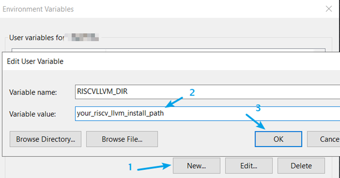

# Set the toolchain for EZHV 

To set the toolchain for EZHV, perform the following steps:

1.  Download and install the RISCV LLVM toolchain.
2.  Add a system environment variable `RISCVLLVM_DIR`, and set the value to the RISCV LLVM install path.

    -   For Linux or Mac, run the command:

        ```
        export RISCVLLVM_DIR=<your_risc_llvm_install_path>
        ```

    -   For Windows, as shown in [Set the toolchain for EZHV](ezhv_set_the_toolchain_for_ezhv.md), perform the following steps:

        1.  Click **Windows Start** -\> **Settings**.
        2.  Search and open **Edit environment variable for your account**
        3.  Create a new variable.
        

3.  Download Ninja from [this link](https://github.com/ninja-build/ninja/releases). Add the path ninja executable to system environmental variable **PATH**. When it finishes, run the ninja – version in command line to verify the installation. The result looks like:

    ```
    $ ninja --version
    1.10.1
    ```

4.  Download and install [CMake](https://cmake.org/download/).

**Parent topic:**[Build and run the ezhv\_examples](../topics/build_and_run_the_ezhv_examples.md)

