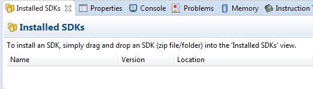
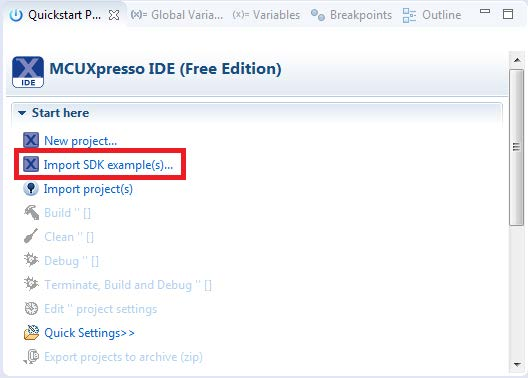
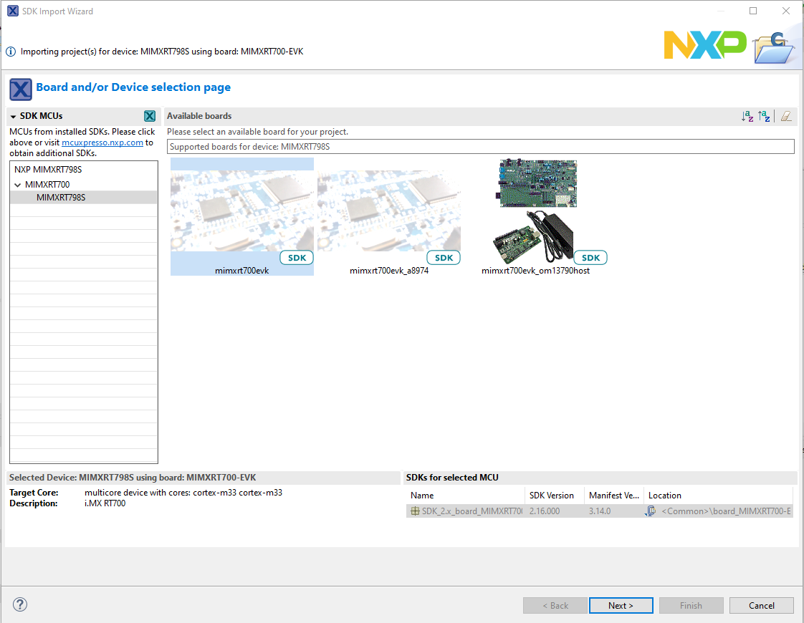
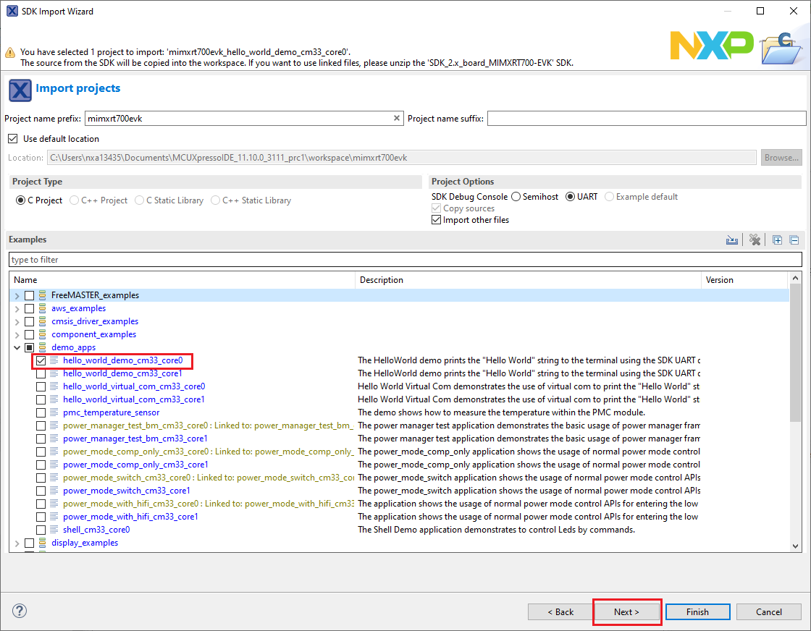

# Build an example application 

To build an example application, perform the following steps.

1.  Drag and drop the SDK zip file into the **Installed SDKs** view to install an SDK.

    

    In the window that appears, click **OK**and wait until the import has finished.

2.  On the **Quickstart Panel**, click **Import SDK example\(s\)**.

    

3.  In the window that appears, select **mimxrt700evk** or **kits** and click **Next**.

    

4.  Expand the *demo\_apps* folder and select **hello\_world\_demo\_cm33\_core0**. Then, click **Next**.

    

5.  Click **Finish**.

**Parent topic:**[Run a demo using MCUXpresso IDE](../topics/run_a_demo_using_ide.md)

