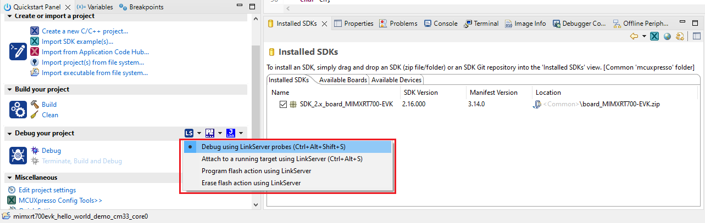
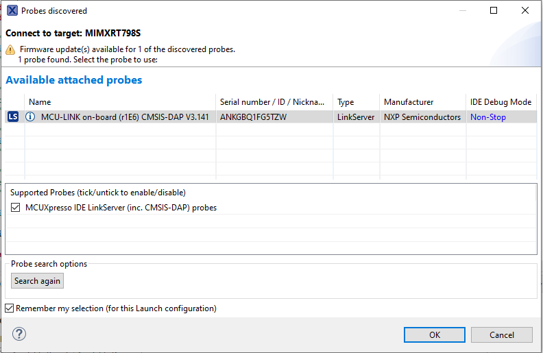
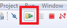

# Run an example application 

To download and run the application, perform the following steps:

1.  Determine the debug interface that comes loaded on your specific hardware platform.

    -   For MIMXRT700-EVK, MCU-LINK is used.
    -   J54 is used as the debugging port which provides both debugging functionality and console out.
2.  Connect USB cable between J54 on EVK and PC USB port.
3.  Open the terminal application on the PC, such as, PuTTY or TeraTerm, and connect to the debug serial port number. To determine the COM port number, see [How to determine COM port](how_to_determine_com_port.md). Configure the terminal with these settings:

    -   115200 baud rate or 9600 baud rate, depending on your board \(reference `BOARD_DEBUG_UART_BAUDRATE` variable in the *board.h* file\)
    -   No parity
    -   8 data bits
    -   1 stop bit
     configurations")

4.  On the **Quickstart Panel**, click **Debug** to launch the debug session.

    

5.  The first time you debug a project, the **Debug Emulator Selection** dialog is displayed, showing all supported probes that are attached to your computer. Select the probe through which you want to debug and click **OK**. \(For any future debug sessions, the stored probe selection is automatically used, unless the probe cannot be found.\)

    

    **Note:** Make sure that the board is set to XSPI0 flash boot mode.

6.  The application is downloaded to the target and automatically runs to `main()`.

     when running debugging")

7.  To start the application, click the **Resume**.

    

The `hello_world` application is now running and a banner is displayed on the terminal. If not, check your terminal settings and connections.

**Parent topic:**[Run a demo using MCUXpresso IDE](../topics/run_a_demo_using_ide.md)

