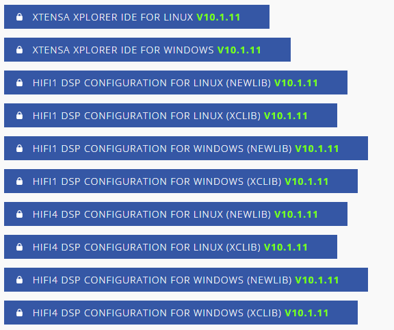

# Install the Xtensa Xplorer IDE and Tools

To install the Xtends Xplorer IDE and tools, perform the following steps:

1.  Go to the URL [https://tensilicatools.com/download/hifi-dsp-development-tools-for-rt700/](https://tensilicatools.com/download/hifi-dsp-development-tools-for-rt700/) and log in. If you are accessing the site for the first time, make sure to register.

2.  Make sure to use your corporate email address to register.

    

3.  Once registered you should receive an email confirmation with an activation link from ‘Tensilica Tools’ [no-reply@tensilicatools.com](mailto:no-reply@tensilicatools.com). Make sure to check the spam folder if this email does not show up in the inbox.

4.  To complete the registration, click the activation link.

5.  Once registered, log in to see the material available for download:

    

    1.  Download and install the **Xplorer IDE V10.1.11** for your operating system \(Windows or Linux\).
    2.  Download the **DSP Configuration** for your operating system – installed later through the IDE, see [Install RT700 DSP Build Configuration](install_rt700_dsp_build_configuration.md).
    **Note:** NXP recommends version **10.1.11** of the Xtensa Xplorer IDE and tools for use with the RT700 DSP.

**Parent topic:**[Install Xplorer Toolchains](../topics/install_xplorer_toolchains.md)

