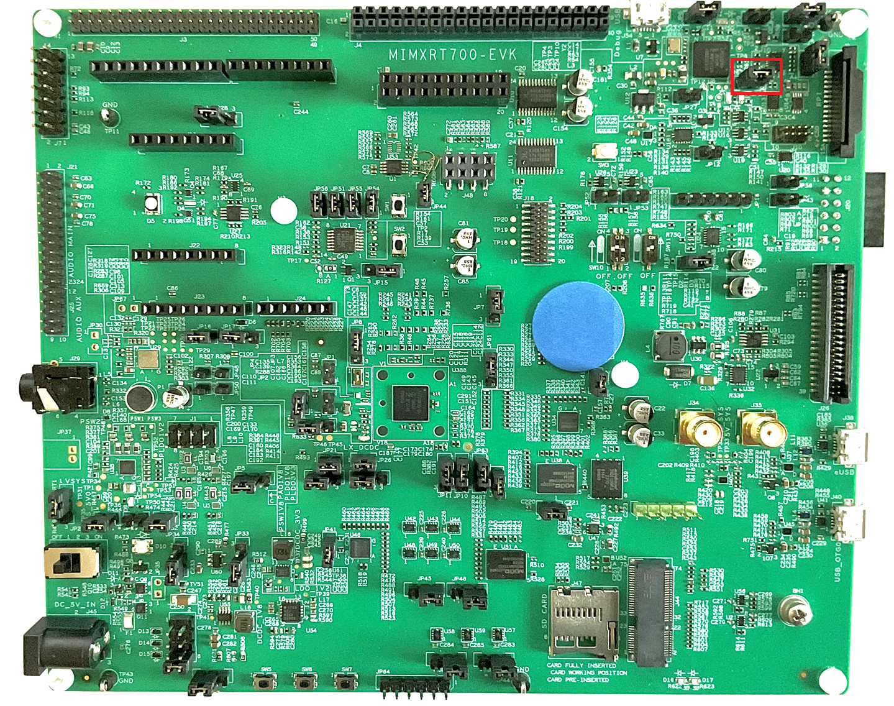
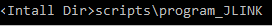
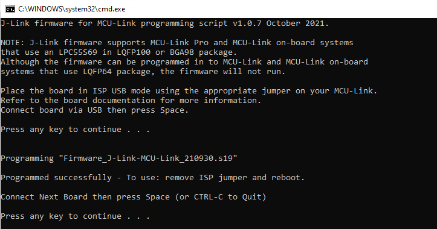
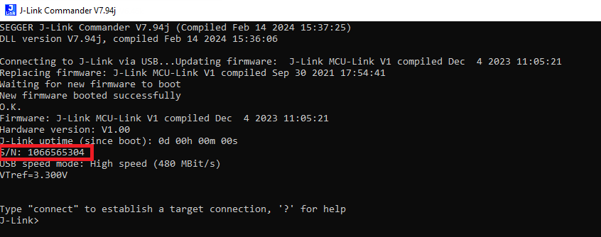
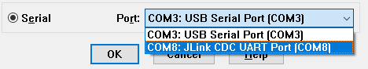

# Program MCU-Link Debug Probe with SEGGER J-Link \(Optional\)

In addition to standalone probes, the onboard MCU-Link debug probe can be used to debug HiFi4 DSP over SWD port. The RT700 EVK has an LPC55S69 MCU \(top right corner on EVK\) and by default has been pre-programmed as CMSIS-DAP probe. CMSIS-DAP is not compatible with HiFi4 the DSPs, but to enable serial logging of Core 1, CMSIS-DAP firmware is required.

To use the on-board J-Link without Core 1 serial logging, a few extra steps are required to flash it with J-Link firmware.

The steps are:

1.  Install MCU-Link, a command-line tool for programming onboard MCU-Link debug probe with the CMSIS-DAP and J-Link firmware. MCU-Link installer is available for download from: [https://www.nxp.com/design/design-center/software/development-software/mcuxpresso-software-and-tools-/mcu-link-debug-probe:MCU-LINK\#t996](https://www.nxp.com/design/design-center/software/development-software/mcuxpresso-software-and-tools-/mcu-link-debug-probe:MCU-LINK#t996).
2.  After the download is complete, run the installer.

    **Note:** During the installation, the DFU, and VCOM drivers are automatically installed for all platforms.

3.  To update the MCU-Link debug circuit firmware, unplug the USB cable on J54 and then connect the JP20 jumper. .

    

4.  Reconnect the board to the host computer over the debug link USB connector J54.
5.  Go to the scripts folder in the MCU-Link install location: `C:\NXP\MCU-LINK_installer_2.263\scripts`.

    

6.  In that command shell, run the program\_JLINK script to install the JLink debug firmware.

    |

|

    **Note:** File paths in this document use the Windows directory separator, on Linux or Mac OSX. The file paths must be replaced with ‘/.’ For Windows users, shortcuts to the scripts are available from the MCU-LInk entry on the Start menu.

7.  Verify once you select the firmware \(in this case J-Link\), MCU-Link. The console appears as shown in [Figure 4](program_lpc-link2_with_segger_j-link.md#JJEFJHWV).

    |

|

8.  Open/ Disconnect JP20 and power cycle the board. The onboard MCU-Link is ready to be used as SEGGER J-Link probe.

    Every EVK/ MCU-Link has a different J-Link S/N. Therefore, make sure to write down the S/N for xt-ocd and topology.xml as indicated in [Install Xtensa On Chip Debugger Daemon](install_xtensa_on_chip_debugger_daemon.md#).

    |

|

9.  MCU-Link debug probe creates a virtual serial port over USB, so the extra UART2USB cable for debugging is not required.

    |

|

    The download link provides the document, demo videos and details on MCU-Link. If you have any questions, or have difficulties to program the probe, see [https://www.nxp.com/document/guide/getting-started-with-the-mcu-link:GS-MCU-LINK](https://www.nxp.com/document/guide/getting-started-with-the-mcu-link:GS-MCU-LINK).

**Parent topic:**[Install Xplorer Toolchains](../topics/install_xplorer_toolchains.md)

