# Prepare DSP Core for ‘Hello World’

The RT700 SDK provides a collection of DSP example applications located in `boards/mimxrt700evk/dsp_examples/`. Each DSP example has two four source directories for cm33\_core0, cm33\_core1, hifi1, and hifi4 cores. In this guide, HiFi4 example will be explained, but HiFi1 examples can be run with the same steps.

|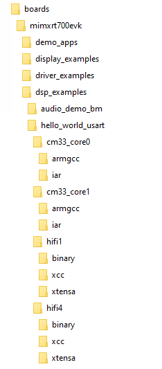

|

The projects for different supported toolchains are built in the above directories. For the DSP example above, the ‘xcc’ project builds on the command line and the ‘xtensa’ directory is an Xplorer IDE project.

To run the ‘Hello World’ demo, import the SDK sources into the Xplorer IDE.

1.  Select **File \> Import \> General \> Existing Projects into Workspace**.

    |

|

2.  Select the SDK directory `<SDK_ROOT>\boards\mimxrt700evk\dsp_examples\hello_world_usart\hifi4\xtensa` as root directory.

    |

|

3.  Leave all the other check boxes blank.

    |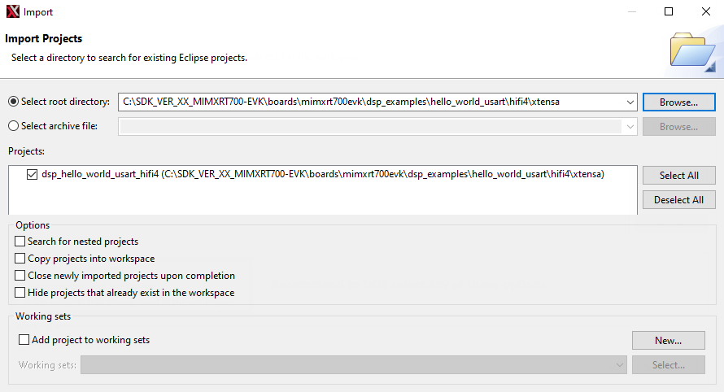

|

    Once imported, the ‘dsp\_hello\_world\_usart\_hifi4’ appears in the Project Explorer.

4.  To make a build selection for the project and hardware target configuration, use the drop-down buttons on the menu bar.

    |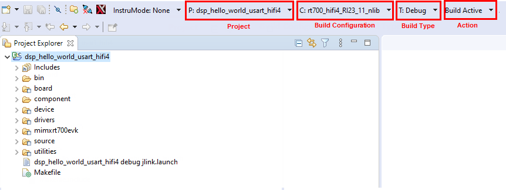

|

5.  To build the project for debug, profile, or trace, use the action buttons on the right side of the menu bar.

    |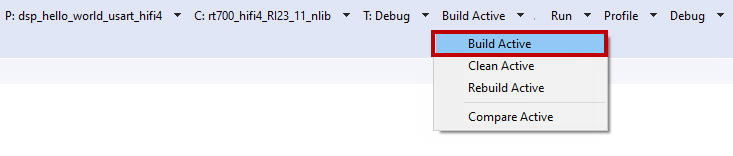

|

    A default debug configuration is provided by the SDK project, which utilizes the on-chip debugger.

6.  To choose the configuration, select the **Debug Configurations** menu item.

    |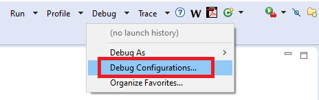

|

    The **Debug Configurations** dialog box appears.

7.  Expand the **Xtensa On Chip Debug** tree option and select ‘*dsp\_hello\_world\_hifi4\_debug\_jlink*’.

    |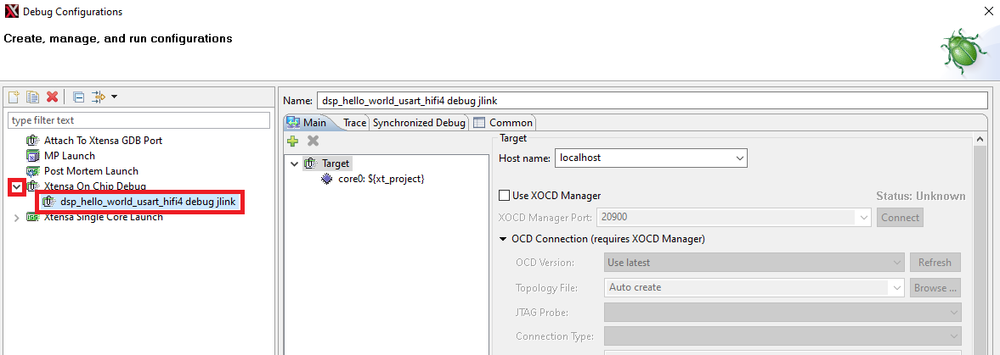

|

8.  Click the **Debug** button. The actual debug on the chip initiates.

    |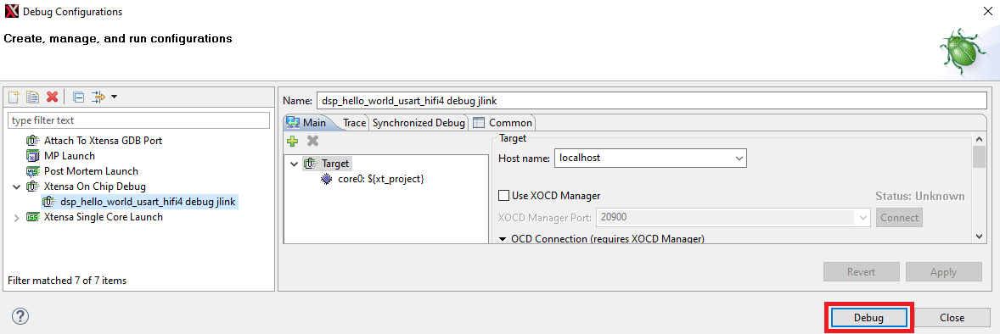

|

    The Xplorer IDE prompts whether binaries should download to the hardware.

9.  Select **Yes**.

    |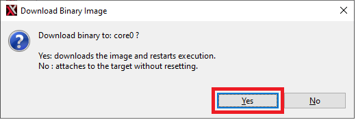

|

10. The Xplorer IDE transitions to the **Debug** perspective after the binary download.

    **Note:** After initial configuration, it is possible to select the same debug configuration as in [Figure 8](prepare_dsp_core_for_hello_world.md#HVHWEG).

    |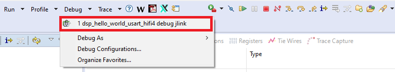

|

    The **Debug** perspective appears as in [Figure 9](prepare_dsp_core_for_hello_world.md#GVDVWQC).

    |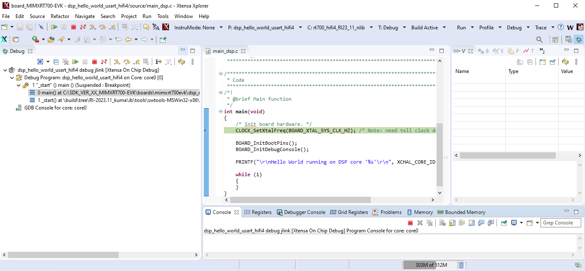

|

    The program stops at the start of main\(\) function. To run the program, click the **Resume** or **Stepping through** icon button as shown in [Figure 10](prepare_dsp_core_for_hello_world.md#LKWEUGG).

    |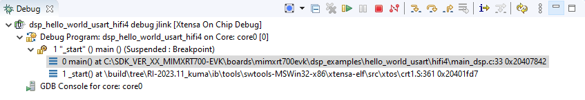

|

11. After resuming / stepping through the ‘printf’ statement, the following output appears in the **Console** view of the IDE.

    ```
    Hello World running on DSP core 'rt700_hifi4_RI23_11_nlib'
    ```

    To return to the default IDE layout after the debugging completes, select the previous code perspective.

    |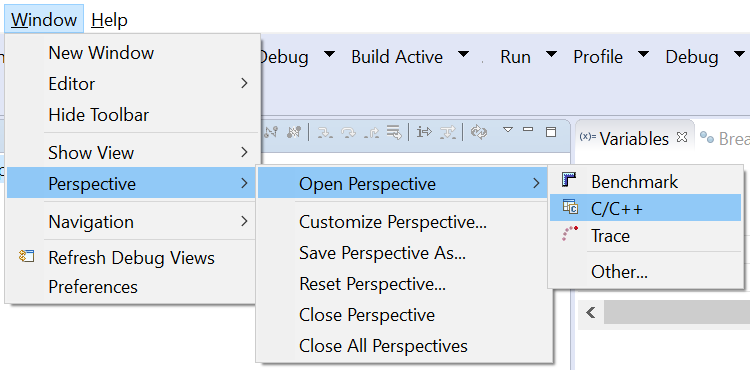

|


**Parent topic:**[Run and Debug DSP Demo using Xplorer IDE](../topics/run_and_debug_dsp_demo_using_xplorer_ide.md)

