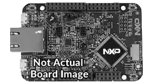

.. _mimxrt700evk:

MIMXRT700-EVK
####################

Overview
********

The i.MX RT700 EVK (MIMXRT700-EVK) features NXPs advanced implementation of the Arm\ :sup:``\ Cortex\ :sup:``-M33 core, combined with the highly optimized Cadence\ :sup:``\ Tensilica\ :sup:``\ HiFi4 and HiFi1 DSP processor cores. MIMXRT700-EVK supports development for the MIMXRT798, MIMXRT758 and MIMXRT735 products and its features make it ideal for portable HMI applications. The i.MX RT700 EVK can help jump start your next design with the included schematics and layout files.

MCU device and part on board is shown below:

 - Device: MIMXRT798S
 - PartNumber: MIMXRT798SGFOA

Getting Started
****************
.. toctree::
   :maxdepth: 1
   :caption: Getting Started with MCUXpresso SDK for MIMXRT700-EVK

   gettingStarted/gsindex.md

Getting Started
****************
.. toctree::
   :maxdepth: 1
   :caption: Getting Started with Xplorer for MIMXRT700-EVK

   gettingStartedXplorer/gsxindex.md

Release Notes
****************
.. toctree::
   :maxdepth: 1
   :caption: MCUXpresso SDK Release Notes for MIMXRT700-EVK

   releaseNotes/rnindex.md
