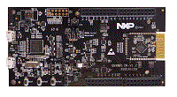

.. _qn908xcdk:

QN908XCDK
####################

Overview
********

The QN908x is a single chip, 10 mW peak power, high performance Bluetooth Low Energy SoC platform. It facilitates the development of end products such as wearables, health, and sport and fitness trackers. The end products also include retail beacons, connected smart home appliances, smart remote controls, HID devices, asset trackers, and home automation. Additional system features include a fully integrated DC-to-DC converter, LDO, low-power sleep timer, battery monitor, high resolution ADC, and GPIO. These features reduce overall system cost and size.

MCU device and part on board is shown below:

 - Device: QN908XC
 - PartNumber: QN9080C

