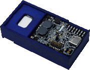

.. _sln_alexa_iot:

SLN-ALEXA-IOT
####################

Overview
********

Turnkey embedded i.MX RT voice solution for Amazons Alexa Voice Service using the i.MX MIMXRT106A 600 MHz 32-bit ARM Cortex-M7 MCU.

MCU device and part on board is shown below:

 - Device: MIMXRT106A
 - PartNumber: MIMXRT106ADVL6A

