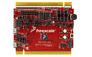

.. _twrk22f120m:

TWR-K22F120M
####################

Overview
********

.It features the Kinetis K22FN512VDC12 low-power MCU with 512 KB Flash, 128 KB SRAM, and USB connectivity with crystal-less operation.The TWR-K22F120M operates as a standalone debug tool and can also be combined and used as part of the modular Tower System development platform.

MCU device and part on board is shown below:

 - Device: MK22F51212
 - PartNumber: MK22FN512VDC12

