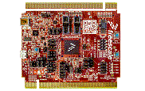

.. _twrk64f120m:

TWR-K64F120M
####################

Overview
********

The NXP TWR-K64F120M is a development board for the Kinetis K24, K63 and K64 120 MHz 32-bit ARM Cortex-M4 MCUsThe TWR-K64F120M features the Kinetis MK64FN1M0VMD12 low-power MCU with 1 MB Flash, 256 KB SRAM, USB USB and Ethernet MAC.It operates as a standalone debug tool and can also be combined and used as part of the modular Tower System development platform.

MCU device and part on board is shown below:

 - Device: MK64F12
 - PartNumber: MK64FN1M0VMD12

