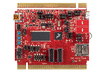

.. _twrk65f180m:

TWR-K65F180M
####################

Overview
********

The TWR-K65F180M is a development board for the Kinetis K26, K65 and K66 180 MHz 32-bit ARM Cortex-M4 MCUs. It features the Kinetis MK65FN2M0VMI18 low-power MCU with 2MB Flash, 256 KB SRAM, SDRAM Controller, HS USB and Ethernet MAC.The TWR-K65F180M operates as a standalone debug tool and can also be combined and used as part of the modular Tower System development platform.

MCU device and part on board is shown below:

 - Device: MK65F18
 - PartNumber: MK65FN2M0VMI18

