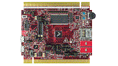

.. _twrk81f150m:

TWR-K81F150M
####################

Overview
********

The TWR-K81F150M is a development board for the Kinetis K80, K81, and K82 150Mhz 32-bit ARM Cortex-M4 MCUs.The TWR-K81F150M board:Features the Kinetis MK81FN256VDC15 low-power MCU with 256 KB Flash, 256 KB SRAM, USB, and XIP QuadSPI capabilities.Operates as a standalone debug tool and can also be combined and used as part of the modular Tower System development platform.

MCU device and part on board is shown below:

 - Device: MK81F25615
 - PartNumber: MK81FN256VDC15

