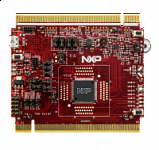

.. _twrke18f:

TWR-KE18F
####################

Overview
********

The TWR-KE18F is a development board for the Kinetis KE1xF 32-bit MCUs.The power supply voltage range from 3.3V to 5V, and it features a KE18 device boasting a maximum operating frequency of 168 MHz, up to 512 KB Flash size and numerous analog and digital peripherals.Board operates as a standalone debug tool and can also be combined and used as part of the modular Tower System development platform

MCU device and part on board is shown below:

 - Device: MKE18F16
 - PartNumber: MKE18F512VLL16

