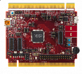

.. _twrkl28z72m:

TWR-KL28Z72M
####################

Overview
********

The TWR-KL28Z72M is a development board for the Kinetis KL28 32-bit MCUs. Features the Kinetis KL28 MCU with 512KB Flash, 128KB SRAM. Operates as a standalone debug tool and can also be combined and used as part of the modular Tower System development platform

MCU device and part on board is shown below:

 - Device: MKL28Z7
 - PartNumber: MKL28Z512VLL7

