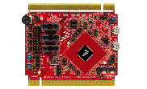

.. _twrkl43z48m:

TWR-KL43Z48M
####################

Overview
********

.The TWR-KL43Z48M module is designed to work either in standalone mode or as part of the Tower System, a modular development platform that enables rapid prototyping and tool re-use through reconfigurable hardware.The TWR-KL43Z48M is supported by a range of NXP and third-party development software.

MCU device and part on board is shown below:

 - Device: MKL43Z4
 - PartNumber: MKL43Z256VLH4

