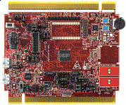

.. _twrkl82z72m:

TWR-KL82Z72M
####################

Overview
********

The TWR-KL82Z72M is a development board for Kinetis KL82 32-bit MCUs. It features the Kinetis MKL82Z128VMC7 MCU 72 MHz ARM Cortex-M0+ core, 128 KB flash, 96 KB SCRAM, 121 MAPBGA and USB.The TWR-KL82Z72M operates as a standalone debug tool and can also be combined and used as part of the modular Tower System development platform.

MCU device and part on board is shown below:

 - Device: MKL82Z7
 - PartNumber: MKL82Z128VMC7

