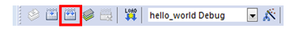

# Build an example application

-   Open the desired example application workspace in:

    ```
    <install_dir>/boards/<board_name>/*<example\_type\>*/<application_name>/mdk
    ```

    The workspace file is named <demo\_name\>.uvmpw, so for this specific example, the actual path is:

    ```
    <install_dir>/boards/twrkm35z75m/demo_apps/hello_world/mdk/hello_world.uvmpw
    ```

-   To build the demo project, select the **Rebuild** button, highlighted in red.

    |

|

-   The build completes without errors.

**Parent topic:**[Run a demo using Keil MDK/μVision](../topics/run_a_demo_using_keil__mdk_vision.md)

