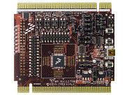

.. _twrkv11z75m:

TWR-KV11Z75M
####################

Overview
********

The TWR-KV11Z75M is a development tool for the Kinetis V series KV1x 64 KB and 128 KB MCU family built on the ARM Cortex-M0+ processor.As is standard with all Tower System modules, the TWR-KV11Z75M MCU module can be used with a variety of existing peripheral modules, such as TWR-MC-LV3PH for motor control rapid rapid prototyping. The TWR-KV11Z75M is supported by a range of NXP and third-party development software. Torque your designs and speed your time to market with TWR-KV11Z75M.

MCU device and part on board is shown below:

 - Device: MKV11Z7
 - PartNumber: MKV11Z128VLH7

