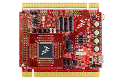

.. _twrkv31f120m:

TWR-KV31F120M
####################

Overview
********

The TWR-KV31F120M is a development tool for the Kinetis V series KV3x family built on the ARM Cortex-M4 processor.The TWR-KV31F120M MCU module is designed to work either in standalone mode or as part of the Tower System , a modular development platform that enables rapid prototyping and tool re-use through reconfigurable hardware.The TWR-KV31F120M is supported by a range of NXP and third-party development software, and is now enabled with Kinetis Motor Suite. Kinetis Motor Suite is a software solution that enables the rapid configuration of motor drive systems, and accelerates development of the final motor drive application, whilst improving overall motor system performance. For more information go to nxp.com/kms.

MCU device and part on board is shown below:

 - Device: MKV31F51212
 - PartNumber: MKV31F512VLL12

