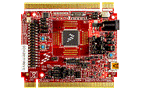

.. _twrkv46f150m:

TWR-KV46F150M
####################

Overview
********

The TWR-KV46F150M is a development tool for the Kinetis V series KV4x MCU family built on the ARM Cortex-M4 processor. The TWR-KV46F150M MCU module is designed to work either in standalone mode or as part of the Tower System, a modular development platform that enables rapid prototyping and tool re-use through reconfigurable hardware.As is standard with all Tower System modules, the TWR-KV46F150M MCU module can be used with a variety of existing peripheral modules, such as TWR-MC-LV3PH for motor control rapid prototyping and TWR-SMPS-LVFB for digital power conversion rapid prototyping. Torque your designs and speed your time to market with TWR-KV46F150M.

MCU device and part on board is shown below:

 - Device: MKV46F16
 - PartNumber: MKV46F256VLL16

