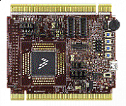

.. _twrkv58f220m:

TWR-KV58F220M
####################

Overview
********

The TWR-KV58F220M is a development tool for the Kinetis V series KV5x MCU family built on the ARM Cortex-M7 processor. The TWR-KV58F220M MCU module is designed to work either in standalone mode or as part of the Tower System, a modular development platform that enables rapid prototyping and tool re-use through reconfigurable hardware.As is standard with all Tower System modules, the TWR-KV58F220M MCU module can be used with a variety of existing peripheral modules, such as TWR-MC-LV3PH for motor control rapid prototyping.

MCU device and part on board is shown below:

 - Device: MKV58F24
 - PartNumber: MKV58F1M0VLQ24

