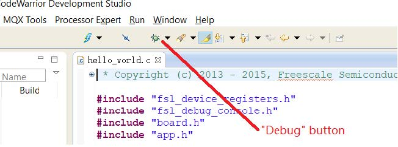
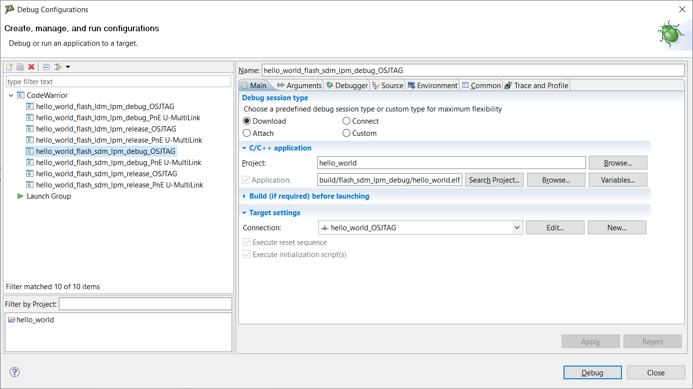
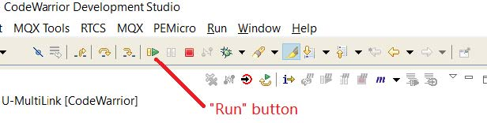
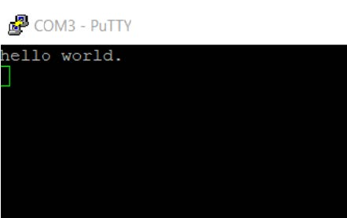

# Run an example application

To download and run the application, perform the following steps:

1.  Connect USB cable between the host PC and the JM60 USB\(J18\) port on the TWR-MC56F8400 target board. It sets OSJTAG and COM port in PC device manager.
2.  Install the OSJTAG driver and USB CDC driver as PC hint if it is the first time you run it on your PC. The OSJTAG and USB CDC driver are provided by CodeWarrior by default.

    The CodeWarrior may prompt to update the JM60 firmware, which requires to connect the J17 with a jumper on TWR-MC56F8400 board and then follow the instruction by CodeWarrior to finish the firmware update. The default debug interface is OSJTAG for TWR-MC56F8400 board.

3.  Open the terminal application on the PC, such as PuTTY or TeraTerm, and connect to the debug COM port \(to determine the COM port number, see [How to determine COM port](how_to_determine_com_port.md)\). Configure the terminal with these settings:

    1.  115200, defined by `BOARD_DEBUG_UART_BAUDRATE` in the *board.h* file
    2.  No parity
    3.  8 data bits
    4.  1 stop bit
    | configuration")

|

4.  For this example, click **Debug** in the **Commander** pane, and select the `hello_world_flash_sdm_lpm_debug_OSJTAG` launch configuration.

    |

|

    |

|

    Then the application is downloaded onto target board and automatically runs to the `main()` function.

    To run the code, click **Run** on the toolbar.

    **Note:**

    -   Generally there are four build configurations for DSC SDK 2.1x.x: `flash_sdm_lpm_debug`, `flash_sdm_lpm_release`, `flash_ldm_lpm_debug`, and `flash_ldm_lpm_release`.

        `debug` uses optimization level 1 and `release` uses optimization level 4. `sdm` means small data memory model. `ldm` means large data memory model. `lpm` means large program memory model.

    -   Check each demo `readme` document, which includes detailed instructions for HW and SW settings.
    |

|

5.  The `hello_world` application is now running and a banner is displayed on the terminal, as shown in [Figure 5](run_an_example_application.md#FIG_TEXTDISPLAYHELLOWORLD). If it does not appear, check your terminal settings and connections.

    |

|

**Parent topic:**[Run a demo application using CodeWarrior](../topics/run_a_demo_application_using_codewarrior.md)

