# CMake And Kconfig Based Build And Configuration System

## Acronyms and Abbreviations

| Acronym or Term | Definition                      |
| :-------------: | ------------------------------- |
|       BS        | Build System                    |
|       BCS       | Build and Configuration System  |
|       BCP       | Build and Configuration Process |

## Environment Setup

### Docker SUpport

An all-in-one docker image for all required packages can be find [here](docker.nxp.com/mcux/mcusdk3_ci:latest) 

### Repos Setup

***Firstly, ensure all your code is up-to-date, run `west update_repo`.***
To isolate your development environment, suggest use [python venv](https://docs.python.org/3/library/venv.html).
In sdk-next workspace root directory, create and activate a virtual environment:

```bash
# Please ensure your system python version >= 3.8
python -m venv .venv

# For Linux/MacOS
source .venv/bin/activate

# For Windows
.\.venv\Scripts\activate
```

Then install required packages

```bash
# Note: you can add option '--default-timeout=1000' if you meet connection issue.
pip install -r mcu-sdk-3.0/scripts/requirements.txt
```

Following build, flash and debug commands are referred from zephyr's official one. So you can find the full documentation here: [https://docs.zephyrproject.org/latest/develop/west/build-flash-debug.html](https://docs.zephyrproject.org/latest/develop/west/build-flash-debug.html)

Most of native zephyr's west build features are reserved.

### Build Environment Setup

#### CMake

Since the BS uses CMake as the main build tool, please follow the [CMake](https://cmake.org/getting-started/) doc to install CMake. The minimum version is ***3.22.0***.

#### Ninja

The BS uses Ninja as the default output generator of CMake, please make sure you have installed the [Ninja](https://ninja-build.org/). The minimum ninja version is ***1.11.0***.

#### Python

Python is used as a Swiss knife in many aspects from repo management to BS. The minimum ninja version is ***3.8***.

### Toolchain Setup

Build system supports IAR, MDK, Armgcc and [Zephyr SDK](https://docs.zephyrproject.org/latest/develop/toolchains/zephyr_sdk.html#toolchain-zephyr-sdk) to build.

You need to set environment variables to specify the toolchain installation so that build system can find it.

Here are the toolchain environment variable table

| Toolchain | Environment variable   | Cmd Line Argument           |
| --------- | ---------------------- | :-------------------------- |
| IAR       | IAR_DIR                | --toolchain iar             |
| MDK       | MDK_DIR                | --toolchain mdk             |
| Armgcc    | ARMGCC_DIR             | --toolchain armgcc(default) |
| Zephyr    | ZEPHYR_SDK_INSTALL_DIR | --toolchain zephyr          |

## Kconfig

1. Please install python3 and menuconfig. For menuconfig, you can run with

   ```bash
   pip install -U kconfiglib
   ```

2. Make sure that `mcu-sdk-boards`, `mcu-sdk-components`, `mcux-devices-kinetis`, `mcux-devices-lpc`, `mcux-devices-rt` projects are cloned because there are Kconfig data inside these repos for boards/components/devices. Only with all these data included, then you can enjoy full feature of kconfig.

3. Run

   Inside Kconfig files, there are board/device variables inside, so it cannot be directly run, so Kconfig shall be run inside whole cmake process.

   - Run cmake configuration

     ```bash
     west build -b frdmk64f examples/demo_apps/hello_world --cmake-only
     ```

     You can ignore `--cmake-only`, then the project will be built.
   - Run guiconfig target

     ```bash
     west build -t guiconfig
     ```

     Then you will get the Kconfig GUI launched, like

     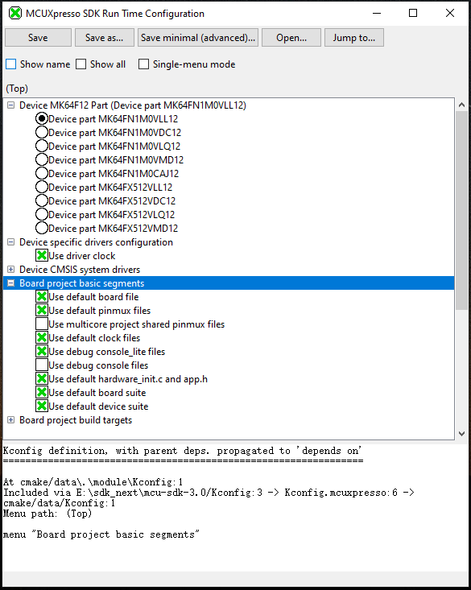

     You can select/deselect and modify to do reconfiguration and remember to save.

     After you save and close, you can directly run "west build" to do the build.

## West Extension Commands

### Build

Use `west build -h` to see help information for west build command.
Compared to zephyr's west build, our west build command provides following additional options for mcux examples:

- --toolchain: specify the toolchain for this build, default armgcc.
- --config: value for CMAKE_BUILD_TYPE, default debug.
- --show-configs: show all supported build configurations for the project.

Here are some typical usage for generating a SDK example is:

```bash

# Generate example with default settings
west build -b frdmk64f examples/demo_apps/hello_world

# Just print cmake commands, do not execute it
west build -b frdmk64f examples/demo_apps/hello_world --dry-run

# Generate other toolchain like iar, default armgcc
west build -b frdmk64f examples/demo_apps/hello_world --toolchain iar

# Generate config type, default debug
west build -b frdmk64f examples/demo_apps/hello_world --config release

# Show all supported build configurations
west build -b frdmk64f examples/demo_apps/hello_world --show-configs

```

For multicore devices, you shall specify the corresponding core id by passing the command line argument "-Dcore_id". For example

```bash
west build -b evkmimxrt1170 examples/demo_apps/hello_world --toolchain iar -Dcore_id=cm7 --config flexspi_nor_debug
```

Remember to use "--config" to specify build target which is different from SDKGENv3.

### Sysbuild(System build)

To support multicore project building, we ported Sysbuild from Zephyr. It supports combining multiple projects for compilation. You can build all projects by adding "--sysbuild" for main application. For example:

```bash
west build -b evkmimxrt1170 --sysbuild ./examples/middleware/multicore/multicore_examples/hello_world/primary -Dcore_id=cm7 --config flexspi_nor_debug -p always
```

For more details, please refer to [System build](#system-build)

### Flash

***Note***: Please refer [West Flash and Debug Support](#west-flash-and-debug-support) to enable west flash/debug support.

As we do not have a FRDM-K64F with JLink or other runners for test, we only ensure flash/debug commands can work for linkserver. Please install linkserver and add it to your PATH firstly.

Flash the hello_world example:

```bash
west flash -r linkserver
```

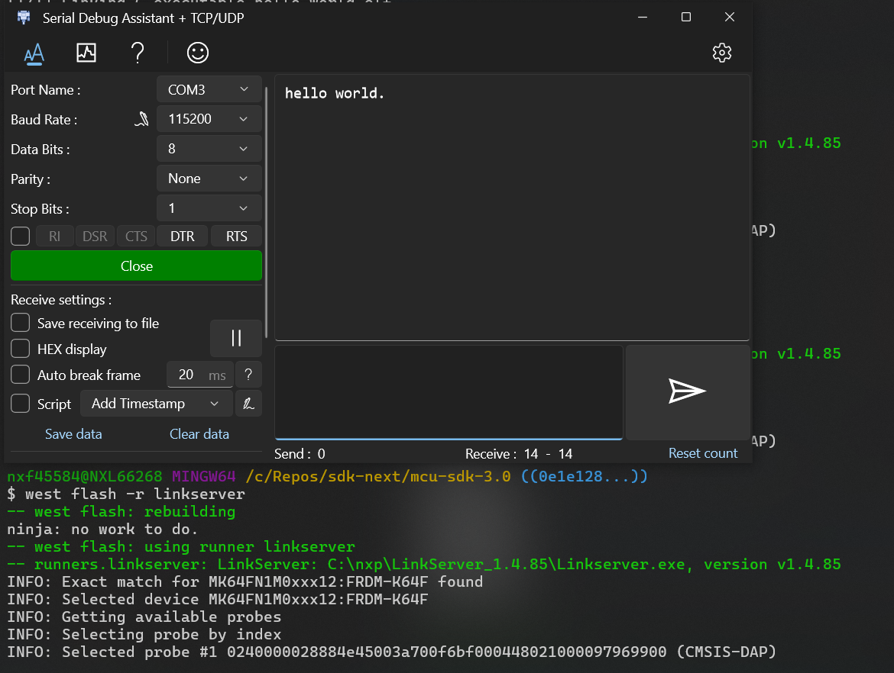

### Debug

Start a gdb interface by following command:

```bash
west debug -r linkserver
```

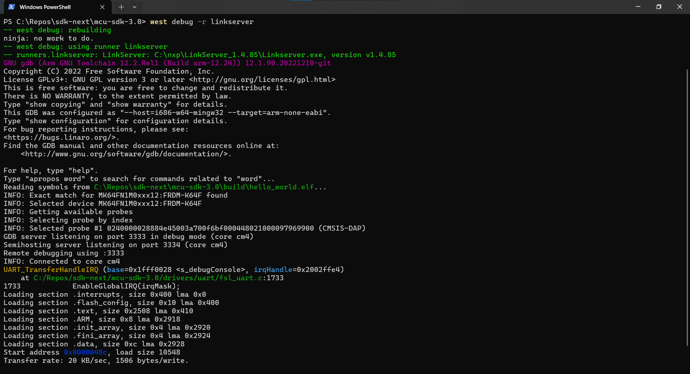

## Overview

MCUXpresso SDK build and configuration system is based on CMake and Kconfig.

[Kconfig](https://www.kernel.org/doc/html/next/kbuild/kconfig-language.html) is a selection-based configuration system originally developed for the Linux kernel which now found more and more use in other projects beyond the Linux kernel. In MCUXpresso SDK, Kconfig is used to config the build in run time which includes component selection with dependency resolve, component configuration with feature enable, disable and customization.

You can interact with Kconfig via a curses or graphical menu interface, usually invoked by running `west build -t guiconfig` after you have already run passed the CMake configuration process. In this interface, the user selects the options and features desired, and saves a configuration file, which is then used as an input to the
build process.

[CMake](https://cmake.org/) which is cross platform not only manages the software build process based on Kconfig result.

Beyond traditional CMake generation, MCUXpresso build system also integrates some useful functionalities like IDE project generation.

## Toolchains Beyond GCC

MCUXpresso SDK supports all mainstream toolchains in the embedded world beyond traditional armgcc.

The toolchain list supported by our build system is IAR, MDK, Xcc, Xclang and Zephyr. The CMake toolchain setting files are placed in `mcu-sdk-3.0/cmake/toolchain` folder. All toolchain files generally follow the same structure and loaded through `mcu-sdk-3.0/cmake/<toolchain>.cmake`. The CMake variable for toolchain is `CONFIG_TOOLCHAIN` which is used to cmdline to specify the toolchain to build.

If you need to enable new toolchain, please follow the existing toolchain file pattern and place it there.

## CMake Extension

MCUXpresso SDK is a comprehensive product including hundred of boards and devices, thousands of components and ten thousands of examples, all mainstream toolchains. The MCUXpresso CMake extensions aims to greatly reduce build data development and maintenance efforts.

Following extensions are provided for you to facilitate component, project and misc data record for all toolchains. All extension functions start with prefix `mcux_`

### Source And Include

#### mcux_add_source/mcux_add_include

Add the source and include can be done with `mcux_add_source` and `mcux_add_include`

Please see following table for the arguments

| Argument Name | Argument Type | Explanation                              |
| ------------- | ------------- | ---------------------------------------- |
| BASE_PATH     | Single        | If provided, the final source path equals `BASE_PATH` + `SOURCES`. This is usually used in abstracted `.cmake` files which are not placed together with real sources. For sources or includes in CMakeLists.txt which is usually put together with real source, no need to add it. |
| CONFIG        | Single        | Specify that the source is a config file or the include is for a config header. |
| SOURCES       | Multiple      | The sources. This is only for `mcux_add_source`. If there are multiple sources, please separate them with whitespace. |
| INCLUDES      | Multiple      | The includes. This is only for `mcux_add_include`. If there are multiple includes, please separate them with whitespace. |
| TARGET_FILES  | Multiple      | This is only for `mcux_add_include` which is used to specify the include target which header file. This is required only for `config` header. |
| COMPILERS     | Multiple      | The compilers. It means the source or include only supports the listed compilers.<br>Here are all the supported compilers: armclang, iar, gcc, xcc, mwcc56800e. |
| TOOLCHAINS    | Multiple      | The toolchains. It means the source or include only supports the listed toolchains.<br>Here are all the supported toolchains: iar, mdk, armgcc, xcc, codewarrior. |
| CORES         | Multiple      | The cores. It means the source or include only supports the listed cores.<br>Here are all the supported cores: cm0, cm0p, cm3, cm4, cm4f, cm7, cm7f, cm33, cm33f, cm23, ca7, dsp56800ex, dsp56800ef, dsp |
| CORE_IDS      | Multiple      | The core_ids. It means the source or include only supports the listed core_ids. This is usually to distinguish support for core in multicore platform. |
| DEVICES       | Multiple      | The devices. It means the source or include only supports the listed device, like MK64F12. |
| DEVICE_IDS    | Multiple      | The device ids. It means the source or include only supports the listed device id, like MK64FN1M0xxx12. |
| FPU           | Multiple      | The fpu. It means the source or include only supports the listed fpu. fpu enum values are  NO_FPU,  SP_FPU and  DP_FPU. |
| DSP           | Multiple      | The dsp. It means the source or include only supports the listed dsp. dsp enum values are NO_DSP and DSP |
| TRUSTZONE     | Multiple      | The trustzone. It means the source or include only supports the listed trustzone. trustzone enum values are TZ and  NO_TZ. |
| COMPONENTS    | Multiple      | The components. It means the source or include only supports the listed components |

Here is one example:

```cmake
# In drivers/uart/CMakelists.txt
if (CONFIG_MCUX_COMPONENT_driver.uart)
    mcux_add_source(
        SOURCES fsl_uart.h 
                fsl_uart.c
    )
    mcux_add_include(
        INCLUDES .
    )
endif()

# In examples/demo_apps/hello_world/CMakelists.txt
mcux_add_source(
    SOURCES hello_world.c
)

mcux_add_include(
    INCLUDES .
)
```

#### mcux_convert_binary

Specify the Output binary format

| Argument Name | Argument Type | Explanation                   |
| ------------- | ------------- | ----------------------------- |
| TOOLCHAINS    | Multiple      | Supported toolchains          |
| BINARY        | Single        | The target output binary type |

Here is one example

```cmake
mcux_convert_binary(
        TOOLCHAINS armgcc mdk iar
        BINARY ${APPLICATION_BINARY_DIR}/core1_image.bin
)
```

#### mcux_add_iar_linker_script/mcux_add_mdk_linker_script/mcux_add_armgcc_linker_script

Add linker for toolchain.

| Argument Name | Argument Type | Explanation                              |
| ------------- | ------------- | ---------------------------------------- |
| TARGETS       | Multiple      | The build targets, like debug release    |
| BASE_PATH     | Single        | If provided, the final linker path equals `BASE_PATH` + `LINKER`. This is usually used in abstracted .cmake files which are not placed together with real linker. |
| LINKER        | Single        | The linker path                          |

Here is one example

```cmake
mcux_add_iar_linker_script(
        TARGETS debug release
        BASE_PATH ${SdkRootDirPath}
        LINKER devices/${soc_series}/${device}/iar/${MCUX_TOOLCHAIN_LINKER_DEVICE_PREFIX}_flash.icf
)

mcux_add_armgcc_linker_script(
        TARGETS debug release
        BASE_PATH ${SdkRootDirPath}
        LINKER devices/${soc_series}/${device}/gcc/${MCUX_TOOLCHAIN_LINKER_DEVICE_PREFIX}_flash.ld
)

mcux_add_mdk_linker_script(
        TARGETS debug release
        BASE_PATH ${SdkRootDirPath}
        LINKER devices/${soc_series}/${device}/arm/${MCUX_TOOLCHAIN_LINKER_DEVICE_PREFIX}_flash.scf
)
```

### Configuration

#### mcux_add_configuration

Add configuration for all toolchains with specified build targets.

| Argument Name | Argument Type | Explanation                              |
| ------------- | ------------- | ---------------------------------------- |
| TARGETS       | Multiple      | Supported build targets. If not provided, then supporting all targets |
| LIB           | Multiple      | The library, the full path               |
| AS            | Single        | The assemble compiler flag               |
| CC            | Single        | The c compiler flags                     |
| CX            | Single        | The cxx compiler flags                   |
| LD            | Single        | The linker flags                         |

Note, please use native compiler flags of the compilers.

Here is one example

```cmake
mcux_add_configuration(
        TARGETS release
        AS "-DMCUXPRESSO_SDK -DNDEBUG"
        CC "-DMCUXPRESSO_SDK -DNDEBUG"
        CX "-DMCUXPRESSO_SDK -DNDEBUG"
)
```

#### mcux_add_iar_configuration\mcux_add_mdk_configuration\mcux_add_armgcc_configuration\mcux_add_xcc_configuration

Very similar with mcux_add_configuration, just target specified toolchain, not for all.

### Remove

Except adding data, the build system also supports removing defined data. For example, if in a common definition, a macro is defined for examples in the board, but your example cannot use it, then you can use following remove function to remove it.

#### mcux_remove_configuration

Remove configuration for all toolchains with specified build targets.

| Argument Name | Argument Type | Explanation                              |
| ------------- | ------------- | ---------------------------------------- |
| TARGETS       | Multiple      | Supported build targets. If not provided, then supporting all targets |
| LIB           | Multiple      | The library, the full path               |
| AS            | Single        | The assemble compiler flag               |
| CC            | Single        | The c compiler flags                     |
| CX            | Single        | The cxx compiler flags                   |
| LD            | Single        | The linker flags                         |

Note, please use native compiler flags of the compilers.

Here is one example

```cmake
mcux_remove_configuration(
        TARGETS release
        AS "-DMCUXPRESSO_SDK -DNDEBUG"
        CC "-DMCUXPRESSO_SDK -DNDEBUG"
        CX "-DMCUXPRESSO_SDK -DNDEBUG"
)
```

#### mcux_remove_iar_configuration/mcux_remove_mdk_configuration/mcux_remove_armgcc_configuration

Very similar with mcux_remove_configuration, just target specified toolchain, not for all.

#### mcux_remove_iar_linker_script/mcux_remove_mdk_linker_scriptmcux_remove_armgcc_linker_script

| Argument Name | Argument Type | Explanation                              |
| ------------- | ------------- | ---------------------------------------- |
| TARGETS       | Multiple      | The build targets, like debug release    |
| BASE_PATH     | Single        | If provided, the final linker path equals BASE_PATH + LINKER. This is usually used in abstracted .cmake files which are not placed together with real linker. |
| LINKER        | Single        | The linker path                          |

Here is one example

```cmake
mcux_remove_iar_linker_script(
        TARGETS debug release
        BASE_PATH ${SdkRootDirPath}
        LINKER devices/${soc_series}/${device}/iar/${MCUX_TOOLCHAIN_LINKER_DEVICE_PREFIX}_flash.icf
)

mcux_remove_armgcc_linker_script(
        TARGETS debug release
        BASE_PATH ${SdkRootDirPath}
        LINKER devices/${soc_series}/${device}/gcc/${MCUX_TOOLCHAIN_LINKER_DEVICE_PREFIX}_flash.ld
)

mcux_remove_mdk_linker_script(
        TARGETS debug release
        BASE_PATH ${SdkRootDirPath}
        LINKER devices/${soc_series}/${device}/arm/${MCUX_TOOLCHAIN_LINKER_DEVICE_PREFIX}_flash.scf
)
```

#### mcux_project_remove_include\mcux_project_remove_source

Remove project source or include.

| Argument Name | Argument Type | Explanation                              |
| ------------- | ------------- | ---------------------------------------- |
| BASE_PATH     | Single        | If provided, the final source path equals `BASE_PATH` + `SOURCES`. This is usually used in abstracted .cmake files which are not placed together with real sources. For sources or includes in CMakeLists.txt which is usually put together with real source, no need to add it. |
| INCLUDES      | Single        | The include path.                        |
| SOURCES       | Single        | The source path.                         |

Here is one example

```cmake
mcux_project_remove_source(
  SOURCES hello_world.c
)

mcux_project_remove_include(
  INCLUDES .
)
```

### Misc

#### mcux_set_variable

Set variable.

Here is one example

```cmake
mcux_set_variable(soc_series Kinetis)
```

#### mcux_add_cmakelists

Add CMakelists.txt

Here is one example

```cmake
mcux_add_cmakelists(${SdkRootDirPath}/devices/Kinetis/MK64F12/drivers)
```

#### mcux_load_all_cmakelists_in_directory

Load all cmakelists under one directory

```cmake
mcux_load_all_cmakelists_in_directory(${SdkRootDirPath}/drivers)
```

## SDK Data

### Data File Types

The SDK data is recorded in CMake and Kconfig. CMake holds most build data like sources, includes, static configurations while Kconfig holds component dependencies and run time configurations.

Since Kconfig data are configurable, then there are 3 ways to provide the configure values

1. Kconfig default value

   Inside the Kconfig file, for each symbol, default value must be provided. In this way, any symbol will anyway gets a default value in any cases.
2. prj.conf

   For visible Kconfig symbols, you can directly set symbol=value in `prj.conf` to do the configuration. The `prj.conf`s placed in designated places will be taken as Kconfig process input with priority. Please refer [prj.conf](#prj-conf) for details.
3. Kconfig.defconfig

   For invisible Kconfig symbols, prj.conf won't take effect. Please use `Kconfig.defconf` to redefine the symbol without type but with new default value.

   Note, `Kconfig.defconfig` will is actually repeatedly define Kconfig symbols. They are only supported in board and device reconfiguration. Please don't use it in your examples customization.

### Principles

There are 2 principles for MCUXpresso SDK data

1. Componentization

   SDK data is recorded and used in a `component` way instead of fragment lines. There are several component types each of which in data record is a data section.  Please refer [Data Section](#data-section) chapter for details.

   In this way software is highly modularized thus greatly improve the integration.
2. Decoupling.

   There are many kinds SDK data: boards, devices, drivers, components, middlewares, examples, etc. Different type data are strictly decoupled from each other and prepared separately.

   In this way, migrability is highly addressed and achieved. When adding a driver, you don't need to care about examples. When adding an example, you don't need to care about board or device data like pinmux or clock.

   So please don't mix data during the developments.

### Data Section

Each data section is composed of CMake and Kconfig.

3 data section types are supported: component, project segment and project.

#### Component

"component" section is used for software components.

In CMake, component data shall be recorded inside a if-endif guard. The if condition shall be with prefix `CONFIG_MCUX_COMPONENT` to specify the following data belongs to a software component. The component name is right next to it.

Here is one driver.uart component cmake data:

```cmake
if (CONFIG_MCUX_COMPONENT_driver.uart) # component name
    # component data
    mcux_add_source(
        SOURCES fsl_uart.h 
                fsl_uart.c
    )
    mcux_add_include(
        INCLUDES .
    )
endif()
```

If a component definition is split into several CMake files, please use the same if-endif guard in all files data.

In Kconfig, symbol for a component shall also start with `MCUX_COMPONENT_` to be identical with CMake component name.

Component configuration and dependency shall be recorded following the below pattern:

```bash
config MCUX_HAS_COMPONENT_driver.uart
    bool
    default y if MCUX_HW_IP_DriverType_UART

config MCUX_COMPONENT_driver.uart
    bool "Use driver uart"
    select MCUX_COMPONENT_driver.common
    depends on MCUX_HAS_COMPONENT_driver.uart # component dependency

 # Configuration for driver.uart shall be put into the if-endif so that only driver.uart is selected, the configuration will be showed
    if MCUX_COMPONENT_driver.uart 
     # Configuration for driver.gpio
    endif
```

About the dependency, please refer [Complex Dependency In Kconfig](#complex-dependency-in-kconfig) chapter for details.

For multiple components belonging to one middleware set, please use Kconfig "menu" to gather them together, like

```bash
menu "freertos-kernel(FreeRTOSConfig.h)"
    config MCUX_COMPONENT_middleware.freertos-kernel
        bool "middleware.freertos-kernel"
        select MCUX_COMPONENT_middleware.freertos-kernel.extension
    config MCUX_COMPONENT_middleware.freertos-kernel.extension
        bool "tad extension"
    config MCUX_COMPONENT_middleware.freertos-kernel.heap_1
        bool "heap 1"
    config MCUX_COMPONENT_middleware.freertos-kernel.heap_2
        bool "heap 2"
    config MCUX_COMPONENT_middleware.freertos-kernel.heap_3
        bool "heap 3"
    config MCUX_COMPONENT_middleware.freertos-kernel.heap_4
        bool "heap 4"
    config MCUX_COMPONENT_middleware.freertos-kernel.heap_5
        bool "heap 5"
    ......
endmenu
```

#### Project Segment

MCUXpresso SDK is composed of hundreds of devices and boards, thousands of components and ten thousands of projects. Projects on these boards and devices have many shared data like core related settings, common build target settings,  device headers and configurations, board files, clock and pinmux. Project segment data section is an abstraction of common shared data. It is introduced to avoid data duplication.

Like the component, in CMake, project segment data shall also be recorded inside a if-endif guard. The if condition shall be with prefix `CONFIG_MCUX_PRJSEG_`, right after it is the project segment name.

Here is the frequently used and prepared project segments table.

| Project Segment Name                     | Location               | Functionality                            |
| ---------------------------------------- | ---------------------- | ---------------------------------------- |
| CONFIG_MCUX_PRJSEG_config.arm.shared     | arch/arm/configuration | The commonly shared configuration by all examples of ARM platforms |
| CONFIG_MCUX_PRJSEG_config.kinetis.shared | arch/arm/configuration | The commonly shared configuration by all examples of kinetis platforms |
| CONFIG_MCUX_PRJSEG_config.arm.core.`<core name>` | arch/arm/cortexm       | The ARM core settings                    |
| CONFIG_MCUX_PRJSEG_config.arm.core.fpu.`<fpu type>` | arch/arm/cortexm       | The ARM core fpu settings                |
| CONFIG_MCUX_PRJSEG_config.device_core.define | arch/arm/cortexm       | The core CPU macro definition            |
| CONFIG_MCUX_PRJSEG_target.`<buiild target name>` | arch/arm/target        | Build configuration target               |
| CONFIG_MCUX_PRJSEG_module.board.`<board module name>` | boards/common          | Commonly shared board modules like board file, pinmux, clock config, etc. |
| CONFIG_MCUX_PRJSEG_project.`<project module name>` | boards/common          | Commonly shared project modules like hardware init app. etc. |

Here is one project segment CMake example:

```cmake
if (CONFIG_MCUX_PRJSEG_module.board.clock)
    mcux_add_source(
        BASE_PATH ${SdkRootDirPath}
        SOURCES boards/${board}/clock_config.h
                boards/${board}/clock_config.c
    )
    mcux_add_include(
        BASE_PATH ${SdkRootDirPath}
        INCLUDES boards/${board}
    )
endif()
```

In Kconfig, symbol for a project segment shall start with `MCUX_PRJSEG_` to be identical with CMake project segment name. Project segment configuration and dependency shall be recorded following the below pattern:

```bash
config MCUX_PRJSEG_module.board.clock
    bool "Use default clock files"
    imply MCUX_COMPONENT_driver.clock
    if MCUX_PRJSEG_module.board.clock
    endif
```

Unlike the component dependency, the dependency for project segment is simple, just several parallel `imply` to state that the project segment depends on some components and maybe other project segment to work. Since it is frequently occuring cases that some examples on certain boards need to customize some project segment dependencies, please use `imply` instead of `select` for project segment dependencies because `select` once true then cannot be deselected anymore.

#### Project

Just like the native CMake way, all data inside CMakeLists.txt with `project` macro inside is a `project` segment.

Here is one project CMake example

```cmake
cmake_minimum_required(VERSION 3.22.0)

include(${SdkRootDirPath}/cmake/extension/mcux.cmake)

# Specify the project
project(hello_world LANGUAGES C CXX ASM PROJECT_ROOT_PATH boards/${board}/demo_apps/hello_world/${multicore_foldername})

# Include device, board, drivers/components, middlewares
include(${SdkRootDirPath}/CMakeLists.txt)

include(${SdkRootDirPath}/examples/demo_apps/reconfig.cmake OPTIONAL)
include(${SdkRootDirPath}/${project_root_path}/reconfig.cmake OPTIONAL)

mcux_add_source(
    SOURCES hello_world.c
)

mcux_add_include(
    INCLUDES .
)

# convert binary to .bin. 
mcux_convert_binary(BINARY ${APPLICATION_BINARY_DIR}/${MCUX_SDK_PROJECT_NAME}.bin)
```

For project, it is not required to provide example specific Kconfig. If your example has specific Kconfig, then please follow the pattern to add it.

```bash
rsource "../../../Kconfig.mcuxpresso"

mainmenu "Hello world Example Run Time Configuration"

config HELLO_WORLD_EXAMPLE_MACRO
    bool
    default y
    help
        "Hello world example macro"
```

1. `rsource "../../../Kconfig.mcuxpresso"` must be added to load all repo Kconfigs because Kconfig.mcuxpresso is assembly point for Kconfigs.
2. Set `mainmenu` to give the GUI title
3. Set your example specific configurations

**Note, the Kconfig process will take example specific Kconfig as entry point with priority. If not provided, then take the <mcu-sdk-3.0>/Kconfig instead. So if your example doesn't have Kconfig contents, please don't keep it.**

### Dependency

BS provided dependencies record and resolve for both sections(project and components) and sources.

#### Section Level Dependency

[Kconfig](https://www.kernel.org/doc/html/next/kbuild/kconfig-language.html) dependency mechanism and tool is used to describe and resolve section level dependency.

##### Dependency Mechanisms

[Kconfig](https://www.kernel.org/doc/html/next/kbuild/kconfig-language.html) provides `depends on`, `select` and `choice` dependency mechanisms.

- "depends on"

  It defines a dependency for Kconfig symbol. If multiple dependencies are defined, they can be connected with ‘&&’, ‘||’, and ! for NOT.

  The Kconfig item won’t be showed if the “depends on” is not satisfied.
- "select"

  It forces a symbol to true which means the depended component is selected anyway no matter the dependency is
  satisfied or not.
- "choice"

  It defines a choice group. The single choice can only be of type bool or tristate. If no type is specified for a choice, its type will be determined by the type of the first choice element in the group or remain unknown if none of the choice elements have a type specified.

Kconfig processor in BCS will give detailed warnings about unsatisfied component selection so that  you can immediately find it and fix.

For depending on hardware related dependency items like board, device, device_id, please use `depends on`. If not satisfied, the related components will not be showed so that not bloat the Kconfig GUI list.

For depending on software component, priority to use `select`. It helps to auto select component dependency.

If there are `any of` dependencies, `choice` can satisfy the needs, please see [Dependency Patterns](#dependency-patterns)

Don’t use `depends on` on component dependency because Kconfig doesn’t support mutual dependency(recursive issue)

##### Dependency Items

Except for software components, following dependency items are provided.

| Dependency Item               | Illustration                             |
| ----------------------------- | ---------------------------------------- |
| MCUX_HW_DEVICE_\<device>      | Device, like MK64F12                     |
| MCUX_HW_DEVICE_ID_\<device_d> | Device id, like MK64FN1M0xxx12           |
| MCUX_HW_CORE_\<core_name>     | Core name, like cm4f                     |
| MCUX_HW_CORE_ID_\<core_id>    | Core id, like cm33_core0                 |
| MCUX_HW_BOARD_\<board name>   | Board name, like frdmk64f                |
| MCUX_HW_KIT_\<kit name>       | Kit name, like frdmk64f_agm01            |
| MCUX_HW_\<fpu type>           | fpu type name, like  MCUX_HW_FPV4_SP     |
| MCUX_HW_DSP                   | DSP                                      |
| MCUX_HW_MPU                   | MPU                                      |
| MCUX_HW_\<secure type>        | Secure or nonsecure, like MCUX_HW_SECURE, MCUX_HW_NONSECURE |
| MCUX_HW_\<trustzone type>     | Trustzone type, like MCUX_HW_TZ, MCUX_HW_NO_TZ |

**All these dependency items shall be defined in device Kconfig.chip.**

##### Dependency Patterns

Here are summarized frequently used dependency patterns.

- Pattern1: Simple allOf with only one sub anyOf

  ```yaml
  componentA:
    allOf:
      - component1
      - component2
      - anyOf:
        - component3
        - component4
  ```

  The Kconfig pattern is like

  ```bash
  config MCUX_HAS_COMPONENT_component3
    bool

  config MCUX_HAS_COMPONENT_component4
    bool

  config MCUX_COMPONENT_componentA
    bool "Component A, pattern 1"
    select MCUX_COMPONENT_component1 
    select MCUX_COMPONENT_component2
    select MCUX_COMPONENT_component3 if MCUX_HAS_COMPONENT_component3
    select MCUX_COMPONENT_component4 if MCUX_HAS_COMPONENT_component4

  ```

  Note, if MCUX_HAS_COMPONENT_component3 and MCUX_HAS_COMPONENT_component4 are satisfied simultaneously, then MCUX_COMPONENT_component3 and MCUX_COMPONENT_component4 will be added simultaneously correspondingly.
- Pattern 2: starting with allOf with more than 1 anyOf

  ```yaml
  componentB:
  dependency:
    allOf:
    - component1
    - component2
    - anyOf:
   - component3
   - component4
    - anyOf:
   - component5
   - component6
    - core:
   - cm33
   - cm33f
    - device:
   - MK64F12
   - MK63F12
  ```

  The Kconfig dependency pattern is like

  ```bash
  config MCUX_COMPONENT_componentB
    bool "Component B, pattern 1"
    select MCUX_COMPONENT_component1 
    select MCUX_COMPONENT_component2
    depends on MCUX_HW_CORE_CM4F || MCUX_HW_CORE_CM4
    depends on MCUX_HW_DEVICE_MK64F12 || MCUX_HW_DEVICE_MK63F12

    if MCUX_COMPONENT_componentB
     choice
      prompt "Component B anyOf 1"
      default MCUX_DEPENDENCY_COMPONENT_componentB_DEPEND_COMPONENT_component3
      config MCUX_DEPENDENCY_COMPONENT_componentB_DEPEND_COMPONENT_component3
       bool "Select component3"
       select MCUX_COMPONENT_component3

      config MCUX_DEPENDENCY_COMPONENT_componentB_DEPEND_COMPONENT_component4
       bool "Select component4"
      select MCUX_COMPONENT_component4
     endchoice

     choice
      prompt "Component B anyOf 2"
      default MCUX_DEPENDENCY_COMPONENT_componentB_DEPEND_COMPONENT_component5
      config MCUX_DEPENDENCY_COMPONENT_componentB_DEPEND_COMPONENT_component5
       bool "Select component5"
       select MCUX_COMPONENT_component5

      config MCUX_DEPENDENCY_COMPONENT_componentB_DEPEND_COMPONENT_component6
       bool "Select component6"
       select MCUX_COMPONENT_component6
     endchoice          
  endif
  ```

- Pattern 3: start with allOf with 2 sub level dependencies including anyOf/allOf

  ```yaml
  componentC:
    dependency:
      allOf:
      - component1
      - component2
      - compiler:
        - iar
        - mdk
      - anyOf:
          - allOf:
            - component3
            - component4
            - device:
              - MK64F12
              - MK63F12
          - allOf:
            - component5
            - component6
            - device:
              - LPC54005
              - LPC54016
              - LPC54018
              - LPC54018M
              - LPC54628
  ```

  The Kconfig dependency pattern is like

  ```bash
  config MCUX_COMPONENT_componentC
    bool "Component C, pattern 2"
    select MCUX_COMPONENT_component1 
    select MCUX_COMPONENT_component2
    depends on MCUX_COMPILER_IAR || MCUX_COMPILER_MDK
    # All device scope shall be explicitly specified here, otherwise for a device which is not in the scope which means the dependency is not satisfied, but componentC is still showed and configurable
    depends on MCUX_HW_DEVICE_MK64F12 || MCUX_HW_DEVICE_MK63F12 || MCUX_HW_DEVICE_LPC54005 || MCUX_HW_DEVICE_LPC54016 || MCUX_HW_DEVICE_LPC54018 || MCUX_HW_DEVICE_LPC54018M || MCUX_HW_DEVICE_LPC54628

    if MCUX_COMPONENT_componentC
     choice
      prompt "Component C anyOf"
      default MCUX_DEPENDENCY_COMPONENT_componentC_DEPEND_ALLOF_1
      config MCUX_DEPENDENCY_COMPONENT_componentC_DEPEND_ALLOF_1
       bool "Select component3 and component 4 in device MK64F12, MK63F12"
       select MCUX_COMPONENT_component3
       select MCUX_COMPONENT_component4
       depends on MCUX_HW_DEVICE_MK64F12 || MCUX_HW_DEVICE_MK63F12

      config MCUX_DEPENDENCY_COMPONENT_componentC_DEPEND_ALLOF_2
       bool "Select component5 and component4"
       select MCUX_COMPONENT_component5
       select MCUX_COMPONENT_component6
       depends on MCUX_HW_DEVICE_LPC54005 || MCUX_HW_DEVICE_LPC54016 || MCUX_HW_DEVICE_LPC54018 || MCUX_HW_DEVICE_LPC54018M || MCUX_HW_DEVICE_LPC54628
     endchoice         
    endif
  ```

- Pattern 4: start with allOf with 2 sub level dependencies including anyOf/anyOf

  ```yaml
  componentD:
    dependency:
      allOf:
      - component1
      - component2
      - not: component8
      - compiler:
        - iar
        - mdk
      - anyOf:
        - anyOf:
          - component3
          - component4
        - anyOf:
          - component5
          - component6
        - component7
  ```

  The Kconfig dependency pattern is like

  ```bash
  config MCUX_COMPONENT_componentD
    bool "Component D, pattern 3"
    select MCUX_COMPONENT_component1 
    select MCUX_COMPONENT_component2
    depends on !MCUX_COMPONENT_component8 # support not
    depends on MCUX_COMPILER_IAR || MCUX_COMPILER_MDK

    if MCUX_COMPONENT_componentD
     choice
      prompt "Component C Dependencies"

      config MCUX_DEPENDENCY_COMPONENT_componentD_DEPEND_ANYOF_component3_component4
       bool "Select component3 or component4"
       if MCUX_DEPENDENCY_COMPONENT_componentD_DEPEND_ANYOF_component3_component4
        choice
         prompt "Select component3 or component4"
         default MCUX_DEPENDENCY_COMPONENT_componentD_DEPEND_COMPONENT_component3
         config MCUX_DEPENDENCY_COMPONENT_componentD_DEPEND_COMPONENT_component3
          bool "Select component3"
          select MCUX_COMPONENT_component3
         config MCUX_DEPENDENCY_COMPONENT_componentD_DEPEND_COMPONENT_component4
          bool "Select component4"
          select MCUX_COMPONENT_component4
        endchoice  
       endif            

      config MCUX_DEPENDENCY_COMPONENT_componentD_DEPEND_ANYOF_component5_component6
       bool "Select component5 or component6"
       if MCUX_DEPENDENCY_COMPONENT_componentD_DEPEND_ANYOF_component5_component6
        choice
         prompt "Select component5 or component6"
         default MCUX_DEPENDENCY_COMPONENT_componentD_DEPEND_COMPONENT_component5
         config MCUX_DEPENDENCY_COMPONENT_componentD_DEPEND_COMPONENT_component5
          bool "Select component5"
          select MCUX_COMPONENT_component5
         config MCUX_DEPENDENCY_COMPONENT_componentD_DEPEND_COMPONENT_component6
          bool "Select component6"
          select MCUX_COMPONENT_component6
        endchoice      
       endif          

      config MCUX_DEPENDENCY_COMPONENT_componentD_DEPEND_COMPONENT_component7
       bool "Select component7"
       select MCUX_COMPONENT_component7

     endchoice         
    endif
  ```

- Pattern 5: start with anyOf with multiple allOf

  ```yaml
  componentE:
    dependency:
      anyOf:
      - allOf:
        - component1
        - component2
        - core:
          - cm4
          - cm4f
        - device:
          - MK64F12
          - MK63F12
      - allOf:
        - component3
        - component4
  ```

  The Kconfig dependency pattern is like

  ```bash
  config MCUX_COMPONENT_componentE
    bool "Component E, pattern 5"
    if MCUX_COMPONENT_componentE
     choice
      prompt "Component E anyOf"
      default MCUX_DEPENDENCY_COMPONENT_componentE_DEPEND_ALLOF_component1_component2
      config MCUX_DEPENDENCY_COMPONENT_componentE_DEPEND_ALLOF_component1_component2
       bool "Select component1 and component2"
       select MCUX_COMPONENT_component1
       select MCUX_COMPONENT_component2
       depends on MCUX_HW_CORE_CM4 || MCUX_HW_CORE_CM4F
       depends on MCUX_HW_DEVICE_MK64F12 || MCUX_HW_DEVICE_MK63F12

      config MCUX_DEPENDENCY_COMPONENT_componentE_DEPEND_ALLOF_component3_component4
       bool "Select component3 and component4"
       select MCUX_COMPONENT_component3
       select MCUX_COMPONENT_component4
     endchoice         
    endif
  ```

- Pattern 6: start with allOf with one not

  ```yaml
  componentF:
    dependency:
      allOf:
      - component1
      - not: 
          device:
          - MK64F12
          - MK63F12
  ```

  The Kconfig dependency pattern is like

  ```bash
  config MCUX_COMPONENT_componentF
    bool "Component F, pattern 6"
    select MCUX_COMPONENT_component1
    depends on !MCUX_HW_DEVICE_MK64F12 && !MCUX_HW_DEVICE_MK63F12  
  ```

- Pattern 7: start with anyOf, with multiple allOf and not

  ```yaml
  componentG:
    dependency:
      anyOf:
      - allOf:
        - component1
        - device:
          - MK64F12
          - MK63F12
      - allOf:
        - component2
        - not:
            device:
            - MK64F12
            - MK63F12    
  ```

  The Kconfig dependency pattern is like

  ```bash
  config MCUX_COMPONENT_componentG
    bool "Component G, pattern 7"
    if MCUX_COMPONENT_componentG
     choice
      prompt "component F dependency"
      default MCUX_DEPENDENCY_COMPONENT_componentG_DEPEND_ALLOF_component9
      config MCUX_DEPENDENCY_COMPONENT_componentG_DEPEND_ALLOF_component9
       bool "Select component 9 in devce MK64F12 and MK63F12"
       select MCUX_COMPONENT_component9
       depends on MCUX_HW_DEVICE_MK64F12 || MCUX_HW_DEVICE_MK63F12

      config MCUX_DEPENDENCY_COMPONENT_componentG_DEPNED_ALLOF_component10
       bool "Select component 10 in devce other than MK64F12 and MK63F12"
       select MCUX_COMPONENT_component10
       depends on !MCUX_HW_DEVICE_MK64F12 && !MCUX_HW_DEVICE_MK63F12
     endchoice
    endif
  ```

#### Source Level Dependency

Source level dependency is achieved through the CMake extension, like

```cmake
    mcux_add_source(
        SOURCES portable/GCC/ARM_CM0/port.c
        # The following 2 lines mean port.c only supports cm0p core and toolchain armgcc, mcux and mdk
        CORES cm0p
        TOOLCHAINS armgcc mcux mdk
    )
```

Please refer the [mcux_add_source/mcux_add_include extension arguments](#source-and-include) for supported dependency items.

### IDE Related

The meta build system support GUI project, the build information of assembler/compiler/linker comes from  artifacts of CMake configuration, more specifically, the build.ninja file. However, it is not enough for build system. Since the IDE will provide rich download debugging capabilities, we need to record this additional information in CMake. 

The IDE related data are recorded in IDE.cmake. These cmake files are are automatically loaded by the meta build system in a certain order and do not need to be manually loaded by the user. The loading sequence is:

1. `${SdkRootDirPath}`/boards/`${board}`/IDE.cmake
2. `${SdkRootDirPath}`/boards/`${board}`/`${core_id}`/IDE.cmake
3. `${SdkRootDirPath}`/`${project_category_path}`/IDE.cmake
4. `${SdkRootDirPath}`/`${project_root_path}`/IDE.cmake

Note:

- These loading files are optional, there is no problem even if it is not provided
- If the same setting is set in different files, settings loaded later will override settings loaded earlier
- project_category_path indicates the name of each folder containing project files in the boards/\${board} directory, for example, demo_apps. 

There are 3 kinds of IDE data: project templates, IDE option and Special functional files.

#### Project templates

The project template files are the most basic and original IDE definition files for GUI project generation. All IDE settings are set based on these files. We have prepared project template files in advance, which are located in the mcu-sdk-3.0/scripts/guigenerator/templates, for example

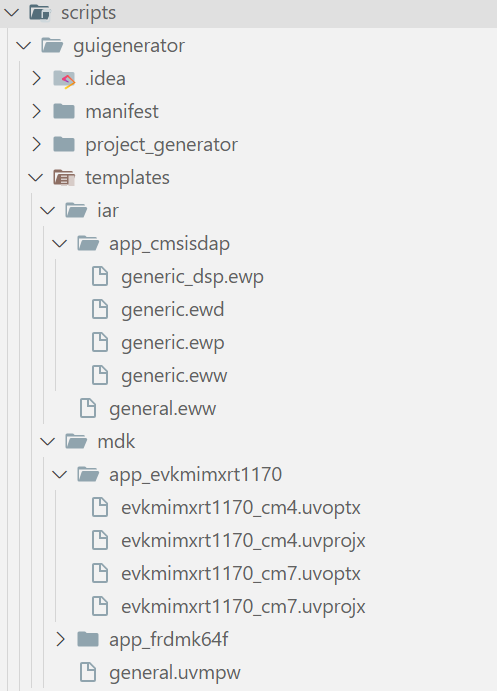

Currently, only IAR and Keil MDK are supported. For IAR, the *.ewp and *.ewd are necessary. For Keil MDK, we have provide project template files for each board, you need to set *.uvprojx and *.uvoptx.

To record such files in CMake, we  provided CMake function **mcux_set_ide_template** and **mcux_replace_ide_template**, the parameter of these two function are same:

- BASE_PATH: The base path for source which using relative path, if BASE_PATH is not provided, the source path is relative to current CMake file 
- TOOLCHAINS: The toolchain targeted by SOURCE
- SOURCE: The location of the project template file

Here is the example:

```cmake
# sdk-next/mcu-sdk-3.0/boards/evkmimxrt1170/cm7/IDE.cmake
mcux_set_ide_template(
        BASE_PATH ${SdkRootDirPath}
        TOOLCHAINS mdk
        SOURCE scripts/guigenerator/templates/mdk/app_evkmimxrt1170/evkmimxrt1170_cm7.uvoptx
                scripts/guigenerator/templates/mdk/app_evkmimxrt1170/evkmimxrt1170_cm7.uvprojx
)
# sdk-next/mcu-sdk-3.0/boards/evkmimxrt1170/demo_apps/hello_world/cm7/IDE.cmake
mcux_replace_ide_template(
        BASE_PATH ${SdkRootDirPath}
        TOOLCHAINS iar
        SOURCE scripts/guigenerator/templates/iar/app_jlinkswd/generic.ewp
                scripts/guigenerator/templates/iar/app_jlinkswd/generic.ewd
                scripts/guigenerator/templates/iar/general.eww
)
```

Note: Make sure mcux_replace_ide_template is used after mcux_set_ide_template, otherwise you will get the error message: IDE template is not set before, please use mcux_ide_template instead of mcux_replace_ide_template

#### IDE option

In general, IDEs support some special debugging settings, which are not implemented in the native CMake build system. For example, IAR support to selects the reset strategy to be used when the debugger starts, Keil MDK support to load application at startup, etc.

The meta build system provide CMake function **mcux_set_ide_option** and **mcux_replace_ide_option** for IDE option, the parameter of these two function are same:

  - TOOLCHAINS: The toolchain targeted by the option
  - TARGETS: The build configuration targeted by the option, such as debug/release/flexspi_nor_debug/flexspi_nor_release, etc.
  - SETTING: The name of the option to be set
  - VALUE: The value of the option

Here is the example:
```cmake
# sdk-next/mcu-sdk-3.0/boards/evkmimxrt1170/cm7/IDE.cmake
mcux_set_ide_option(
        TOOLCHAINS iar
        TARGETS ram_0x1400_debug ram_0x1400_release
        SETTING cmsisdap_resetlist
        VALUE software
# sdk-next/mcu-sdk-3.0/boards/evkmimxrt1170/demo_apps/hello_world/cm7/IDE.cmake
mcux_replace_ide_option(
        TOOLCHAINS iar
        TARGETS ram_0x1400_debug ram_0x1400_release
        SETTING cmsisdap_resetlist
        VALUE hardware
)
```

Note: For same toolchain and targets targeted by same option, make sure mcux_replace_ide_option is used after mcux_set_ide_option, otherwise you will get the error message: setting is not set before, please use mcux_set_ide_option instead of mcux_replace_ide_option.

For details of commonly used option settings, please refer to [IDE Option Setting](#ide-option-setting)

#### Special functional scripts

Some IDEs may use scripts to initialize the compilation environment before and after the compilation phase, or to process the image files generated by the compilation, or to initialize the flash before the start of debugging, etc. So we need to support the recording of these scripts in CMake with special functions.

The meta build system provide CMake function **mcux_set_ide_file** and  **mcux_replace_ide_file** for IDE option, the parameter of these two function are same:

- BASE_PATH: The base path for IDE script which using relative path, if BASE_PATH is not provided, the script path is relative to current CMake file 
- TOOLCHAINS: The toolchain targeted by the IDE script
- TARGETS: The build configuration targeted by the IDE scripts, such as debug/release/flexspi_nor_debug/flexspi_nor_release, etc.
- SOURCE: The relative path of the IDE script
- ATTRIBUTE: The attribute of the script, Represents the function of the script

Here is the example:

```cmake
# sdk-next/mcu-sdk-3.0/boards/evkmimxrt1170/cm7/IDE.cmake
mcux_set_ide_file(
        BASE_PATH ${SdkRootDirPath}
        TOOLCHAINS iar
        SOURCE boards/${board}/evkmimxrt1170_connect_cm7.mac
        TARGETS sdram_txt_debug sdram_txt_release ram_0x1400_debug ram_0x1400_release
        ATTRIBUTE macro-file
)
# sdk-next/mcu-sdk-3.0/boards/evkmimxrt1170/demo_apps/hello_world/cm7/IDE.cmake
mcux_replace_ide_file(
        TOOLCHAINS iar
        SOURCE evkmimxrt1170_connect_cm7.mac
        TARGETS sdram_txt_debug sdram_txt_release ram_0x1400_debug ram_0x1400_release
        ATTRIBUTE macro-file
)
```

Note: For same toolchain and targets targeted by same option, make sure mcux_replace_ide_file is used after mcux_set_ide_file, otherwise you will get the error message: Attribute file is not set before, please use mcux_set_ide_file instead of mcux_replace_ide_file

For details of supported attribute file, please refer to [IDE Script Setting](#ide-script-setting)

### Variables

Variable mechanism is introduced to facilitate data record in both CMake and Kconfig for MCUXpresso SDK.

For example, in CMake with a `board` variable in the source, one copy of the following project segment data can be shared by all boards examples without any duplication.

```cmake
if (CONFIG_MCUX_PRJSEG_module.board.suite)
    mcux_add_source(
        BASE_PATH ${SdkRootDirPath}/boards/${board} # "board" variable shall be defined in each board so that each board can use this project segment
        SOURCES dcd.c dcd.h
    )
    ...
endif()
```

In Kconfig, the same `board` variable can set the board Kconfig path for all boards.

```bash
rsource "${board}/Kconfig"
```

There are some required variables which must be provided for each build to make the CMake configuration process run passed.

Besides, customized variables are allowed for some software data recorded although not suggested.

#### Required Variables

There are some required variables which shall be defined in advance to make the BCP workable. These variables are generally related to hardware related information.

In the BS, all these required variables can be defined in CMake to make the build work, but to enable the switch across device parts in run time in Kconfig, most hardware related variables are moved into Kconfig.chip because Kconfig mechanism can make sure that when you switch device part, all related variables can be switch at the same time.

Here is the CMake stored variable table:

| Variable Name        | Explanation               | Acquisition                              | Used in           | Usage                                    |
| -------------------- | ------------------------- | ---------------------------------------- | ----------------- | ---------------------------------------- |
| SdkRootDirPath       | SDK root directory        | Automatically set by BS                  | CMake             | Secify sdk root path like `include(${SdkRootDirPath}/devices/common/device_header.cmake)` |
| board                | board name, like frdmk64f | Provided in cmdline argument, also need to record it in board variable cmake | CMake and Kconfig | Specify the target board, like `${SdkRootDirPath}/boards/${board}` |
| device               | device name, like MK64F12 | Device variable cmake                    | CMake and Kconfig | Specify the target device, like `${SdkRootDirPath}/devices/\${soc_series}/${device}` |
| core_id              | Core id, like cm33_core0  | Device variable cmake. This is only required for multicore device. | Kconfig           | Specify the core_id, like `rsource "${core_id}/Kconfig`.<br>This is only needed for multiple core device Kconfig. |
| core_id_suffix_name  | Core id suffix name       | Device variable cmake                    | CMake             | Unify data record across single core and multicore device. For example, for the same hello_world project name, in multicore device, it is may called hello_world_cm4 and hello_world_cm7 while in single core device, it is may called hello_world, then "hello_world${core_id_suffix_name}" can work for all cases. For cm4 core, it can be "_cm4", for cm7 core, it can be "_cm7", for single core, it can be "" |
| multicore_foldername | multicore folder name     | Device variable cmake                    | CMake             | Unify data record across single core and multicore device. For example, for the same hello_world project root, in multicore device evkmimxrt1170, it is boards/evkmimxrt1170/demo_apps/hello_world/cm4 and boards/evkmimxrt1170/demo_apps/hello_world/cm7 while in single core board frdmk64f, it is boards/frdmk64f/demo_apps/hello_world, then "boards/evkmimxrt1170/demo_apps/hello_world/${multicore_foldername}" can work for all cases. For cm4 core, it can be "cm4", for cm7 core, it can be "cm7", for single core, it can be "." |
| soc_series           | soc series                | Soc series cmake                         | CMake             | Specify the soc series, like `${SdkRootDirPath}/devices/${soc_series}/${device}` |

The above variables shall anyway be provided in CMake because they are used before Kconfig process.

Here is the Kconfig stored variable table:

| Variable Name                       | Explanation                              | Acquisition     | Used in | Usage |
| ----------------------------------- | ---------------------------------------- | --------------- | ------- | ----- |
| MCUX_HW_CORE                        | Core                                     | Kconfig process | CMake   |       |
| MCUX_HW_CORE_ID                     | Core id                                  | Kconfig process | CMake   |       |
| MCUX_HW_DEVICE_CORE                 | device core. For single core, it is the device like MK64F12. For multicore, it is device+core like  MIMXRT1176_cm4 or  MIMXRT1176_cm7 | Kconfig process | CMake   |       |
| MCUX_HW_FPU                         | fpu                                      | Kconfig process | CMake   |       |
| MCUX_HW_FPU_TYPE                    | fpu type.                                | Kconfig process | CMake   |       |
| MCUX_HW_DEVICE_ID                   | Device id like  MK64FN1M0xxx12           | Kconfig process | CMake   |       |
| MCUX_HW_DEVICE_PART                 | Device part like  MK64FN1M0VDC12         | Kconfig process | CMake   |       |
| MCUX_TOOLCHAIN_LINKER_DEVICE_PREFIX | NPI provided device default linker file name prefix, like "LINKER devices/${soc_series}/${device}/gcc/${MCUX_TOOLCHAIN_LINKER_DEVICE_PREFIX}_flash.ld", for MK64F12, it is devices/Kinetis/MK64F12/gcc/MK64FN1M0xxx12_flash.ld | Kconfig process | CMake   |       |
| MCUX_TOOLCHAIN_IAR_CPU_IDENTIFIER   | IAR IDE project device identifier        | Kconfig process | CMake   |       |
| MCUX_TOOLCHAIN_MDK_CPU_IDENTIFIER   | MDK IDE project device identifier        | Kconfig process | CMake   |       |

Basically, all type string Kconfig symbol can be regarded as variable and used in CMake.

Except for the above variables, there are variables which are generated in the configuration stage:

| Variable Name          | Explanation                              |
| ---------------------- | ---------------------------------------- |
| MCUX_SDK_PROJECT_NAME  | The processed example name, it equals `PROJECT_NAME`+`core_id_suffix_name` |
| APPLICATION_SOURCE_DIR | Project CMakelists.txt directory like examples/demo_apps/hello_world |
| APPLICATION_BINARY_DIR | Output build directory like `<mcu-sdk-3.0>/build` |

#### Customized Variables

Besides the above variables, you can set your own variable in CMake to facilitate your data record with extension mcux_set_variable.

For the required variables, BCS will guarantee that they are defined before they are used.

For you customized variables, please make sure that your variables are defined before they are used by yourself.

#### Tips For Variable Usage

- Variable value replacement is invisible in CMake process, to avoid potential issues, please minimize the usage of variable.
- To make Kconfig integratable for other Kconfig system, please don't use variables in Kconfig data other than "rsource". "rsource" is only to load Kconfig files.

### Repo Data

MCUXpresso SDK repo CMake and Kconfig data are composed of arch, boards, devices, drivers, components, middlewares and examples. Based on the decoupling principle, all these different kinds data are placed under different folders of the MCUXpresso SDK repo.

#### Arch Data

MCUXpresso SDK support all mainstream soc architecture like ARM, Riscv, DSC. The soc architecture specific data are recorded in `<mcu-sdk-3.0>/arch/<arch>` folder.

Here is the hierarchy of arch data folder:

```yaml
arch:
  arm:
    targets: Commonly shared build targets data like debug and release
    configuration: Commonly shared build configuration data
    cortexm: Core settings
    CMSIS: CMSIS headers
  riscv:
  dsc:
  Kconfig: load all Kconfig
```

#### Board Data

Board data stays in boards folder. Here is a hierarchy demonstrated with single core device board frdmk64f and multicore device board evkmimxrt1170:

```yaml
boards:
  frdmk64f: # A single core device board
    CMakeLists.txt: Board specific contents like components and settings
    Kconfig: Board software Kconfig, mainly specify board specific component and project segment dependency
    Kconfig.defconfig: Board specific components selection and configuration for invisible Kconfig symbols
    prj.conf: Board specific components selection and configuration
    <category>_example_list.yml: Board example list like sdk_example_list, freertos_example_list, etc
    variable.cmake: Board variables
    board_runner.cmake: Board debug settings
    demo_apps:
      hello_world:
        reconfig.cmake: Board example reconfig, mainly replace, remove some default board settings
        prj.conf: Board example specific component selection and configuration
      reconfig.cmake: Board example category reconfig, mainly replace, remove some default settings
      prj.conf: Board example category specific component selection and configuration
    rtos_examples: # like above demo_apps
      freertos_hello:
        reconfig.cmake:
        prj.conf:
      reconfig.cmake:
      prj.conf:
  evkmimxrt1170: # A multicore device board
    cm4: Core specific contents folder 
      <category>_example_list.yml: Board core specific example list
      Kconfig: Board core software Kconfig, mainly specify board core specific component and project segment dependency
      Kconfig.defconfig: Board core specific components selection and configuration for invisible Kconfig symbols
      prj.conf: Board core specific components selection and configuration
      setting.cmake: Board core specific data and settings
      variable.cmake: Board core specific variables
    cm7: # Just like above cm4 core
      <category>_example_list.yml:
      Kconfig:
      Kconfig.defconfig:
      prj.conf: 
      setting.cmake:
      variable.cmake:
    CMakeLists.txt: Board specific contents like components and settings
    Kconfig: Board software Kconfig, mainly specify board specific component and project segment dependency
    Kconfig.defconfig: Board specific components selection and configuration for invisible Kconfig symbols
    prj.conf: Board specific components selection and configuration
    variable.cmake: Board variables
    board_runner.cmake: Board debug settings
    demo_apps:
      reconfig.cmake:  Board example category reconfig, mainly replace, remove some default board settings
      hello_world:
        cm4:
          reconfig.cmake: Board core specific example reconfig, mainly replace, remove some default board settings
          prj.conf: Board core example specific components selection and configuration
        cm7:
          reconfig.cmake:
          prj.conf:
        reconfig.cmake: Board example category reconfig, mainly replace, remove some default board settings
        prj.conf: Board example category specific component selection and configuration
  prj.conf: components selection and configuration by all boards
```

Note, the supported examples by the board shall be recorded inside `boards/<board>/<category>_example_list.yml`. For multicore boards, since each core has different examples, the supported examples shall be recorded inside `boards/<board>/<core_id>/<category>_example_list.yml`.

A typical sdk_example_list.yml is like

```yaml
hello_world:
 required: true # false or without "required" is treated as NOT supported.
freertos_hello:
 required: true
```

#### Device Data

Device data stays in devices folder. Here is the device data hierarchy demonstrated with single core device MK64F 2 and multicore device MIMXRT1176:

```yaml
devices:
  Kinetis: Device socs sery
    MK63F12:
      Kconfig: Device software Kconfig, mainly specify board specific component and project segment dependency
      Kconfig.chip: Device hardware Kconfig related to device and core
      Kconfig.defconfig: Device specific components selection and configuration for invisible Kconfig symbols
      CMakeLists.txt: Device specific contents like components and settings, usually, just load mainset cmakelist
      driver:
        CMakeLists.txt: Device specific drivers
        Kconfig: Device specific drivers Kconfig
      prj.conf: Device specific components selection and configuration for visible Kconfig symbols
    MK64F12:
      Kconfig: Device software Kconfig, mainly specify board specific component and project segment dependency
      Kconfig.chip: Device hardware Kconfig related to device and core
      Kconfig.defconfig: Device specific components selection and configuration for invisible Kconfig symbols
      CMakeLists.txt: Device specific contents like components and settings
      driver:
        CMakeLists.txt: Device specific drivers
        Kconfig: Device specific drivers Kconfig
      prj.conf: Device specific components selection and configuration   
    prj.conf: Components selection and configuration by all Kinetis series
  RT:
    MIMXRT1175:
      cm4:
        driver:
          CMakeLists.txt: Device core specific drivers
        Kconfig: Device core software Kconfig, mainly specify board specific component and project segment dependency
        Kconfig.chip: Device core hardware Kconfig related to device and core
        Kconfig.defconfig: Device core specific components selection and configuration for invisible Kconfig symbols
        setting.cmake: Device core specific data and settings
        variable.cmake: Device core specific variables
        prj.conf: Device core specific components selection and configuration
      cm7: # just like core cm4 
        driver:
          CMakeLists.txt:
        Kconfig:
        Kconfig.chip:
        Kconfig.defconfig:
        setting.cmake:
        variable.cmake:
        prj.conf:
      CMakeLists.txt: Device specific contents like components and settings, usually, just load mainset cmakelist
      driver:
        CMakeLists.txt: Device specific drivers
      Kconfig: Device 
      Kconfig.chip: Device software Kconfig, mainly specify board specific component and project segment dependency
      Kconfig.defconfig: Device specific components selection and configuration for invisible Kconfig symbols
      prj.conf: Device specific components selection and configuration
    MIMXRT1176:
      cm4:
        driver:
          CMakeLists.txt: Device core specific drivers
        Kconfig: Device core software Kconfig, mainly specify board specific component and project segment dependency
        Kconfig.chip: Device core hardware Kconfig related to device and core
        Kconfig.defconfig: Device core specific components selection and configuration for invisible Kconfig symbols
        setting.cmake: Device core specific data and settings
        variable.cmake: Device core specific variables
        prj.conf: Device core specific components selection and configuration
      cm7: # just like core cm4 
        driver:
          CMakeLists.txt:
        Kconfig:
        Kconfig.chip:
        Kconfig.defconfig:
        setting.cmake:
        variable.cmake:
        prj.conf:
      CMakeLists.txt: Device specific contents like components and settings
      driver:
        CMakeLists.txt: Device specific drivers
      Kconfig: Device 
      Kconfig.chip: Device software Kconfig, mainly specify board specific component and project segment dependency
      Kconfig.defconfig: Device specific components selection and configuration for invisible Kconfig symbols
      prj.conf: Device specific components selection and configuration
    prj.conf: Components selection and configuration by all RT series
  prj.conf: Components selection and configuration by all devices
```

#### Example Data

All examples are expected to be placed under `examples` folder in their category.

```yaml
examples:
  demo_apps: 
    prj.conf: Component selection and configuration for all examples under demo_apps
    hello_world: 
      Kconfig: hello_world example Kconfig, if there is no project specific configuration data, please don't add it
      CMakeLists.txt: hello world example CMakeLists.txt
      prj.conf: hello world example component selection and configuration
  rtos_examples: 
    prj.conf: Component selection and configuration for all examples under rtos_examples
    freertos_hello:
      Kconfig: freertos_hello example Kconfig, if there is no project specific configuration data, please don't add it
      CMakeLists.txt: freertos_hello example CMakeLists.txt
      prj.conf: freertos hello example component selection and configuration
  prj.conf: all examples shared component selection and configuration
```

#### Driver Data

Base SDK drivers are placed under `drivers` folder.

You can use `mcux_load_all_cmakelists_in_directory(${SdkRootDirPath}/drivers)` to recursively include all drivers CMakelists.txt once.

```yaml
drivers:
  clock:
    CMakeLists.txt:
    Kconfig:
  common:
    CMakeLists.txt:
    Kconfig:
  <other drivers>:
    CMakeLists.txt:
    Kconfig:
  Kconfig: load all driver Kconfig
```

#### Component Data

Base SDK components are placed under `components` folder.

You can use `mcux_load_all_cmakelists_in_directory(${SdkRootDirPath}/components)` to recursively include all components CMakelists.txt once.

```yaml
components:
  serial_manager:
    CMakeLists.txt:
    Kconfig:
  <other components>:
    CMakeLists.txt:
    Kconfig:  
  Kconfig: load all components Kconfig
```

#### Assembly Point

All the above data are pieces of building blocks. For any build process, all data shall be loaded for selection and configuration. The assembly point is the start entry from where all CMakes and Kconfigs can be loaded.

The assembly point for all cmakes is the root CMakeLists.txt. It looks like

```cmake
# Load device CMakeLists.txt
mcux_add_cmakelists(${SdkRootDirPath}/devices/${soc_series}/${device})

# Load board CMakeLists.txt
mcux_add_cmakelists(${SdkRootDirPath}/boards/${board})

# Load all drivers
mcux_load_all_cmakelists_in_directory(${SdkRootDirPath}/drivers)

# all components
mcux_load_all_cmakelists_in_directory(${SdkRootDirPath}/components)

# middlewares
mcux_add_cmakelists(${SdkRootDirPath}/rtos/freertos/freertos-kernel OPTIONAL)
mcux_add_cmakelists(${SdkRootDirPath}/middleware/fatfs OPTIONAL)
mcux_add_cmakelists(${SdkRootDirPath}/middleware/multicore OPTIONAL)
```

The assembly point for all Kconfig is the root Kconfg.mcuxpresso which is

```bash
# arch
rsource "arch/Kconfig"

# board
rsource "boards/Kconfig"

# device
rsource "devices/Kconfig"

# Driver config
rsource "drivers/Kconfig"

# Component config
rsource "components/Kconfig"

# middleware config
menu "Middleware"
    osource "middleware/mbedtls/Kconfig"
    osource "rtos/freertos/freertos-kernel/Kconfig"
    osource "middleware/fatfs/Kconfig"
    osource "middleware/multicore/Kconfig"
endmenu
```

The CMake include and Kconfig rsource(load) are generally aligned which means they shall stay together corresponding each other.

For other CMake based BS which wants to integrate MCUXpresso SDK, it may needs to set up the new assembly point file for CMake and Kconfig files in this repo.

## Kconfig Interface

menuconfig and guiconfig are 2 available interactive configuration interfaces to start a GUI to do run time selection and configuration for Kconfig options.

menuconfig is a curses-based interface that runs in the terminal while guiconfig is a graphical configuration interface.

Since the Kconfig data has variable inside, they need to be processed. BS has integrated this process into the build process. You can use west cmdline to start the GUI.

1. Run cmake configuration

   ```bash
   west build -b frdmk64f examples/demo_apps/hello_world --cmake-only
   ```

   You can ignore "--cmake-only", then the projecrt will be built.
2. Run guiconfig target

   ```bash
   west build -t guiconfig
   ```

   Then you will get the Kconfig GUI launched, like

   

   You can select/deselect and modify to do reconfiguration and remember to save.

   After you save and close, you can directly run "west build" to do the build.

## Kconfig Process Flow

The Kconfig files and related prj.conf with priority are put into the Kconfig processor.

The direct output is the .config and config headers. Any updates in input Kconfig, output .config and config header will trigger a Kconfig process in next build cmd

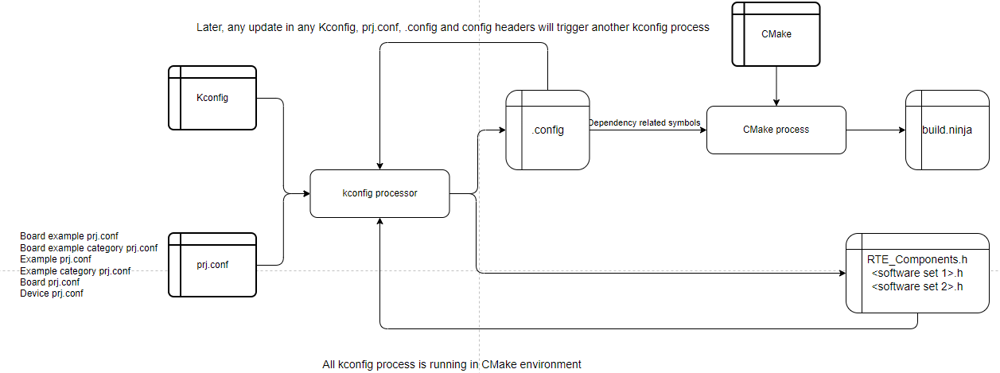

### prj.conf

As illustrated previously, prj.conf is the pre set value for Kconfig symbols. It is the input for the Kconfig process.

Unlike the CMake which shall be explicitly included, the proj.conf will be loaded implicitly with different priority.

Here is the priority list from low to high

1. devices/prj.conf
2. devices/`<soc_series>`/prj.conf
3. devices/`<soc_series>`/`<device>`/prj.conf
4. devices/`<soc_series>`/`<device>`/`<core_id>`/prj.conf
5. boards/prj.conf
6. boards/`<board>`/prj.conf
7. boards/`<board>`/`<core_id>`/prj.conf
8. examples/prj.conf
9. examples/`<example_category>`/prj.conf
10. boards/`<board>`/`<example_category>`/prj.conf
11. boards/`<board>`/`<example_category>`/`<example>`/prj.conf

High priority prj.conf data will override low priority prj.conf data.

### .config

.config will be filtered to get the component and project segment dependency symbol values, such symbol values will be put into cmake process so that cmake knows which component and project segment data shall be included into the build process.

For example, if `CONFIG_MCUX_COMPONENT_driver.uart` is `y` in .config, then the following sources and includes will be added into the build during cmake process, otherwise not.

```cmake
if (CONFIG_MCUX_COMPONENT_driver.uart)
    mcux_add_source(
        SOURCES fsl_uart.h 
                fsl_uart.c
    )
    mcux_add_include(
        INCLUDES .
    )
endif()
```

### config headers

The Kconfig symbols and the values will be generated into config headers placed in build binary folder.

The config headers shall be included in the source in advance and the build binary folder will be added into includes so that all config headers will be added into build tree.

If it is not set, then all Kconfig symbols and values will be generated header named `RTE_Components.h`.

If you want your components Kconfig symbols and values to be generated `endmenu` into customized header, you can set Kconfig menu with (header name). Here is an example with Freertos kernel.

```bash
menu "freertos-kernel(FreeRTOSConfig.h)" # All freertos kernel Kconfig symbols and values will be generated into FreeRTOSConfig.h
    config MCUX_COMPONENT_middleware.freertos-kernel
        bool "middleware.freertos-kernel"
        select MCUX_COMPONENT_middleware.freertos-kernel.extension

    config MCUX_COMPONENT_middleware.freertos-kernel.extension
    ......
endmenu
```

## Build Process Flow

Broadly speaking, the build process flow can be divide into Kconfig process and CMake process.

When you run a build, BS start from the example CMakelists.txt to work:

```cmake
cmake_minimum_required(VERSION 3.22.0)

include(${SdkRootDirPath}/cmake/extension/mcux.cmake)
## In this mcux.cmake, BS does the following work
# 1. Load used extension modules like python.cmake, sysbuild.cmake
# 2. Clean cached cmake compiler flags variable
# 3. Load toolchain.cmake
# 4. Load board variable
# 5. Load device variable
# With board and device variable, cmake has the environment to start Kconfig because Kconfig needs board and device variables to work. This execution will be done in following "project"

project(hello_world LANGUAGES C CXX ASM PROJECT_ROOT_PATH boards/${board}/demo_apps/hello_world/${multicore_foldername})
## In this "project" macro, BS continuously does the following work
# 6. Add execution cmake target
# 7. Add pristine cmake target
# 8. Execute Kconfig process to get .config and config headers
# 9. Process .config to get 
#  a. All variables used in CMakes so that all cmakes can be included
#  b. component and project segment if-endif guard condition value so that cmake knows whether include or skip the component or project segment
#  config headers with compiler macros inside which are in the build tree
# 10. Add run cmake target 
# 11. Add GUI generation cmake target

include(${SdkRootDirPath}/CMakeLists.txt)
# ${SdkRootDirPath}/CMakeLists.txt is the assembly point for all board/device, drivers, components,  middlewares cmake data.
# Here is its contents
# # Load device CMakeLists.txt
# mcux_add_cmakelists(${SdkRootDirPath}/devices/${soc_series}/${device})
# Load board CMakeLists.txt
# mcux_add_cmakelists(${SdkRootDirPath}/boards/${board})
# Load all drivers
# mcux_load_all_cmakelists_in_directory(${SdkRootDirPath}/drivers)
# all components
# mcux_load_all_cmakelists_in_directory(${SdkRootDirPath}/components)
# CMSIS
# mcux_add_cmakelists(${SdkRootDirPath}/CMSIS)
# middlewares
# mcux_add_cmakelists(${SdkRootDirPath}/rtos/freertos/freertos-kernel OPTIONAL)
# mcux_add_cmakelists(${SdkRootDirPath}/middleware/fatfs OPTIONAL)
# mcux_add_cmakelists(${SdkRootDirPath}/middleware/multicore OPTIONAL)
# After the include(${SdkRootDirPath}/CMakeLists.txt), the project has got the environment setup and all depended data included

# If needed, load other customized cmake
include(${SdkRootDirPath}/examples/demo_apps/reconfig.cmake OPTIONAL)
include(${SdkRootDirPath}/${project_root_path}/reconfig.cmake OPTIONAL)

# Add the project self source and include
mcux_add_source(
    SOURCES hello_world.c
)

mcux_add_include(
    INCLUDES .
)
```

## Enable An Example

Please firstly make sure that the target board and device data are ready, then follow the example CMakelists.txt pattern in [Project](#project) chapter and make your own one.

If the default board and device data and configuration cannot satisfy, then you need to do customization for the certain board or device or both.

BCS provides following ways to do the customization.

1. Reconfig CMake

   For example, the hello_world example CMakelists.txt is defined in "examples/demo_apps/hello_world". Inside it, there are 2 optional included reconfig.cmake, like

   ```cmake
   include(${SdkRootDirPath}/examples/demo_apps/reconfig.cmake OPTIONAL)
   # project_root_path here means boards/frdmk64f/demo_apps/hello_world
   include(${SdkRootDirPath}/${project_root_path}/reconfig.cmake OPTIONAL)
   ```

   You can add reconfig.cmake in any sub folder of the above 2 optional cmake path to different level reconfig.cmake and remember to include it recursively in deeper level cmake.

   For example, if you add a boards/frdmk64f/demo_apps/reconfig.cmake, then you should be awared of that this reconfig.cmake shall apply for all demo_apps in frdmk64f.

   In these reconfig.cmake, [remove](#remove) extensions can be used to remove board/device common data and settings. After removing the previous data and settings, customization data and settings can be added.
2. prj.conf

   For component selection and configuration, you can use different level prj.conf to achieve it. Refer the priority level in [prj.conf](#prj-conf) to set the data.

## Enable West Flash and Debug

Like Zephyr, BS supports setting up configuration for flash runners (invoked from west flash) which allows for customising how commands are used when programming boards.

### board_runner.cmake

`mcux.cmake`will always include this file under `${SdkRootDirPath}/boards/<board>` to get runner arguments and which runners are supported for this board. Here is an example:

```cmake
board_runner_args(pyocd "--target=mimxrt1170_${core_id}")
if(${core_id} STREQUAL cm7)
    board_runner_args(jlink "--device=${MCUX_HW_DEVICE_ID}_M7" "--reset-after-load")
elseif(${core_id} STREQUAL cm4)
    board_runner_args(jlink "--device=${MCUX_HW_DEVICE_ID}_M4")
endif()
board_runner_args(linkserver "--device=${MCUX_HW_DEVICE_ID}:MIMXRT1170-EVK")
board_runner_args(linkserver "--core=${core_id}")

include(${SdkRootDirPath}/cmake/extension/runner/jlink.board.cmake)
include(${SdkRootDirPath}/cmake/extension/runner/pyocd.board.cmake)
include(${SdkRootDirPath}/cmake/extension/runner/linkserver.board.cmake)
```

`board_runner_args` is used to pass runner speicfic arguments and then you have to include the board supported runner cmake file from `${SdkRootDirPath}/cmake/extension/runner/`.

## IDE Generation

CMake is a text-oriented tool that uses the command-line, for many developers, especially those who are used to working on Windows operating system, this is not a great experience for coding and debugging. Therefore the meta build system supports GUI project generation for specific IDE.

### Prerequisite

Currently, we have not implemented all features through Python. So, in order to generate IDE GUI projects, you have to prepare the ruby 3.1 environment, You can refer [SDK Generator V3 environment setup](https://confluence.sw.nxp.com/display/MCUXSDK/Getting+Started+With+SDK+Generator+V3#GettingStartedWithSDKGeneratorV3-EnvironmentSetup).

In short words:

- For windows: use [portable_ruby](https://bitbucket.sw.nxp.com/projects/MCUCORE/repos/mcu-sdk-generator/browse/bin/windows)
- For Linux/MacOS: use [rbenv](https://github.com/rbenv/rbenv) to install `ruby 3.1.2` and then download [Gemfile](https://bitbucket.sw.nxp.com/projects/MCUCORE/repos/mcu-sdk-generator/raw/Gemfile?at=refs%2Fheads%2Fdevelop%2Fmcu_sdk_generator) and [Gemfile.lock](https://bitbucket.sw.nxp.com/projects/MCUCORE/repos/mcu-sdk-generator/raw/Gemfile.lock?at=refs%2Fheads%2Fdevelop%2Fmcu_sdk_generator) in an empty directory and then run `gem install bundle && bundle install` in it.

### Command

It's quiet easy for you to generate a GUI project definition files, only "--toolchain [iar|mdk] -t guiproject" is required for west command. It tells CMake to run guiproject target to generate project files for specific toolchain.

If you are running a pristine build, please specify board/examples/toolchain/core_id on the command line. For example:

```bash
west build -b evkmimxrt1170 examples/demo_apps/hello_world --toolchain iar -Dcore_id=cm7 --config flexspi_nor_debug -p always -t guiproject
```

If you have run this command, there is a simpler and faster command:

```bash
west build -t guiproject
```

After the command runs, the project files are generated into the compilation directory. You can find it in command line, for example:

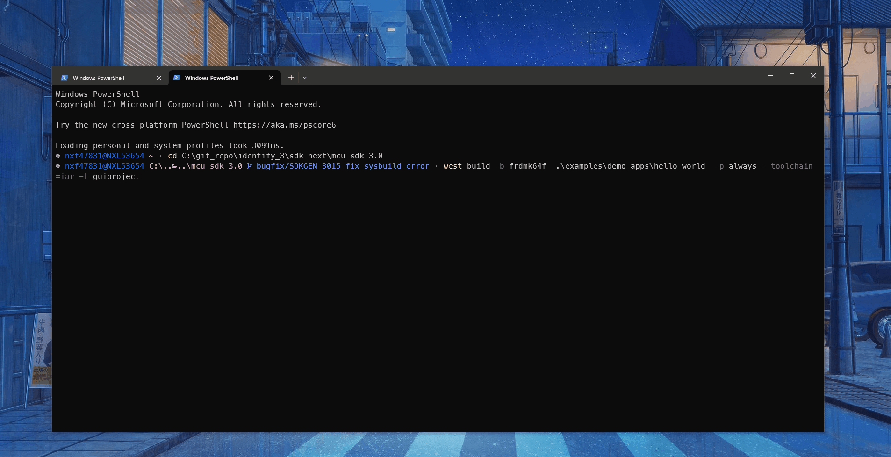

> [!NOTE]
>
> Currently only IAR and MDK are supported, but we will support other toolchains in the future.
>
> Currently the generation script is ported from SDK Generator which use Ruby language. During the official release phase we will change to python to reduce the effort of configuring development environment.

## System Build

Sysbuild is a higher-level build system that can be used to combine multiple other build systems together. It's ported from [Sysbuild (System build) — Zephyr Project](https://docs.zephyrproject.org/latest/build/sysbuild/index.html#sysbuild-zephyr-application). For meta build system, it's mainly used for multi-image build.

### Sysbuild files

To include sub projects into building system, you must prepare `sysbuild.cmake` into main application folder. Sub projects can be located anywhere, which are imported by `ExternalZephyrProject_Add` command inside sysbuild.cmake. For example:

```cmake
# examples/middleware/multicore/multicore_examples/hello_world/primary/sysbuild.cmake

ExternalZephyrProject_Add(
        APPLICATION hello_world_secondary_core
        SOURCE_DIR  ${APP_DIR}/../secondary
        board ${SB_CONFIG_secondary_board}
        core_id ${SB_CONFIG_secondary_core_id}
        config ${SB_CONFIG_secondary_config}
        toolchain ${SB_CONFIG_secondary_toolchain}
)

# Let's build the secondary application first
add_dependencies(${DEFAULT_IMAGE} hello_world_secondary_core)
```

The build order can by set by [add_dependencies](https://cmake.org/cmake/help/latest/command/add_dependencies.html#add-dependencies) function in sysbuild.cmake.

The variables in sysbuild.cmake can be defined inside the file. Or you can pass them with west command.

In practice, however, it is more common to set these variables automatically via kconfig to support multiple platforms in a more flexible way. For example, you can prepare a Kconfig.sysbuild in main application folder:

```bash
# examples/middleware/multicore/multicore_examples/hello_world/primary/Kconfig.sysbuild

config secondary_board
    string
    default "$(board)"

config secondary_core_id
    string
    default "cm4" if $(board) = "evkmimxrt1170" && $(core_id) = "cm7"
    default "cm33_core1" if $(board) = "lpcxpresso55s69" && $(core_id) = "cm33_core0"

config secondary_config
    string
    default "debug" if $(config) = "debug"
    default "debug" if $(config) = "flexspi_nor_debug"

config secondary_toolchain
    string
    default "$(toolchain)"
```

One thing to emphasize is that, sysbuild is only used to organize how individual images are compiled, but in reality, how images are included is set by the project's own cmakelsist.txt. For example, you must import the secondary core binary in primary core image CMakeLists.txt:

```cmake
# mcu-sdk-3.0/examples/middleware/multicore/multicore_examples/hello_world/secondary/CMakeLists.txt
mcux_convert_binary(
        TOOLCHAINS armgcc mdk iar
        BINARY ${APPLICATION_BINARY_DIR}/core1_image.bin
)
# mcu-sdk-3.0/examples/middleware/multicore/multicore_examples/hello_world/primary/CMakeLists.txt
mcux_add_iar_configuration(
        LD "--image_input=${APPLICATION_BINARY_DIR}/../hello_world_secondary_core/core1_image.bin,_core1_image,__core1_image,4 "
)
```

### Build command

To enable sysbuild, only `--sysbuild` is needed when you run the main application

```bash
west build -b evkmimxrt1170 --sysbuild ./examples/middleware/multicore/multicore_examples/hello_world/primary -Dcore_id=cm7  --config flexspi_nor_debug --toolchain=armgcc -p always
```

You can find build information from terminal:

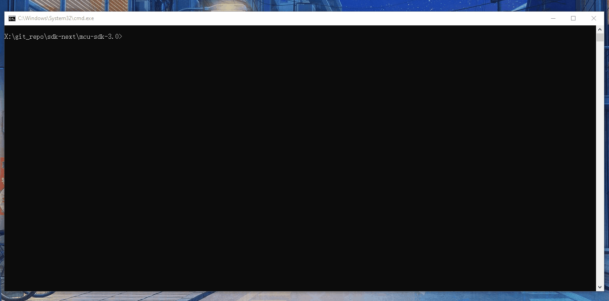

### Kconfig Target

The sysbuild projects can be configured with kconfig, just like a normal project in the meta build system. The only different is the target name, for main application, they're menuconfig or guiconfig, for sub project, you must add project name prefix to differ each target. For example:

```bash
west build -t guiconfig
west build -t hello_world_secondary_core_guiconfig
```

## Integrated Into Other Build System

The meta build system can be integrate into other build system which is based on CMake. In principle, the meta build system use customized CMake function and configured by Kconfig, so that it requires you to:

1. Include `mcu-sdk-3.0/cmake/extension/function.cmake`
2. Load necessary `CMakeLists.txt` files for source code
3. Involve kconfig file into your project

Let's say if you want to use drivers from meta build system, you need to prepare:

1. Kconfig file

   The Kconfig file determines which drivers are available on which devices, it will load drivers kconfig and device kconfig file, for example, if you're working on zephyr, the kconfig file should contain content at least:

   ```bash
   source "$(ZEPHYR_HAL_NXP_MODULE_DIR)/mcux/mcux-sdk/drivers/Kconfig"
   source "$(ZEPHYR_HAL_NXP_MODULE_DIR)/mcux/mcux-sdk/devices/common/Kconfig.common"
   source "$(ZEPHYR_HAL_NXP_MODULE_DIR)/mcux/mcux-sdk/CMSIS/Kconfig"

   if $(BOARD_IDENTIFIER) = "/mimxrt1176/cm7"
   source "$(ZEPHYR_HAL_NXP_MODULE_DIR)/mcux/mcux-sdk/devices/RT/MIMXRT1176/Kconfig.chip"
   source "$(ZEPHYR_HAL_NXP_MODULE_DIR)/mcux/mcux-sdk/devices/RT/MIMXRT1176/cm7/Kconfig.chip"
   endif
   ```

2. CMakeLists.txt

   In meta build system, some variables are used, so that you must set them before loading any CMakeLists.txt,  if you're working on zephyr, for example:

   ```cmake
   include(${CMAKE_CURRENT_LIST_DIR}/../cmake/extension/function.cmake)

   set(MCUX_SDK_PROJECT_NAME ${ZEPHYR_CURRENT_LIBRARY})

   enable_language(C ASM)

   # The varaibles below should be set in zephyr's build system, list here for reference
   set(soc_series RT)
   set(device MIMXRT1176)
   set(SdkRootDirPath ${CMAKE_CURRENT_LIST_DIR}/..)
   set(core_id cm7)
   set(MCUX_HW_CORE cm7f)
   set(MCUX_HW_FPU_TYPE fpv5_dp)

   # load device CMakeLists.txt
   mcux_add_cmakelists(${ZEPHYR_HAL_NXP_MODULE_DIR}/mcux/mcux-sdk/devices/${soc_series}/${device})
   # Load all drivers CMakeList.txt
   mcux_load_all_cmakelists_in_directory(${ZEPHYR_HAL_NXP_MODULE_DIR}/mcux/mcux-sdk/drivers)
   ```

   ***Note: This section is still being evaluated and will be refined subsequently***

## Integrate Other CMake build system

The meta build system is based on CMake, theoretically, it supports the integration of other third-party software based on the CMake compilation system.

There are two ways for this requirement:

1. If the other software want to  use assembler/compiler/linker flags provided by meta build system, you can just import software CMakeLists.txt by [add_subdirectory](https://cmake.org/cmake/help/latest/command/add_subdirectory.html#add-subdirectory) function.  Let's say you have a code that will be compiled into library, the source code is added into a CMake target called "my_library":

   ```cmake
   add_library(my_library STATIC ${SOURCE_FILES})
   ```

   In meta build system project, you can import "my_library" and link it in project CMakeLists.txt:

   ```cmake
   add_subdirectory(path/to/my_library ${CMAKE_CURRENT_BINARY_DIR}/mylib)
   target_link_libraries(${MCUX_SDK_PROJECT_NAME} PRIVATE my_library)
   ```

2. If the other software is a standalone project which has separated configuration, it can be imported by sysbuild.

   For example, you can provide a sysbuild.cmake:

   ```cmake
   ExternalZephyrProject_Add(
           APPLICATION my_library
           SOURCE_DIR  path/to/my_library
           CMAKE_ARGS -DCMAKE_BUILD_TYPE=debug -DCMAKE_TOOLCHAIN_FILE=path/to/toolchain.cmake
   )

   # Let's build the secondary application first
   add_dependencies(${DEFAULT_IMAGE} my_library)
   ```

## IDE Setting

### Assembler/Compiler/Linker Flags

The meta build system use CMake to create build artifacts. In general, CMake doesn’t provide abstraction of flags setting for all kinds of toolchains. So that developer should use the flags for assembler/compiler/linker which follows the rule by each toolchain. 

Here are links for you to refer:

- [IAR][https://wwwfiles.iar.com/AVR/webic/doc/EWAVR_CompilerGuide.pdf]
- [MDK][https://developer.arm.com/documentation/100748/0622/Using-Common-Compiler-Options]
- [ARMGCC][https://gcc.gnu.org/onlinedocs/]

Assembler/Compiler/Linker flags are set with following CMake configuration function, please refer to  [Configuration](#configuration)

For example:

```cmake
    mcux_add_iar_configuration(
        TARGETS flexspi_nor_debug
        CC "-Ol"
        )
```

In the following sections, the commonly used settings are described.

#### Optimizations flags

- IAR

  IAR supported compiler optimization flags are:

  - -On 
  - -Ol  
  - -Om 
  - -Oh
  - -Ohs
  - -Ohz

  Besides, IAR provides special optimization features:

  - --no_size_constraints
  - --no_cse
  - --no_unroll
  - --no_inline
  - --no_code_motion
  - --no_tbaa
  - --no_clustering
  - --no_scheduling

  These settings are set up in the IAR GUI as shown here

  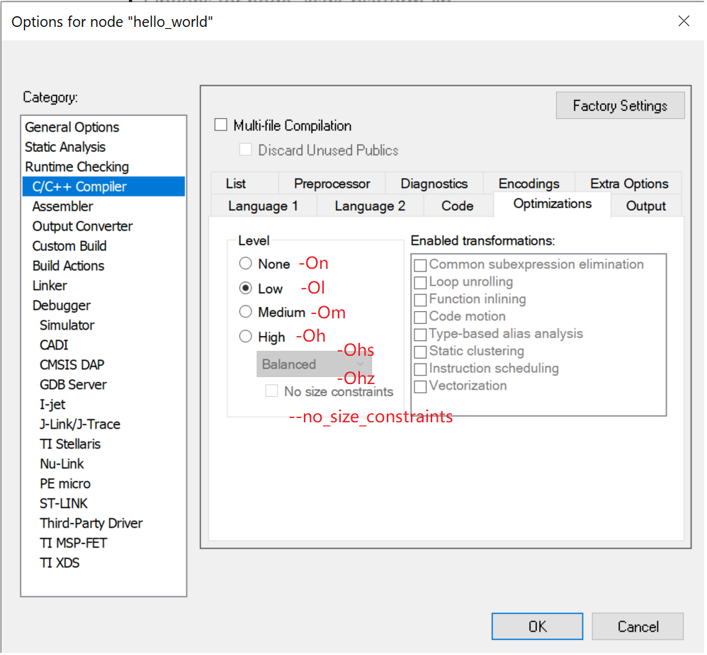

- MDK

  For ARM compiler v6, optimization flags are -O0/-O1/-O2/-O3/-Ofast/-Os/-Oz.

  These flags match with IDE settings as below:

  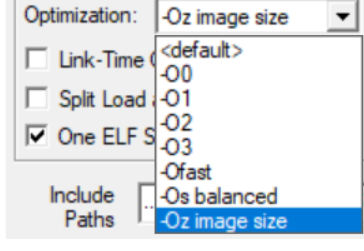

- ARMGCC

  For ARMGCC, optimization flag are -O0/-O1/-O2/-O3/-Os/-Ofast/-Og.

#### Macro definition

Macro is used to preprocess source files, it is a common setting for assembler/compiler. You can use CMake configuration function defined in  [Configuration](#configuration) to set macro definition.

The macro definition follow the pattern "-Dname=value", or "-Dname" if no value provided.

For example:

```cmake
    mcux_add_iar_configuration(
        TARGETS flexspi_nor_debug
        AS "-DDEBUG"
        CC "-DDEBUG -DXIP_EXTERNAL_FLASH=1 -DFSL_SDK_DRIVER_QUICK_ACCESS_ENABLE=1"
        CX "-DDEBUG"
        )
```

#### Heap Stack setting

Heap and stack is setting by linker script. Generally SDK use macro `__stack_size__`and `__heap_size__` to set the size.

It's not identical for different toolchain:

- IAR

  IAR  use linker flags `--config_def __stack_size__=${stack size}` and `--config_def __heap_size__=${heap size}`

  For example

  ```cmake
  mcux_add_iar_configuration(
      LD "--config_def __stack_size__=0x3000 --config_def __heap_size__=0x3000"
      )
  ```

- MDK

  MDK use linker flags `--predefine="-D__stack_size__=${stack size}` and  `--predefine="-D__heap_size__=${heap size}`

  For example

  ```cmake
  mcux_add_mdk_configuration(
  	LD "--predefine=\"-D__stack_size__=0x3000\" --predefine=\"-D__heap_size__=0x3000\""
  )
  ```

- ARMGCC

  ARMGCC use linker flags `-Xlinker --defsym=__stack_size__=${stack size}` and  `-Xlinker --defsym=__heap_size__=${heap size}`

  For example

  ```cmake
  mcux_add_armgcc_configuration(
  	LD "-Xlinker --defsym=__stack_size__=0x3000 -Xlinker --defsym=__heap_size__=0x3000"
  )
  ```

### IDE Option Setting

The IDE option setting is set by CMake function "mcux_set_ide_option" and "mcux_replace_ide_option". The option is set by the SETTING and VALUE fields. For more details, please refer to  [IDE Option](#ide-option)

#### Keil MDK

Supported option for MDK are:

- Update Target before Debugging for Keil

  - SETTING: update-before-debug

  - VALUE: true or false

    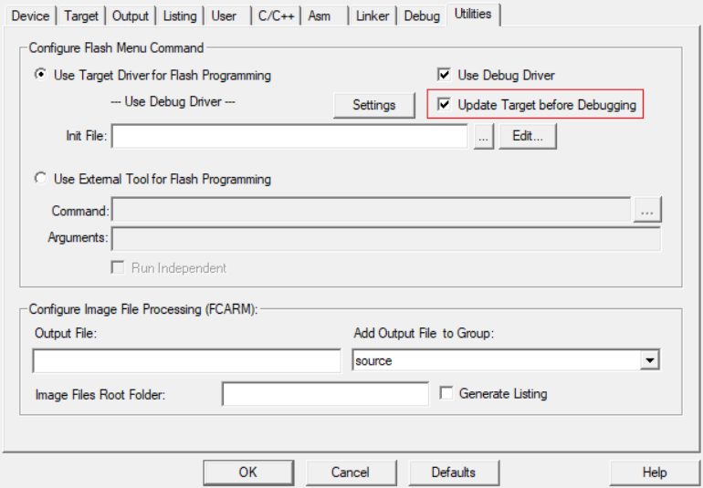

- Load Application at Startup for Keil

  - SETTING: load_application

  - VALUE: true or false

    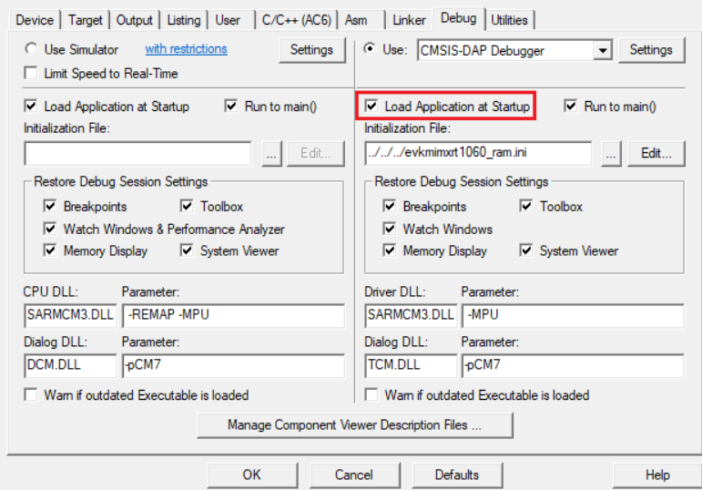

- Set Periodic Window Update for Keil

  - SETTING: periodic_update

  - VALUE: true or false

    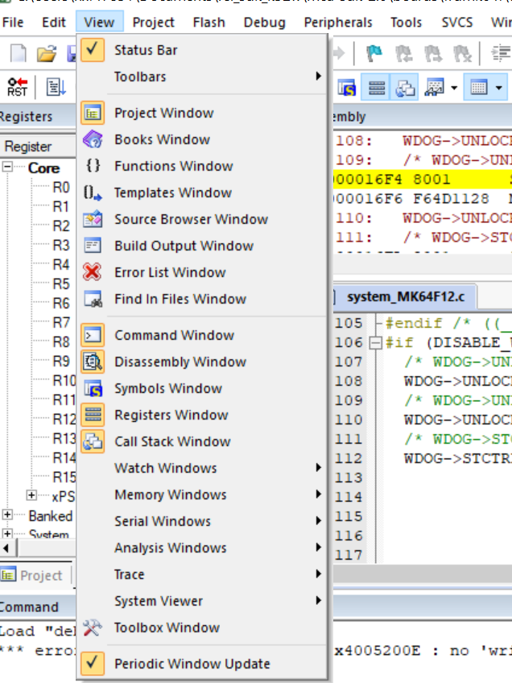

#### IAR

Supported option for IAR are:

- Debugger Extra Options for IAR

  - SETTING: debugger_extra_options

  - VALUE: Specific settings for quote bracketing, for example, ""--macro_param enable_core=1"

    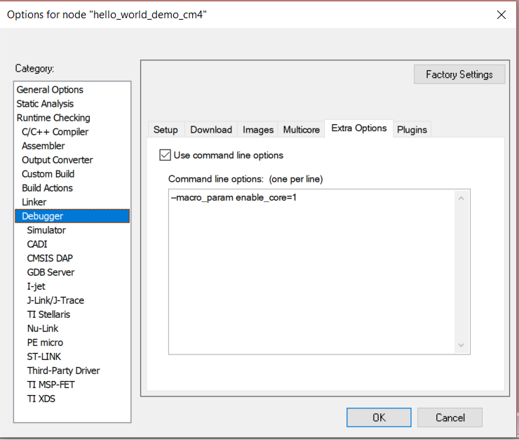

### IDE Script Setting

The IDE option setting is set by CMake function "mcux_set_ide_file" and "mcux_replace_ide_file". The option is set by the SOURCE and ATTRIBUTE  fields. For more details, please refer to  [Special functional scripts](#special-functional-scripts)

#### Keil MDK

Supported attribute for script files are:

- initialization_file

  

- flash_programming_file

  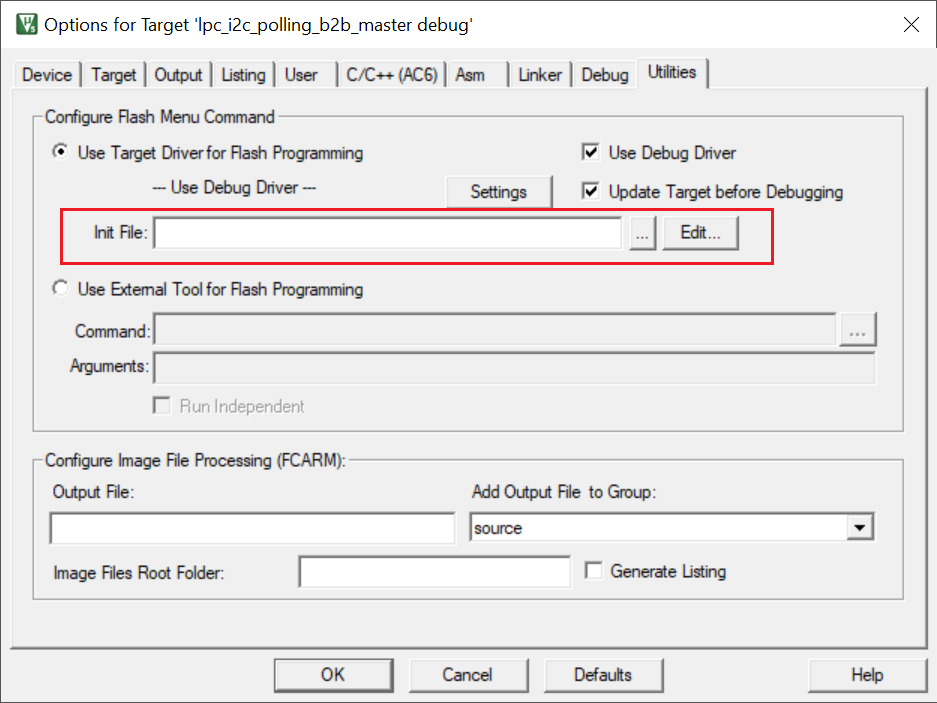

#### IAR

Supported attribute for script files are:

- board-file

  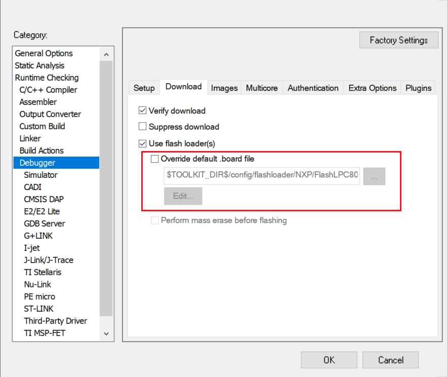

- dlib-config-file

  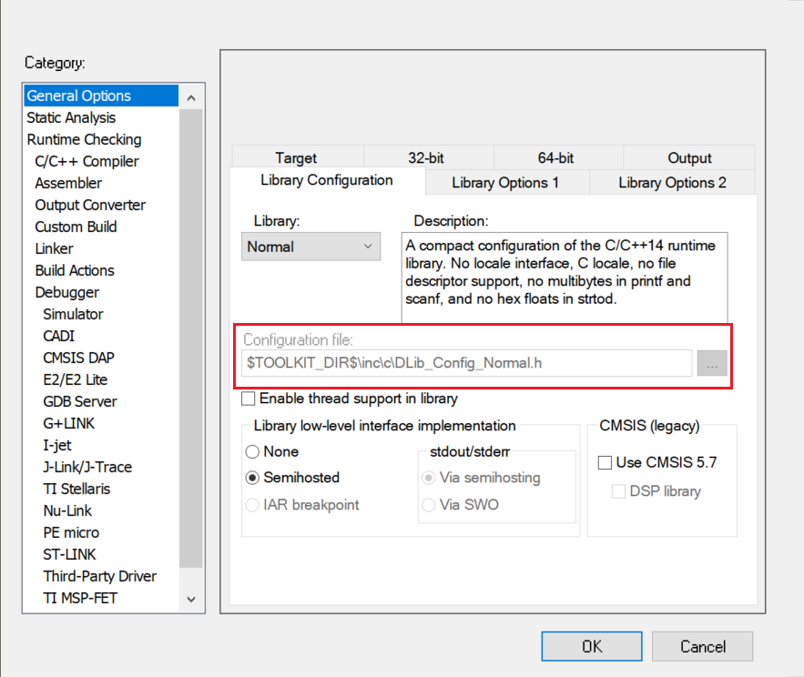

- macro-file

  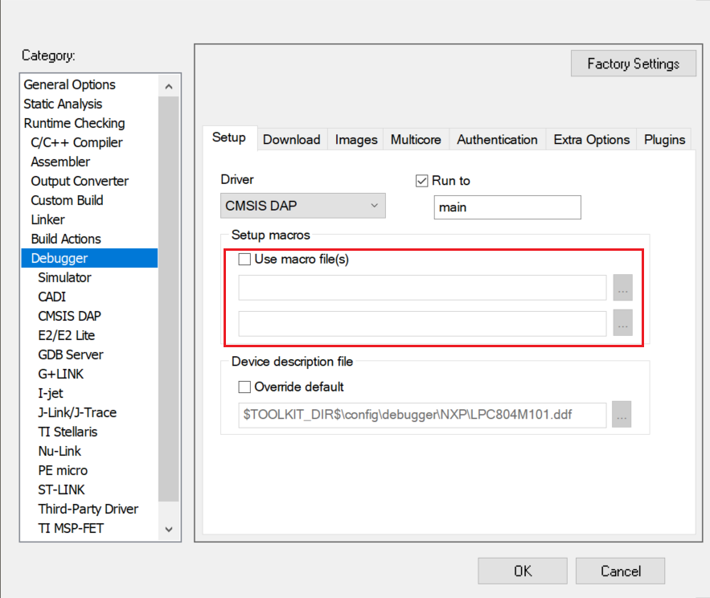

- jlink_script_file

  

[https://wwwfiles.iar.com/AVR/webic/doc/EWAVR_CompilerGuide.pdf]: 