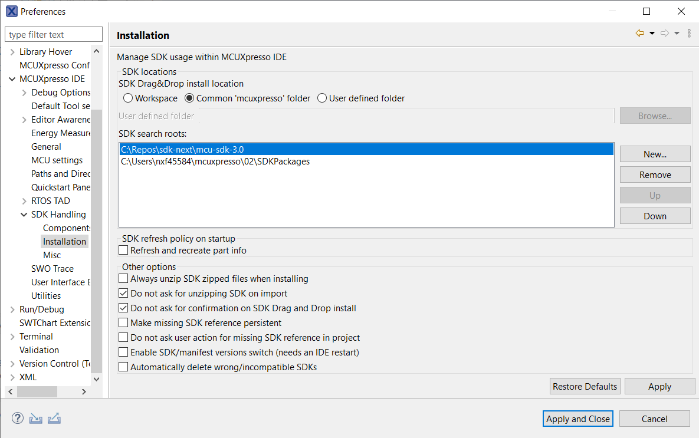

# CMake Based Build System

## Environment Setup

### Repos Setup

***Firstly, ensure all your code is up-to-date, run `west update_repo`.***
To isolate your development environment, suggest use python venv.
In sdk-next workspace root directory, create and activate a virtual environment:

```bash
# Please ensure your system python version >= 3.8
python -m venv .venv

# For Linux/MacOS
source .venv/bin/activate

# For Windows
.\.venv\Scripts\activate
```

Then install pip and required packages

```bash
pip install west -U

# Note: you can add option '--default-timeout=1000' if you meet connection issue.
pip install -r mcu-sdk-3.0/scripts/requirements.txt
```

Following build, flash and debug commands are refered from zephyr's official one. So you can find the full documentation here: <https://docs.zephyrproject.org/latest/develop/west/build-flash-debug.html>
Most of native zephyr's west build features are reserved.

### Toolchain Setup

Build system supports IAR,MDK,Armgcc, MCUXpresso IDE and Zephyr SDK to build.

For IAR, MDK Armgcc and Zephyr, you need to set environment varaibles to specify the toolchain installation so that build system can find it. 

Here are the toolchain environment variable table

| Toolchain | Environment variable   | Cmd Line Argument           |
| --------- | ---------------------- | :-------------------------- |
| IAR       | IAR_DIR                | --toolchain iar             |
| MDK       | MDK_DIR                | --toolchain mdk             |
| Armgcc    | ARMGCC_DIR             | --toolchain armgcc(default) |
| Zephyr    | ZEPHYR_SDK_INSTALL_DIR | --toolchain zephyr          |

## Kconfig

1. Please install python3 and menuconfig. For menuconfig, you can run with

```bash
pip install -U kconfiglib
```

2. Make sure that `mcu-sdk-boards`, `mcu-sdk-components`, `mcux-devices-kinetis`, `mcux-devices-lpc`, `mcux-devices-rt` projects are cloned because there are Kconfig data inside these repos for boards/components/devices. Only with all these data included, then you can enjoy full feature of kconfig.

3. Run

   Inside Kconfig files, there are board/device variables inside, so it cannot be directly run, so Kconfig shall be run inside whole cmake process.

   1. Run cmake configuration

```bash
west build -b frdmk64f examples/demo_apps/hello_world --cmake-only
```

​	You can ignore "--cmake-only", then the projecrt will be built.

​	2. Run guiconfig target

```bash
west built -t guiconfig
```

​	Then you will get the Kconfig GUI launched, like

​	           

You can select/deselect and modify to do reconfiguration and remember to save.

After you save and close, you can directly run "west build" to do the build.

## West Extension Commands

### Build

Use `west build -h` to see help information for west build command.
Compared to zephyr's west build, our west build command provides two additional options for mcux examples:

- --toolchain: specify the toolchain for this build, default armgcc.
- --config: value for CMAKE_BUILD_TYPE, default debug.

Here are some typical usage for generating a SDK example is:

```bash

# Generate example with default settings
west build -b frdmk64f examples/demo_apps/hello_world

# Just print cmake commands, do not execute it
west build -b frdmk64f examples/demo_apps/hello_world --dry-run

# Generate other toolchain like iar, default armgcc
west build -b frdmk64f examples/demo_apps/hello_world --toolchain iar

# Generate config type, default debug
west build -b frdmk64f examples/demo_apps/hello_world --config release

```

For multicore devices, you should specify the corresponding core id by passing the command line argument "-Dcore_id". For example

```bash
west build -b evkmimxrt1170 examples/demo_apps/hello_world --toolchain iar -Dcore_id=cm7 --config flexspi_nor_debug
```

Remember to use "--config" to specify build target which is different from SDKGENv3.

### Sysbuild(System build)

To support multicore project building, we ported Sysbuild from Zephyr. Sysbuild is a higher-level build system that can be used to combine multiple other build systems together.For more details, please refer to document [Sysbuild (System build) — Zephyr Project Documentation](https://docs.zephyrproject.org/latest/build/sysbuild/index.html#sysbuild-zephyr-application).

You can build all projects by adding "--sysbuild" for main application. For example:

```
west build -b evkmimxrt1170 --sysbuild .\examples\demo_apps\hello_world -Dcore_id=cm7 --config flexspi_nor_debug -p always
```

To include sub projects into building system, you must prepare "sysbuild.cmake" into main application folder. Sub projects are added by "ExternalZephyrProject_Add" command. For example:

```cmake
# demo_apps/hello_world/sysbuild.cmake

ExternalZephyrProject_Add(
        APPLICATION freertos_hello
        SOURCE_DIR  ${APP_DIR}/../../rtos/freertos/freertos-kernel/freertos_hello
        board ${SB_CONFIG_secondary_board}
        core_id ${SB_CONFIG_secondary_core_id}
        config ${SB_CONFIG_secondary_config}
        toolchain ${SB_CONFIG_secondary_toolchain}
)

# Let's build the main application first
add_dependencies(freertos_hello ${DEFAULT_IMAGE})
```

The variables in sysbuild.cmake can be defined inside the file. In practice, however, it is more common to set these variables automatically via kconfig to support multiple platforms in a more flexible way. For example, you can prepare a Kconfig.sysbuild in main application folder:

```
# demo_apps/hello_world/Kconfig.sysbuild

config secondary_board
    string
    default "evkmimxrt1170" if $(board) = "evkmimxrt1170"
    default "lpcxpresso55s69" if $(board) = "lpcxpresso55s69"

config secondary_core_id
    string
    default "cm4" if $(board) = "evkmimxrt1170" && $(core_id) = "cm7"
    default "cm33_core1" if $(board) = "lpcxpresso55s69" && $(core_id) = "cm33_core0"

config secondary_config
    string
    default "debug" if $(config) = "debug"
    default "debug" if $(config) = "flexspi_nor_debug"

config secondary_toolchain
    string
    default "$(toolchain)"
```

### Flash

As we do not have a FRDM-K64F with JLink or other runners for test, we only ensure flash/debug commands can work for linkserver. Please install linkserver and add it to your PATH firstly.

Flash the hello_world example:

```bash
west flash -r linkserver
```


### Debug

Start a gdb interface by following command:

```bash
west debug -r linkserver
```


## IDE GUI Projects

### Prequisites

Currently, we have not implemented all features through Python. So, in order to generate IDE GUI projects, you have to prepare the ruby 3.1 environment, You can refer [SDK Generator V3 environment setup](https://confluence.sw.nxp.com/display/MCUXSDK/Getting+Started+With+SDK+Generator+V3#GettingStartedWithSDKGeneratorV3-EnvironmentSetup).

In short words:

- For windows: use [portable_ruby](https://bitbucket.sw.nxp.com/projects/MCUCORE/repos/mcu-sdk-generator/browse/bin/windows)
- For Linux/MacOS: use [rbenv](https://github.com/rbenv/rbenv) to install `ruby 3.1.2` and then download [Gemfile](https://bitbucket.sw.nxp.com/projects/MCUCORE/repos/mcu-sdk-generator/raw/Gemfile?at=refs%2Fheads%2Fdevelop%2Fmcu_sdk_generator) and [Gemfile.lock](https://bitbucket.sw.nxp.com/projects/MCUCORE/repos/mcu-sdk-generator/raw/Gemfile.lock?at=refs%2Fheads%2Fdevelop%2Fmcu_sdk_generator) in an empty directory and then run `gem install bundle && bundle install` in it.

### IAR/MDK

For the convenience of users who like to use IAR/MDK IDE for development and debugging, the meta build system support to create IDE project definition files from west command with "--toolchain [iar|mdk] -t guiproject". For example:

```bash
west build -b frdmk64f examples/demo_apps/hello_world --toolchain mdk -t guiproject
```

You can check log from command:

```bash
-- west build: running target guiproject
[0/1] cmd.exe /C "cd /D C:\git_repo\identify_2\sdk-next\mcu-sdk-3.0 && C:\CMake\bin\cmake.exe -E env board=frdmk64f device=MK64F12 soc_series=Kinetis Sd..." 
Generate GUI project
generate SDK project:  [debug] [hello_world] [C:\git_repo\identify_2\sdk-next\mcu-sdk-3.0/boards/frdmk64f/demo_apps/hello_world/mdk/hello_world.uvprojx]
```

### MCUXpresso

For mcuxpresso, `-t guiproject` will always be set, so just run:

```bash
west build -b frdmk64f examples/demo_apps/hello_world --toolchain mcux
```

You can check log from command:

```bash
-- west build: running target guiproject
[0/1] C:\WINDOWS\system32\cmd.exe /C "cd /D C:\Repos\sdk-next\mcu-sdk-3.0 &&...ild.ninja -o boards/frdmk64f/demo_apps/hello_world/ -p hello_world -c debug"Generate GUI project
C:/Repos/sdk-next/mcu-sdk-3.0/examples/demo_apps/hello_world/hello_world.yml
D, [2024-03-26T14:33:37.903561 #62960] DEBUG -- : Starting XSD validation
D, [2024-03-26T14:33:37.914107 #62960] DEBUG -- : hello_world_v3_14.xml: Validation complete, no errors were found
generate SDK project:  [mcux] [hello_world] [C:\Repos\sdk-next\mcu-sdk-3.0/boards/frdmk64f/demo_apps/hello_world/hello_world_v3_14.xml]

-- west build: running target manifest
[1/1] C:\WINDOWS\system32\cmd.exe /C "cd /D C:\Repos\sdk-next\mcu-sdk-3.0\bu...on.exe C:\Repos\sdk-next\mcu-sdk-3.0/scripts/mcux_manifest/mcux_manifest.py"
Generate manifest file to C:\Repos\sdk-next\mcu-sdk-3.0\FRDM-K64F_manifest_v3_14.xml
```

To import the sdk in mcuxpresso, you have to add `mcu-sdk-3.0` repo in SDK search roots:



We now have two major limitations with the manifest and project.xml generated from meta build system:

1. No support for MCUXpresso 'New Project Wizard'
  We cannot generate component and dependency information in sdk manifest, but you can use kconfig to get similiar experience.

2. Cannot import standalone project
  MCUXpresso will not copy all sources for include path only if they are explicitly recorded in manifest. So you have to untick the `Copy sources` option.


## Multi Project Solution Build

## Overview

MCUXpresso SDK build system is based on CMake and Kconfig. 

[Kconfig](https://www.kernel.org/doc/html/next/kbuild/kconfig-language.html) is a selection-based configuration system originally developed for the Linux kernel which now found
more and more use in other projects beyond the Linux kernel. In MCUXpresso SDK, Kconfig is used to config the build in run time. This includes component selection with dependency resolve, component configuration with feature
enable/disable, customization. You can interact with Kconfig via a curses or graphical menu interface, usually invoked by running "west build -t guiconfig" after you have already run passed the cmake configuration process. In this interface, the user selects the options and features desired, and saves a configuration file, which is then used as an input to the
build process.

[CMake](https://cmake.org/) which is cross platform not only manages the software build process based on Kconfig result, but also integrate many useful functionalities like IDE project generation. 

## Toolchains Beyond GCC

MCUXpresso SDK supports all mainstream toolchains in the embedded world beyond traditional armgcc. 

The toolchain list supported by our build system is IAR, MDK, Xcc, Xclang and Zephyr. The cmake toolchain setting files are placed in \<mcu-sdk-3.0>/cmake/toolchain folder. All toolchain files generally follow the same structure and loaded through \<mcu-sdk-3.0>/cmake/toolchain.cmake. The configuration variable is "CONFIG_TOOLCHAIN".

If you need to enable new toolchain, please follow the existing toolchain file pattern and place it there.

## CMake Extension

MCUXpresso SDK is a comprehensive product including hundred of boards and devices, thousands of components, drivers and examples. The CMake extension can greatly reduce data adding efforts. 

Following extensions are provided for you to facilitate component, project and misc data record. All extension functions start with prefix "mcux_"

### Source And Include

- mcux_add_source/mcux_add_include

  Add the source and include can be done with mcux_add_source and mcux_add_include

  Please see following table for the arguments

  | Argument Name         | Argument Type | Explanation                              |
  | --------------------- | ------------- | ---------------------------------------- |
  | PROJECT_PATH          | Single        | The project path for the source or include. This attribute is used to construct the source or include explorer view in IDE project. If not provided, then the source or include path relative to the repo root will be used. For project source or include, usually use PROJECT_PATH. <br />If you set hello_world source hello_world.c PROJECT_PATH to "source", then in the generated IDE explorer view, it looks like <br /> |
  | PROJECT_BASE_PATH     | Single        | The base part the of the PROJECT_PATH. For component, usually use PROJECT_BASE_PATH, the left relatIve path part can directly use the source or include real path. For example, we usually set driver source with PROJECT_BASE_PATH "drivers", then in the generated IDE explorer view, it looks like<br /><br /><br />Note, the PROJECT_PATH has priority over PROJECT_BASE_PATH. |
  | PROJECT_RELATIVE_PATH | Single        | The relative part of the PROJECT_PATH which is rarely used. Usually the folder path of "SOURCES" is the default value for it. |
  | BASE_PATH             | Single        | If provided, the final source path equals BASE_PATH + SOURCES. This is usually used in abstracted .cmake files which are not placed together with real sources. For sources or includes in CMakeLists.txt which is usually put together with real source, no need to add it. |
  | CONFIG                | Single        | Specify that the source is a config file or the include is for a config header. |
  | SOURCES               | Multiple      | The sources. This is only for mcux_add_source. If there are multiple sources, please separate them with whitespace. |
  | INCLUDES              | Multiple      | The includes. This is only for mcux_add_include. If there are multiple includes, please separate them with whitespace. |
  | TARGET_FILES          | Multiple      | This is only for mcux_add_include which is used to specify the include target which header file. This is required only for "config" header. |
  | COMPILERS             | Multiple      | The compilers. It means the source or include only supports the listed compilers.<br />Here are all the supported compilers: armclang, iar, gcc, xcc, mwcc56800e. |
  | TOOLCHAINS            | Multiple      | The toolchains. It means the source or include only supports the listed toolchains.<br />Here are all the supported toolchains: iar, mdk, armgcc, xcc, codewarrior. |
  | CORES                 | Multiple      | The cores. It means the source or include only supports the listed cores.<br />Here are all the supported cores: cm0, cm0p, cm3, cm4, cm4f, cm7, cm7f, cm33, cm33f, cm23, ca7, dsp56800ex, dsp56800ef, dsp |
  | CORE_IDS              | Multiple      | The core_ids. It means the source or include only supports the listed core_ids. This is usually to distinguish support for core in multicore platform. |
  | DEVICES               | Multiple      | The devices. It means the source or include only supports the listed device, like MK64F12. |
  | DEVICE_IDS            | Multiple      | The device ids. It means the source or include only supports the listed device id, like MK64FN1M0xxx12. |
  | FPU                   | Multiple      | The fpu. It means the source or include only supports the listed fpu. fpu enum values are  NO_FPU,  SP_FPU and  DP_FPU. |
  | DSP                   | Multiple      | The dsp. It means the source or include only supports the listed dsp. dsp enum values are NO_DSP and DSP |
  | TRUSTZONE             | Multiple      | The trustzone. It means the source or include only supports the listed trustzone. trustzone enum values are TZ and  NO_TZ. |
  | COMPONENTS            | Multiple      | The components. It means the source or include only supports the listed components |

  Here is one example:

  ```cmake
  # In drivers/uart/CMakelists.txt
  if (CONFIG_MCUX_COMPONENT_driver.uart)
      mcux_add_source(
          PROJECT_BASE_PATH drivers
          SOURCES fsl_uart.h 
                  fsl_uart.c
      )
      mcux_add_include(
          PROJECT_BASE_PATH drivers
          INCLUDES .
      )
  endif()

  # In examples/demo_apps/hello_world/CMakelists.txt
  mcux_add_source(
      SOURCES hello_world.c
      PROJECT_PATH source
  )

  mcux_add_include(
      INCLUDES .
      PROJECT_PATH source
  )
  ```

- mcux_convert_binary

  Specify the Output binary format

  | Argument Name | Argument Type | Explanation                   |
  | ------------- | ------------- | ----------------------------- |
  | TOOLCHAINS    | Multiple      | Supported toolchains          |
  | BINARY        | Single        | The target output binary type |

  Here is one example

  ```cmake
  mcux_convert_binary(
          TOOLCHAINS armgcc mdk iar
          BINARY ${APPLICATION_BINARY_DIR}/core1_image.bin
  )
  ```

- mcux_add_iar_linker_script/mcux_add_mdk_linker_script/mcux_add_armgcc_linker_script

  Add linker for toolchain.

  | Argument Name | Argument Type | Explanation                              |
  | ------------- | ------------- | ---------------------------------------- |
  | TARGETS       | Multiple      | The build targets, like debug release    |
  | BASE_PATH     | Single        | If provided, the final linker path equals BASE_PATH + LINKER. This is usually used in abstracted .cmake files which are not placed together with real linker. |
  | LINKER        | Single        | The linker path                          |

  Here is one example

  ```cmake
      mcux_add_iar_linker_script(
              TARGETS debug release
              BASE_PATH ${SdkRootDirPath}
              LINKER devices/${soc_series}/${device}/iar/${MCUX_TOOLCHAIN_LINKER_DEVICE_PREFIX}_flash.icf
      )

      mcux_add_armgcc_linker_script(
              TARGETS debug release
              BASE_PATH ${SdkRootDirPath}
              LINKER devices/${soc_series}/${device}/gcc/${MCUX_TOOLCHAIN_LINKER_DEVICE_PREFIX}_flash.ld
      )
      
      mcux_add_mdk_linker_script(
              TARGETS debug release
              BASE_PATH ${SdkRootDirPath}
              LINKER devices/${soc_series}/${device}/arm/${MCUX_TOOLCHAIN_LINKER_DEVICE_PREFIX}_flash.scf
      )
  ```

### Configuration


- mcux_add_configuration

  Add configuration for all toolchains with specified build targets.

  | Argument Name | Argument Type | Explanation                              |
  | ------------- | ------------- | ---------------------------------------- |
  | TARGETS       | Multiple      | Supported build targets. If not provided, then supporting all targets |
  | LIB           | Multiple      | The library, the full path               |
  | AS            | Single        | The assemble compiler flag               |
  | CC            | Single        | The c compiler flags                     |
  | CX            | Single        | The cxx compiler flags                   |
  | LD            | Single        | The linker flags                         |

  Note, please use native compiler flags of the compilers.

  Here is one example

  ```cmake
      mcux_add_configuration(
              TARGETS release
              AS "-DMCUXPRESSO_SDK -DNDEBUG"
              CC "-DMCUXPRESSO_SDK -DNDEBUG"
              CX "-DMCUXPRESSO_SDK -DNDEBUG"
      )
  ```

- mcux_add_iar_configuration\mcux_add_mdk_configuration\mcux_add_armgcc_configuration\mcux_add_xcc_configuration

  Very similar with mcux_add_configuration, just target specified toolchain, not for all.

### Remove

Except adding data, the build system also supports removing defined data. For example, if in a common definition, a macro is defined for examples in the board, but your example cannot use it, then you can use following remove function to remove it.

- mcux_remove_configuration

  Remove configuration for all toolchains with specified build targets.

  | Argument Name | Argument Type | Explanation                              |
  | ------------- | ------------- | ---------------------------------------- |
  | TARGETS       | Multiple      | Supported build targets. If not provided, then supporting all targets |
  | LIB           | Multiple      | The library, the full path               |
  | AS            | Single        | The assemble compiler flag               |
  | CC            | Single        | The c compiler flags                     |
  | CX            | Single        | The cxx compiler flags                   |
  | LD            | Single        | The linker flags                         |

  Note, please use native compiler flags of the compilers.

  Here is one example

  ```cmake
  mcux_remove_configuration(
          TARGETS release
          AS "-DMCUXPRESSO_SDK -DNDEBUG"
          CC "-DMCUXPRESSO_SDK -DNDEBUG"
          CX "-DMCUXPRESSO_SDK -DNDEBUG"
  )
  ```

- mcux_remove_iar_configuration/mcux_remove_mdk_configuration/mcux_remove_armgcc_configuration

  Very similar with mcux_remove_configuration, just target specified toolchain, not for all.

- mcux_remove_iar_linker_script/mcux_remove_mdk_linker_scriptmcux_remove_armgcc_linker_script

  | Argument Name | Argument Type | Explanation                              |
  | ------------- | ------------- | ---------------------------------------- |
  | TARGETS       | Multiple      | The build targets, like debug release    |
  | BASE_PATH     | Single        | If provided, the final linker path equals BASE_PATH + LINKER. This is usually used in abstracted .cmake files which are not placed together with real linker. |
  | LINKER        | Single        | The linker path                          |

  Here is one example

  ```cmake
      mcux_remove_iar_linker_script(
              TARGETS debug release
              BASE_PATH ${SdkRootDirPath}
              LINKER devices/${soc_series}/${device}/iar/${MCUX_TOOLCHAIN_LINKER_DEVICE_PREFIX}_flash.icf
      )

      mcux_remove_armgcc_linker_script(
              TARGETS debug release
              BASE_PATH ${SdkRootDirPath}
              LINKER devices/${soc_series}/${device}/gcc/${MCUX_TOOLCHAIN_LINKER_DEVICE_PREFIX}_flash.ld
      )
      
      mcux_remove_mdk_linker_script(
              TARGETS debug release
              BASE_PATH ${SdkRootDirPath}
              LINKER devices/${soc_series}/${device}/arm/${MCUX_TOOLCHAIN_LINKER_DEVICE_PREFIX}_flash.scf
      )
  ```

- mcux_project_remove_include\mcux_project_remove_source

  Remove project source or include.

  | Argument Name | Argument Type | Explanation                              |
  | ------------- | ------------- | ---------------------------------------- |
  | BASE_PATH     | Single        | If provided, the final source path equals BASE_PATH + SOURCES. This is usually used in abstracted .cmake files which are not placed together with real sources. For sources or includes in CMakeLists.txt which is usually put together with real source, no need to add it. |
  | INCLUDES      | Single        | The include path                         |
  | SOURCES       | Single        | The source path                          |

  Here is one example

  ```cmake
  mcux_project_remove_source(
  	SOURCES hello_world.c
  )

  mcux_project_remove_include(
  	INCLUDES .
  )
  ```

### Misc

- mcux_set_variable

  Set variable.

  Here is one example

  ```cmake
  mcux_set_variable(soc_series Kinetis)
  ```

- mcux_add_cmakelists

  Add CMakelists.txt

  Here is one example

  ```cmake
  mcux_add_cmakelists(${SdkRootDirPath}/devices/Kinetis/MK64F12/drivers)
  ```

- mcux_load_all_cmakelists_in_directory

  Load all cmakelists under one directory

  ```cmake
  mcux_load_all_cmakelists_in_directory(${SdkRootDirPath}/drivers)
  ```

## Data Organization

The majority of MCUXpresso SDK data is recorded through data sections instead of fragment lines. In this way, software is highly modularized thus greatly improve the software integration.

Every data section is composed of CMake and Kconfig.

### Data Section

3 data sections are supported: component, project segment and project.

#### Component

"component" section is used for any software components. 

In CMake, component data shall be recorded inside a if-endif guard. The condition shall be with prefix "CONFIG_MCUX_COMPONENT", the component name is right after it.

Here is the CMake example

```cmake
if (CONFIG_MCUX_COMPONENT_driver.uart)
    mcux_add_source(
        PROJECT_BASE_PATH drivers
        SOURCES fsl_uart.h 
                fsl_uart.c
    )
    mcux_add_include(
        PROJECT_BASE_PATH drivers
        INCLUDES .
    )
endif()
```

If a component is defined in several cmake files, please use the same if-endif guard in all the file data.

In Kconfig, symbol for a component shall start with "MCUX_COMPONENT_" to be identical with CMake component name. Component configuration and dependency shall be recorded following the below pattern:

```Kcon
config MCUX_HAS_COMPONENT_driver.uart
    bool
    default y if MCUX_HW_IP_DriverType_UART

config MCUX_COMPONENT_driver.uart
    bool "Use driver uart"
    select MCUX_COMPONENT_driver.common
    depends on MCUX_HAS_COMPONENT_driver.uart # component dependency

    if MCUX_COMPONENT_driver.uart
    	# Configuration for driver.gpio
    endif
```

About the dependency, please refer [Complex Dependency In Kconfig](#Complex Dependency In Kconfig ) chapter.

For components belonging to one middleware set, please use Kconfig "menu" to gather them together, like

```Kconfig
menu "freertos-kernel(FreeRTOSConfig.h)"
    config MCUX_COMPONENT_middleware.freertos-kernel
        bool "middleware.freertos-kernel"
        select MCUX_COMPONENT_middleware.freertos-kernel.extension
    config MCUX_COMPONENT_middleware.freertos-kernel.extension
        bool "tad extension"
    config MCUX_COMPONENT_middleware.freertos-kernel.heap_1
        bool "heap 1"
    config MCUX_COMPONENT_middleware.freertos-kernel.heap_2
        bool "heap 2"
    config MCUX_COMPONENT_middleware.freertos-kernel.heap_3
        bool "heap 3"
    config MCUX_COMPONENT_middleware.freertos-kernel.heap_4
        bool "heap 4"
    config MCUX_COMPONENT_middleware.freertos-kernel.heap_5
        bool "heap 5"
    ......
endmenu
```

#### Project Segment

MCUXpresso SDK is composed of hundreds of devices and boards. Projects on these boards and devices have many shared data like core related settings, common build target settings,  device headers and configurations, board files, pinmux and configurations. Project segment data section is introduced to avoid data duplication. It is an abstraction of common shared data.

In CMake, project segment data shall be recorded inside a if-endif guard. The condition shall be with prefix "CONFIG_MCUX_PRJSEG_", right after it is the project segment name.

Here is the frequently used prepared project segment table.

| Project Segment Name                     | Location               | Functionality                            |
| ---------------------------------------- | ---------------------- | ---------------------------------------- |
| CONFIG_MCUX_PRJSEG_config.arm.shared     | arch/arm/configuration | The commonly shared configuration by all examples of ARM platforms |
| CONFIG_MCUX_PRJSEG_config.kinetis.shared | arch/arm/configuration | The commonly shared configuration by all examples of kinetis platforms |
| CONFIG_MCUX_PRJSEG_config.arm.core.\<core name> | arch/arm/cortexm       | The ARM core settings                    |
| CONFIG_MCUX_PRJSEG_config.arm.core.fpu.\<fpu type> | arch/arm/cortexm       | The ARM core fpu settings                |
| CONFIG_MCUX_PRJSEG_config.device_core.define | arch/arm/cortexm       | The core CPU macro definition            |
| CONFIG_MCUX_PRJSEG_target.\<buiild target name> | arch/arm/target        | Build configuration target               |
| CONFIG_MCUX_PRJSEG_module.board.\<board module name> | boards/common          | Commonly shared board modules like board file, pinmux, clock config, etc. |
| CONFIG_MCUX_PRJSEG_project.\<project module name> | boards/common          | Commonly shared project modules like hardware init app. etc. |

In Kconfig, symbol for a component shall start with "MCUX_PRJSEG_" to be identical with CMake project segment name. Project segment configuration and dependency shall be recorded following the below pattern:

```
    config MCUX_PRJSEG_module.board.suite
        bool "Use default board suite"
        default y
        # Here are the dependencies
        imply MCUX_COMPONENT_driver.common
        imply MCUX_COMPONENT_device.CMSIS
        imply MCUX_COMPONENT_device.startup
        if MCUX_PRJSEG_module.board.suite
        	# Configuration shall be record here
        endif
```

#### Project

Just like the native cmake way, all data inside CMakeLists.txt with "project" macro inside is a "project" segment.

Here is one CMake example

```cmake
cmake_minimum_required(VERSION 3.22.0)

include(${SdkRootDirPath}/cmake/extension/mcux.cmake)

# Specify the project
project(hello_world LANGUAGES C CXX ASM PROJECT_ROOT_PATH boards/${board}/demo_apps/hello_world/${multicore_foldername})

include(${SdkRootDirPath}/CMakeLists.txt)

include(${SdkRootDirPath}/examples/demo_apps/reconfig.cmake OPTIONAL)

include(${SdkRootDirPath}/${project_root_path}/reconfig.cmake OPTIONAL)

mcux_add_source(
    SOURCES hello_world.c
    PROJECT_PATH source
)

mcux_add_include(
    INCLUDES .
    PROJECT_PATH source
)
```

### Complex Dependency In Kconfig

#### Dependency Mechanisms

[Kconfig](https://www.kernel.org/doc/html/next/kbuild/kconfig-language.html) provides "depends on", "select" and "choice" dependency mechanisms.

- "depends on"

  It defines a dependency for Kconfig symbol. If multiple dependencies are defined, they can be connected with ‘&&’, ‘||’, and ! for NOT.

  The Kconfig item won’t be showed if the “depends on” is not satisfied.

- "select"

  It forces a symbol to true which means the depended component is selected anyway no matter the dependency is
  satisfied or not.

- "choice"

  It defines a choice group. The single choice can only be of type bool or tristate. If no type is specified for a choice, its type will be determined by the type of the first choice element in the group or remain unknown if none of the choice elements have a type specified.

Build system Kconfig processor will give warnings about unsatisfied component selected. 

For depending on hardware related dependency items like board, device, device_id, please use "depends on". If not satisfied, the related components will not be showed.

For depending on software component, priority to use "select". It helps to auto select component dependency.

If there are "any of" dependencies, "choice" can satisfy the needs.

Don’t use “depends on” on component dependency because Kconfig doesn’tsupport mutual dependency(recursive issue)

#### Dependency Patterns

Here are summarized frequently used dependency patterns.

- Pattern1: Simple allOf with only one sub anyOf

  ```yaml
  componentA:
    allOf:
      - component1
      - component2
      - anyOf:
        - component3
        - component4
  ```

  The Kconfig pattern is like

  ```
  config MCUX_HAS_COMPONENT_component3
    bool

  config MCUX_HAS_COMPONENT_component4
    bool
  	  
  config MCUX_COMPONENT_componentA
    bool "Component A, pattern 1"
    select MCUX_COMPONENT_component1 
    select MCUX_COMPONENT_component2
    select MCUX_COMPONENT_component3 if MCUX_HAS_COMPONENT_component3
    select MCUX_COMPONENT_component4 if MCUX_HAS_COMPONENT_component4
  ```

-  Pattern 2: starting with allOf with more than 1 anyOf

  ```yaml
  componentB:
  dependency:
    allOf:
    - component1
    - component2
    - anyOf:
  	- component3
  	- component4
    - anyOf:
  	- component5
  	- component6
    - core:
  	- cm33
  	- cm33f
    - device:
  	- MK64F12
  	- MK63F12
  ```

  The Kconfig dependency pattern is like

  ```
  config MCUX_COMPONENT_componentB
    bool "Component B, pattern 1"
    select MCUX_COMPONENT_component1 
    select MCUX_COMPONENT_component2
    depends on MCUX_HW_CORE_CM4F || MCUX_HW_CORE_CM4
    depends on MCUX_HW_DEVICE_MK64F12 || MCUX_HW_DEVICE_MK63F12

    if MCUX_COMPONENT_componentB
  	  choice
  		  prompt "Component B anyOf 1"
  		  default MCUX_DEPENDENCY_COMPONENT_componentB_DEPEND_COMPONENT_component3
  		  config MCUX_DEPENDENCY_COMPONENT_componentB_DEPEND_COMPONENT_component3
  			  bool "Select component3"
  			  select MCUX_COMPONENT_component3

  		  config MCUX_DEPENDENCY_COMPONENT_componentB_DEPEND_COMPONENT_component4
  			  bool "Select component4"
  			 select MCUX_COMPONENT_component4
  	  endchoice

  	  choice
  		  prompt "Component B anyOf 2"
  		  default MCUX_DEPENDENCY_COMPONENT_componentB_DEPEND_COMPONENT_component5
  		  config MCUX_DEPENDENCY_COMPONENT_componentB_DEPEND_COMPONENT_component5
  			  bool "Select component5"
  			  select MCUX_COMPONENT_component5

  		  config MCUX_DEPENDENCY_COMPONENT_componentB_DEPEND_COMPONENT_component6
  			  bool "Select component6"
  			  select MCUX_COMPONENT_component6
  	  endchoice            
  endif
  ```

- Pattern 3: start with allOf with 2 sub level dependencies including anyOf/allOf

  ```yaml
  componentC:
    dependency:
      allOf:
      - component1
      - component2
      - compiler:
        - iar
        - mdk
      - anyOf:
          - allOf:
            - component3
            - component4
            - device:
              - MK64F12
              - MK63F12
          - allOf:
            - component5
            - component6
            - device:
              - LPC54005
              - LPC54016
              - LPC54018
              - LPC54018M
              - LPC54628
  ```

  The Kconfig dependency pattern is like

  ```
  config MCUX_COMPONENT_componentC
    bool "Component C, pattern 2"
    select MCUX_COMPONENT_component1 
    select MCUX_COMPONENT_component2
    depends on MCUX_COMPILER_IAR || MCUX_COMPILER_MDK
    # All device scope shall be explicitly specified here, otherwise for a device which is not in the scope which means the dependency is not satisfied, but componentC is still showed and configurable
    depends on MCUX_HW_DEVICE_MK64F12 || MCUX_HW_DEVICE_MK63F12 || MCUX_HW_DEVICE_LPC54005 || MCUX_HW_DEVICE_LPC54016 || MCUX_HW_DEVICE_LPC54018 || MCUX_HW_DEVICE_LPC54018M || MCUX_HW_DEVICE_LPC54628

    if MCUX_COMPONENT_componentC
  	  choice
  		  prompt "Component C anyOf"
  		  default MCUX_DEPENDENCY_COMPONENT_componentC_DEPEND_ALLOF_1
  		  config MCUX_DEPENDENCY_COMPONENT_componentC_DEPEND_ALLOF_1
  			  bool "Select component3 and component 4 in device MK64F12, MK63F12"
  			  select MCUX_COMPONENT_component3
  			  select MCUX_COMPONENT_component4
  			  depends on MCUX_HW_DEVICE_MK64F12 || MCUX_HW_DEVICE_MK63F12

  		  config MCUX_DEPENDENCY_COMPONENT_componentC_DEPEND_ALLOF_2
  			  bool "Select component5 and component4"
  			  select MCUX_COMPONENT_component5
  			  select MCUX_COMPONENT_component6
  			  depends on MCUX_HW_DEVICE_LPC54005 || MCUX_HW_DEVICE_LPC54016 || MCUX_HW_DEVICE_LPC54018 || MCUX_HW_DEVICE_LPC54018M || MCUX_HW_DEVICE_LPC54628
  	  endchoice           
    endif
  ```

- Pattern 4: start with allOf with 2 sub level dependencies including anyOf/anyOf

  ```yaml
  componentD:
    dependency:
      allOf:
      - component1
      - component2
      - not: component8
      - compiler:
        - iar
        - mdk
      - anyOf:
        - anyOf:
          - component3
          - component4
        - anyOf:
          - component5
          - component6
        - component7
  ```

  The Kconfig dependency pattern is like

  ```
  config MCUX_COMPONENT_componentD
    bool "Component D, pattern 3"
    select MCUX_COMPONENT_component1 
    select MCUX_COMPONENT_component2
    depends on !MCUX_COMPONENT_component8 # support not
    depends on MCUX_COMPILER_IAR || MCUX_COMPILER_MDK

    if MCUX_COMPONENT_componentD
  	  choice
  		  prompt "Component C Dependencies"

  		  config MCUX_DEPENDENCY_COMPONENT_componentD_DEPEND_ANYOF_component3_component4
  			  bool "Select component3 or component4"
  			  if MCUX_DEPENDENCY_COMPONENT_componentD_DEPEND_ANYOF_component3_component4
  				  choice
  					  prompt "Select component3 or component4"
  					  default MCUX_DEPENDENCY_COMPONENT_componentD_DEPEND_COMPONENT_component3
  					  config MCUX_DEPENDENCY_COMPONENT_componentD_DEPEND_COMPONENT_component3
  						  bool "Select component3"
  						  select MCUX_COMPONENT_component3
  					  config MCUX_DEPENDENCY_COMPONENT_componentD_DEPEND_COMPONENT_component4
  						  bool "Select component4"
  						  select MCUX_COMPONENT_component4
  				  endchoice  
  			  endif              

  		  config MCUX_DEPENDENCY_COMPONENT_componentD_DEPEND_ANYOF_component5_component6
  			  bool "Select component5 or component6"
  			  if MCUX_DEPENDENCY_COMPONENT_componentD_DEPEND_ANYOF_component5_component6
  				  choice
  					  prompt "Select component5 or component6"
  					  default MCUX_DEPENDENCY_COMPONENT_componentD_DEPEND_COMPONENT_component5
  					  config MCUX_DEPENDENCY_COMPONENT_componentD_DEPEND_COMPONENT_component5
  						  bool "Select component5"
  						  select MCUX_COMPONENT_component5
  					  config MCUX_DEPENDENCY_COMPONENT_componentD_DEPEND_COMPONENT_component6
  						  bool "Select component6"
  						  select MCUX_COMPONENT_component6
  				  endchoice        
  			  endif            

  		  config MCUX_DEPENDENCY_COMPONENT_componentD_DEPEND_COMPONENT_component7
  			  bool "Select component7"
  			  select MCUX_COMPONENT_component7

  	  endchoice           
    endif
  ```

- Pattern 5: start with anyOf with multiple allOf

  ```yaml
  componentE:
    dependency:
      anyOf:
      - allOf:
        - component1
        - component2
        - core:
          - cm4
          - cm4f
        - device:
          - MK64F12
          - MK63F12
      - allOf:
        - component3
        - component4
  ```

  The Kconfig dependency pattern is like

  ```
  config MCUX_COMPONENT_componentE
    bool "Component E, pattern 5"
    if MCUX_COMPONENT_componentE
  	  choice
  		  prompt "Component E anyOf"
  		  default MCUX_DEPENDENCY_COMPONENT_componentE_DEPEND_ALLOF_component1_component2
  		  config MCUX_DEPENDENCY_COMPONENT_componentE_DEPEND_ALLOF_component1_component2
  			  bool "Select component1 and component2"
  			  select MCUX_COMPONENT_component1
  			  select MCUX_COMPONENT_component2
  			  depends on MCUX_HW_CORE_CM4 || MCUX_HW_CORE_CM4F
  			  depends on MCUX_HW_DEVICE_MK64F12 || MCUX_HW_DEVICE_MK63F12

  		  config MCUX_DEPENDENCY_COMPONENT_componentE_DEPEND_ALLOF_component3_component4
  			  bool "Select component3 and component4"
  			  select MCUX_COMPONENT_component3
  			  select MCUX_COMPONENT_component4
  	  endchoice           
    endif
  ```

- Pattern 6: start with allOf with one not

  ```yaml
  componentF:
    dependency:
      allOf:
      - component1
      - not: 
          device:
          - MK64F12
          - MK63F12
  ```

  The Kconfig dependency pattern is like

  ```
  config MCUX_COMPONENT_componentF
    bool "Component F, pattern 6"
    select MCUX_COMPONENT_component1
    depends on !MCUX_HW_DEVICE_MK64F12 && !MCUX_HW_DEVICE_MK63F12  
  ```

- Pattern 7: start with anyOf, with multiple allOf and not

  ```yaml
  componentG:
    dependency:
      anyOf:
      - allOf:
        - component1
        - device:
          - MK64F12
          - MK63F12
      - allOf:
        - component2
        - not:
            device:
            - MK64F12
            - MK63F12      
  ```

  The Kconfig dependency pattern is like

  ```
  config MCUX_COMPONENT_componentG
    bool "Component G, pattern 7"
    if MCUX_COMPONENT_componentG
  	  choice
  		  prompt "component F dependency"
  		  default MCUX_DEPENDENCY_COMPONENT_componentG_DEPEND_ALLOF_component9
  		  config MCUX_DEPENDENCY_COMPONENT_componentG_DEPEND_ALLOF_component9
  			  bool "Select component 9 in devce MK64F12 and MK63F12"
  			  select MCUX_COMPONENT_component9
  			  depends on MCUX_HW_DEVICE_MK64F12 || MCUX_HW_DEVICE_MK63F12

  		  config MCUX_DEPENDENCY_COMPONENT_componentG_DEPNED_ALLOF_component10
  			  bool "Select component 10 in devce other than MK64F12 and MK63F12"
  			  select MCUX_COMPONENT_component10
  			  depends on !MCUX_HW_DEVICE_MK64F12 && !MCUX_HW_DEVICE_MK63F12
  	  endchoice
    endif
  ```


### IDE Related

### Variables

Variable mechanism is introduced to facilitate data record. For example, with a "board" variable in the source, the following project segment can be shared by all boards

```cmake
if (CONFIG_MCUX_PRJSEG_module.board.suite)
    mcux_add_source(
        BASE_PATH ${SdkRootDirPath}/boards/${board}
        PROJECT_PATH board
        SOURCES dcd.c dcd.h
    )
    ...
endif()
```

We can categorize variables into cmake variable and Kconfig variable

### Board Data

### Device Data

### Customization

#### Misc CMake

#### prj.conf

### Project Data Load

### Overview Diagram

## Kconfig Process

## CMake Configuration Process Flow

## IDE Generation

## System Build

## Scripts And Tools


