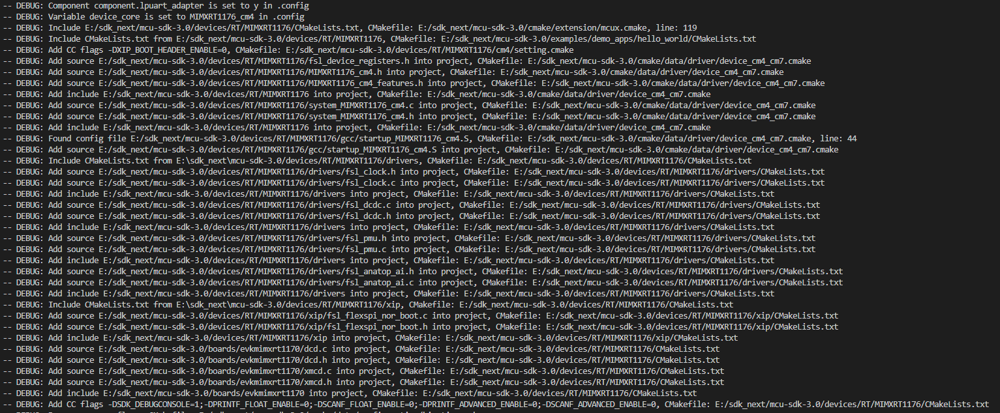
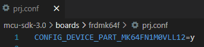

# Frequently Asked Questions

## CMake

1. How to get detailed cmake configuration log about from which cmake files the include/source/configuration is added.

   You can use `--log-level=debug` to get detailed steps of cmake adding source/include/configuration. A cmd example is like

   ```bash
   west build -b evkmimxrt1170 examples/demo_apps/hello_world -Dcore_id=cm4 --log-level=debug
   ```

   The logs look like

   

## Kconfig

1. How the kconfig symbols(configurations) are handled and integrated into build?

   1. All kconfig symbols will firstly been generated into .config with kconfig process lib. We do some updates on the kconfig process lib to meet our needs

   2. Symbols starting with `MCUX_` will be got by cmake and determine which components/drivers/project_segments to be included in.

   3. Macro symbols will be generated into config header files

        3.1 In the kconfig menu, if the header is specified, like menu "freertos-kernel(FreeRTOSConfig.h)", the all symbols under this menu will be generated into FreeRTOSConfig.h

        3.2 If there is no specified headers in the menu, then all systems be generated into RTE_Components.h.

        3.3 all generated config headers are generated and placed under the project root path, like boards/frdmk64f/demo_apps/hello_world. These headers are expected to be included

        ​    in the sources/headers in advance.

        3.4 By default, kconfig will put CONFIG_ prefix in the macros, if you need it, then add "No prefix in generated macro" in the help, like

        ```bash
            if MCUX_COMPONENT_middleware.freertos-kernel

                config configUSE_PREEMPTION
                    bool "configUSE_PREEMPTION"
                    default y
                    help
                        No prefix in generated macro
                config configUSE_TICKLESS_IDLE
                    bool "configUSE_TICKLESS_IDLE"
                    default 0
                    help
                        No prefix in generated macro
        ```

2. For board device variant selection, kconfig files will provide default. We also expect in boards/`<board>`/prj.conf, developers can explicitly specify it, like

   

## GUI Project

1. Why do I get an "wrong argument type nil (expected Regexp)" error when running `-t guiproject`?

   That's because you have run west command for armgcc toolchain, so that the script will get build information from cache, but there is no GUI project for armgcc. In this case, you need to add "-p always" to run a pristine build.

   We have updated the script, if you get the latest commit, you will get more explicit error message:

   ```bash
   Currently supported toolchain: ["iar", "mdk"], but script get armgcc, please check --toolchain in west command, or try run with -p always to prevent setting by cache.
   ```
