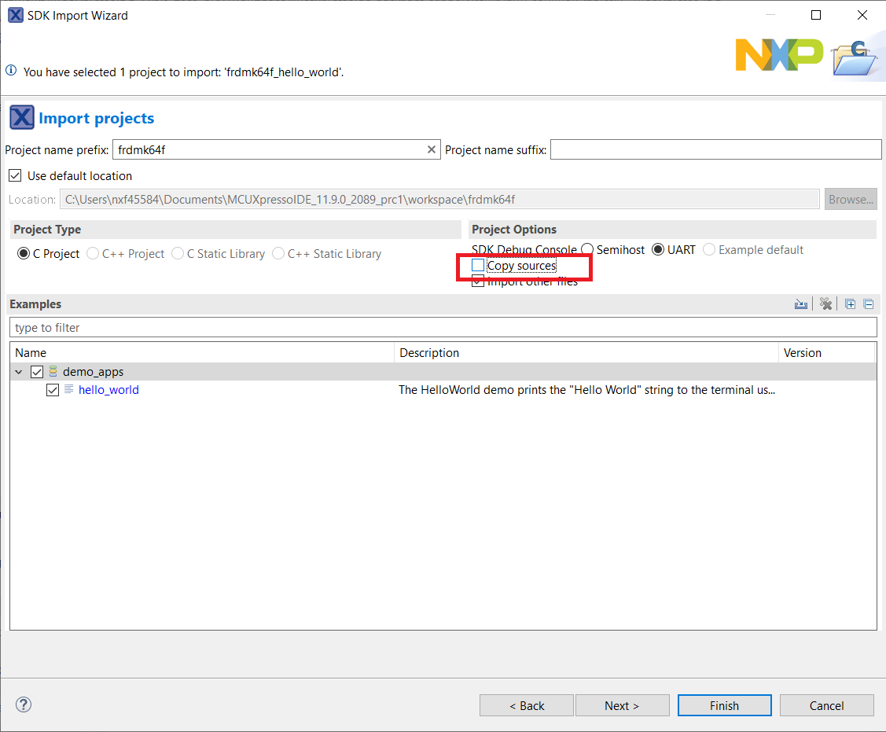

# Meta Build System

## Prequisites

***Firstly, ensure all your code is up-to-date, run `west update_repo`.***
To isolate your development environment, suggest use python venv.
In sdk-next workspace root directory, create and activate a virtual environment:

```bash
# Please ensure your system python version >= 3.8
python -m venv .venv

# For Linux/MacOS
source .venv/bin/activate

# For Windows
.\.venv\Scripts\activate
```

Then install pip and required packages

```bash
pip install west -U

# Note: you can add option '--default-timeout=1000' if you meet connection issue.
pip install -r mcu-sdk-3.0/scripts/requirements.txt
```

Following build, flash and debug commands are refered from zephyr's official one. So you can find the full documentation here: <https://docs.zephyrproject.org/latest/develop/west/build-flash-debug.html>
Most of native zephyr's west build features are reserved.

## Kconfig

1. Please install python3 and menuconfig. For menuconfig, you can run with

```bash
pip install -U kconfiglib
```

2. Make sure that `mcu-sdk-boards`, `mcu-sdk-components`, `mcux-devices-kinetis`, `mcux-devices-lpc`, `mcux-devices-rt` projects are cloned because there are Kconfig data inside these repos for boards/components/devices. Only with all these data included, then you can enjoy full feature of kconfig.

3. Run

```bash
guiconfig
```

You can get the Kconfig GUI and do configuration.

For the time being, the Kconfig flow is still under development, so the output .config is just placed inside mcu-sdk-3.0 repo without being put into cmake configuration.  You can open it and reference.

## West Extension Commands

### Toolchain

Currently, like the build system in sdk-2.x, you have to setup toolchain installation directory in environment varaibles, like `IAR_PATH`, `ARMGCC_PATH` and `MDK_PATH`.

We also support use the modified toolchain/compiler from zephyr sdk. If you followed the zephyr-sdk guide [here](https://docs.zephyrproject.org/latest/develop/toolchains/zephyr_sdk.html#zephyr-sdk-installation), you can use `--toolchain zephyr` with `west build` command in the following chapter to tell meta build system call compiler from it.

### Build

Use `west build -h` to see help information for west build command.
Compared to zephyr's west build, our west build command provides two additional options for mcux examples:

- --toolchain: specify the toolchain for this build, default armgcc.
- --config: value for CMAKE_BUILD_TYPE, default debug.

Here are some typical usage for generating a SDK example is:

```bash

# Generate example with default settings
west build -b frdmk64f examples/demo_apps/hello_world

# Just print cmake commands, do not execute it
west build -b frdmk64f examples/demo_apps/hello_world --dry-run

# Generate other toolchain like iar, default armgcc
west build -b frdmk64f examples/demo_apps/hello_world --toolchain iar

# Generate config type, default debug
west build -b frdmk64f examples/demo_apps/hello_world --config release

```

For multicore devices, you should specify the corresponding core id by passing the command line argument "-Dcore_id". For example

```bash
west build -b evkmimxrt1170 examples/demo_apps/hello_world --toolchain iar -Dcore_id=cm7 --config flexspi_nor_debug
```

Remember to use "--config" to specify build target which is different from SDKGENv3.

### Flash

As we do not have a FRDM-K64F with JLink or other runners for test, we only ensure flash/debug commands can work for linkserver. Please install linkserver and add it to your PATH firstly.

Flash the hello_world example:

```bash
west flash -r linkserver
```


### Debug

Start a gdb interface by following command:

```bash
west debug -r linkserver
```


## IDE GUI Projects

### Prequisites

Currently, we have not implemented all features through Python. So, in order to generate IDE GUI projects, you have to prepare the ruby 3.1 environment, You can refer [SDK Generator V3 environment setup](https://confluence.sw.nxp.com/display/MCUXSDK/Getting+Started+With+SDK+Generator+V3#GettingStartedWithSDKGeneratorV3-EnvironmentSetup).

In short words:

- For windows: use [portable_ruby](https://bitbucket.sw.nxp.com/projects/MCUCORE/repos/mcu-sdk-generator/browse/bin/windows)
- For Linux/MacOS: use [rbenv](https://github.com/rbenv/rbenv) to install `ruby 3.1.2` and then download [Gemfile](https://bitbucket.sw.nxp.com/projects/MCUCORE/repos/mcu-sdk-generator/raw/Gemfile?at=refs%2Fheads%2Fdevelop%2Fmcu_sdk_generator) and [Gemfile.lock](https://bitbucket.sw.nxp.com/projects/MCUCORE/repos/mcu-sdk-generator/raw/Gemfile.lock?at=refs%2Fheads%2Fdevelop%2Fmcu_sdk_generator) in an empty directory and then run `gem install bundle && bundle install` in it.

### IAR/MDK

For the convenience of users who like to use IAR/MDK IDE for development and debugging, the meta build system support to create IDE project definition files from west command with "--toolchain [iar|mdk] -t guiproject". For example:

```bash
west build -b frdmk64f examples/demo_apps/hello_world --toolchain mdk -t guiproject
```

You can check log from command:

```bash
-- west build: running target guiproject
[0/1] cmd.exe /C "cd /D C:\git_repo\identify_2\sdk-next\mcu-sdk-3.0 && C:\CMake\bin\cmake.exe -E env board=frdmk64f device=MK64F12 soc_series=Kinetis Sd..." 
Generate GUI project
generate SDK project:  [debug] [hello_world] [C:\git_repo\identify_2\sdk-next\mcu-sdk-3.0/boards/frdmk64f/demo_apps/hello_world/mdk/hello_world.uvprojx]
```

### MCUXpresso

For mcuxpresso, `-t guiproject` will always be set, so just run:

```bash
west build -b frdmk64f examples/demo_apps/hello_world --toolchain mcux
```

You can check log from command:

```bash
-- west build: running target guiproject
[0/1] C:\WINDOWS\system32\cmd.exe /C "cd /D C:\Repos\sdk-next\mcu-sdk-3.0 &&...ild.ninja -o boards/frdmk64f/demo_apps/hello_world/ -p hello_world -c debug"Generate GUI project
C:/Repos/sdk-next/mcu-sdk-3.0/examples/demo_apps/hello_world/hello_world.yml
D, [2024-03-26T14:33:37.903561 #62960] DEBUG -- : Starting XSD validation
D, [2024-03-26T14:33:37.914107 #62960] DEBUG -- : hello_world_v3_14.xml: Validation complete, no errors were found
generate SDK project:  [mcux] [hello_world] [C:\Repos\sdk-next\mcu-sdk-3.0/boards/frdmk64f/demo_apps/hello_world/hello_world_v3_14.xml]

-- west build: running target manifest
[1/1] C:\WINDOWS\system32\cmd.exe /C "cd /D C:\Repos\sdk-next\mcu-sdk-3.0\bu...on.exe C:\Repos\sdk-next\mcu-sdk-3.0/scripts/mcux_manifest/mcux_manifest.py"
Generate manifest file to C:\Repos\sdk-next\mcu-sdk-3.0\FRDM-K64F_manifest_v3_14.xml
```

To import the sdk in mcuxpresso, you have to add `mcu-sdk-3.0` repo in SDK search roots:


We now have two major limitations with the manifest and project.xml generated from meta build system:

1. No support for MCUXpresso 'New Project Wizard'
We cannot generate component and dependency information in sdk manifest, but you can use kconfig to get similiar experience.

2. Cannot import standalone project
MCUXpresso will not copy all sources for include path only if they are explicitly recorded in manifest. So you have to untick the `Copy sources` option.


