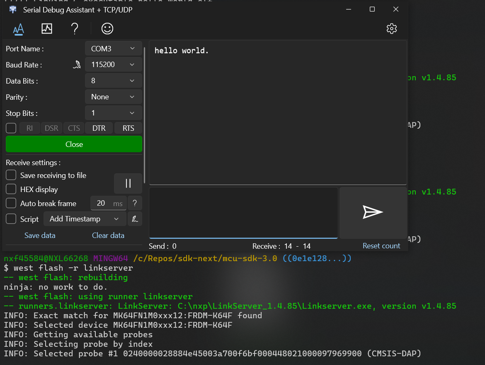
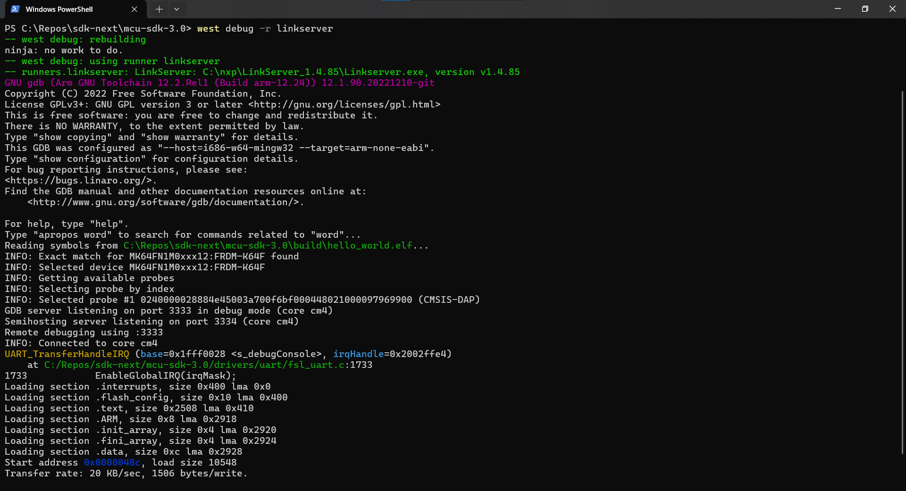

# West

## West Extension Commands

[//]: # ()
### Build

Use `west build -h` to see help information for west build command.
Compared to zephyr's west build, our west build command provides following additional options for mcux examples:

- --toolchain: specify the toolchain for this build, default armgcc.
- --config: value for CMAKE_BUILD_TYPE, default debug.
- --show-configs: show all supported build configurations for the project.

Here are some typical usage for generating a SDK example is:

```bash
# Generate example with default settings
west build -b frdmk22f examples/demo_apps/hello_world

# Just print cmake commands, do not execute it
west build -b frdmk22f examples/demo_apps/hello_world --dry-run

# Generate other toolchain like iar, default armgcc
west build -b frdmk22f examples/demo_apps/hello_world --toolchain iar

# Generate config type, default debug
west build -b frdmk22f examples/demo_apps/hello_world --config release

```

For multicore devices, you shall specify the corresponding core id by passing the command line argument "-Dcore_id". For example

```bash
west build -b evkbmimxrt1170 examples/demo_apps/hello_world --toolchain iar -Dcore_id=cm7 --config flexspi_nor_debug
```

Remember to use "--config" to specify build target which is different from SDKGENv3.

For shield, please use the "--shield" to specify the shield to run, like

```bash
west build -b mimxrt700evk --shield a8974 examples examples/issdk_examples/sensors/fxls8974cf/fxls8974cf_poll -Dcore_id=cm33_core0
```

If you want to get available commands for different build config combinations supported by the project and the toolchain, you can run the command below. Please note that "@${core_id}" suffix for board is only needed for multicore devices.
```bash
  west list_project  -p examples/mbedtls_examples/mbedtls_selftest -b evkmimxrt1160@cm4 -t mdk
```
Here is the output:
```bash
INFO: [   1][west build -p always examples/mbedtls_examples/mbedtls_selftest --toolchain mdk --config debug -b evkmimxrt1160 -Dcore_id=cm4]
INFO: [   2][west build -p always examples/mbedtls_examples/mbedtls_selftest --toolchain mdk --config flexspi_nor_debug -b evkmimxrt1160 -Dcore_id=cm4]
INFO: [   3][west build -p always examples/mbedtls_examples/mbedtls_selftest --toolchain mdk --config flexspi_nor_release -b evkmimxrt1160 -Dcore_id=cm4]
INFO: [   4][west build -p always examples/mbedtls_examples/mbedtls_selftest --toolchain mdk --config release -b evkmimxrt1160 -Dcore_id=cm4]
INFO: [   5][west build -p always examples/mbedtls_examples/mbedtls_selftest --toolchain mdk --config sdram_debug -b evkmimxrt1160 -Dcore_id=cm4]
INFO: [   6][west build -p always examples/mbedtls_examples/mbedtls_selftest --toolchain mdk --config sdram_release -b evkmimxrt1160 -Dcore_id=cm4]
```

### Sysbuild(System build)

To support multicore project building, we ported Sysbuild from Zephyr. It supports combining multiple projects for compilation. You can build all projects by adding "--sysbuild" for main application. For example:

```bash
west build -b evkmimxrt1170 --sysbuild ./examples/middleware/multicore/multicore_examples/hello_world/primary -Dcore_id=cm7 --config flexspi_nor_debug -p always
```

For more details, please refer to [System build](#system-build)

### Flash

***Note***: Please refer [West Flash and Debug Support](#west-flash-and-debug-support) to enable west flash/debug support.

As we do not have a FRDM-K64F with JLink or other runners for test, we only ensure flash/debug commands can work for [linkserver](https://www.nxp.com/design/design-center/software/development-software/mcuxpresso-software-and-tools-/linkserver-for-microcontrollers:LINKERSERVER). Please install linkserver and add it to your PATH firstly.

Flash the hello_world example:

```bash
west flash -r linkserver
```



### Debug

Start a gdb interface by following command:

```bash
west debug -r linkserver
```



**Note**
All of the above west commands can only be run in mcuxsdk west workspace. If you want to use them outside the workspace, please run `SDK-root/mcux-env.cmd` in Windows Command Prompt or `source SDK-root/mcux-env.sh` in Linux terminal to activate the commands.

## Enable West Flash and Debug

Like Zephyr, BS supports setting up configuration for flash runners (invoked from west flash) which allows for customising how commands are used when programming boards.

### board_runner.cmake

`${SdkRootDirPath}/examples/_boards/<board>/board_runner.cmake` is loaded by `${SdkRootDirPath}/cmake/extension/run.cmake` , which is used to get runner arguments and what kind of runners are supported for this board. Here is an example:

```cmake
# set runner speicfic arguments
board_runner_args(pyocd "--target=mimxrt1170_${core_id}")
if(${core_id} STREQUAL cm7)
    board_runner_args(jlink "--device=${CONFIG_MCUX_HW_DEVICE_ID}_M7" "--reset-after-load")
elseif(${core_id} STREQUAL cm4)
    board_runner_args(jlink "--device=${CONFIG_MCUX_HW_DEVICE_ID}_M4")
endif()
board_runner_args(linkserver "--device=${CONFIG_MCUX_HW_DEVICE_ID}:MIMXRT1170-EVK")
board_runner_args(linkserver "--core=${core_id}")

# load board supported runner cmake file
include(${SdkRootDirPath}/cmake/extension/runner/jlink.board.cmake)
include(${SdkRootDirPath}/cmake/extension/runner/pyocd.board.cmake)
include(${SdkRootDirPath}/cmake/extension/runner/linkserver.board.cmake)
```

`board_runner_args` is used to pass runner speicfic arguments and then you have to include the board supported runner cmake file from `${SdkRootDirPath}/cmake/extension/runner/`.

***The first included runner cmake will be set as the default runner for both flash and debug***. If you want to set another default runner. Please set following variable in board's variable.cmake:

```cmake
mcux_set_variable(BOARD_FLASH_RUNNER "linkserver")
mcux_set_variable(BOARD_DEBUG_RUNNER "jlink")
```

To let the runners get correct flash address, MCUXpresso SDK developer should maintain Kconfig variable `FLASH_BASE_ADDRESS` in `devices/${soc_portfolio}/${soc_series}/${device}/(${core_id})/prj.conf`:

```bash
CONFIG_FLASH_BASE_ADDRESS=0x30000400
```

If your project has specific setting, please override this config item in ${project_board_port_path}/prj.conf.
