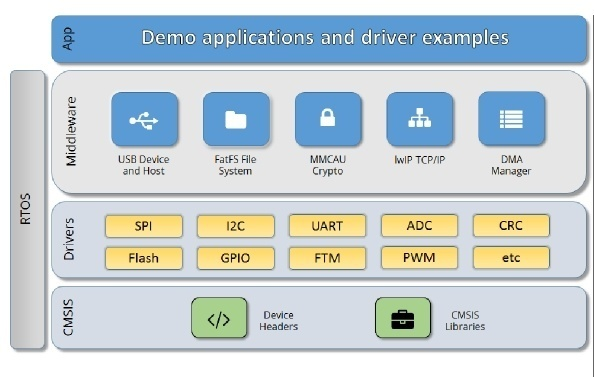
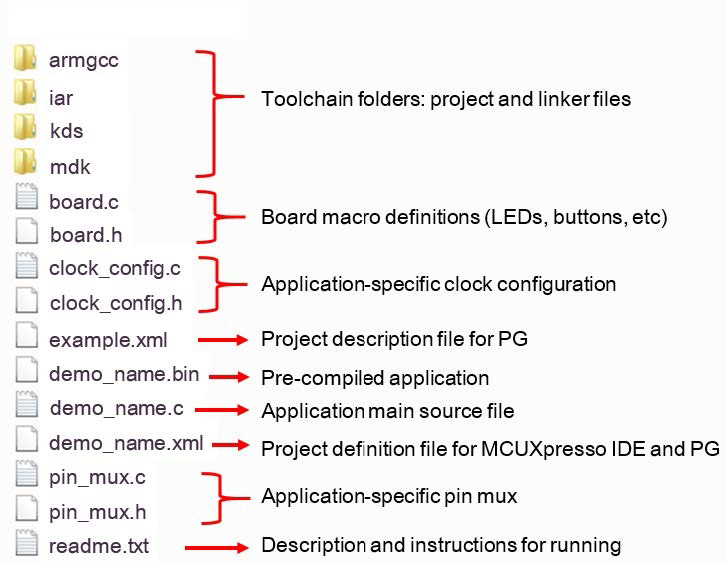

# Architecture

## Introduction

The MCUXpresso Software Development Kit (SDK) provides comprehensive development solutions designed to help accelerate embedded system development of applications based on MCUs from NXP. The MCUXpresso SDK includes a flexible set of peripheral drivers designed to speed up and simplify development of embedded applications. Along with the peripheral drivers, the MCUXpresso SDK provides an extensive set of example applications covering everything from basic peripheral use cases to full technology demonstrations. The MCUXpresso SDK contains optional RTOS integrations such as FreeRTOS, and various other middleware to support rapid development.  

The MCUXpresso SDK architecture is built around the five key components listed below:

1.  **CMSIS** - Arm Cortex Microcontroller Software Interface Standard Core: Device headers, Math/DSP libraries

2.  **Drivers** - SoC peripheral configuration and functions

3.  **RTOS** - Real-time Operating Systems

4.  **Middleware** - Compatible Stacks and technology enablement  

5.  **Applications** - Demo and driver examples based on the MCUXpresso SDK



## CMSIS Support

The MCUXpresso SDK CMSIS folder provides NXP support for the [Arm CMSIS Core](http://www.keil.com/pack/doc/cmsis/Core/html/index.html) standard. Along with SoC and peripheral header files, the SDK also includes common CMSIS header files for the Arm Cortex-M cores and the math and DSP libraries. The CMSIS DSP library source code is included for reference. 

## SoC Support - Header File/Drivers/Startup/Linker\...

The MCUXpresso SDK Device folder allows support for multiple devices in the same package. For example,  MIMXRT1052 is one of the devices in the RT105X family. The support files required to develop with this device will be in a unique folder inside the devices folder. The following sections detail the content provided in these SoC files:

### MCU header files

Each device supported in the MCUXpresso SDK has an overall System-on
Chip (SoC) memory-mapped header file. This header file contains the
memory map and register base address for each peripheral and the IRQ
vector table with the associated vector numbers. The overall SoC header file
provides access to the peripheral registers through pointers and
predefined bit masks. 

The **MCU Header file** is located in:  
    ```
    devices/<DEVICE_PLATFORM>/<DEVICE_FAMILY\>/<DEVICE_NAME>/<DEVICE_NAME>.h
    ```

### Feature Header Files

In addition to the overall SoC memory-mapped header file, the MCUXpresso SDK includes a feature header file for each device. The feature header file allows NXP to deliver a single software driver for a given peripheral. The feature file ensures that the driver is properly compiled for the target SOC.

The peripheral drivers are designed to be reusable regardless of the
peripheral functional differences from one MCU device to another. An
overall Peripheral Feature Header File is provided for the MCUXpresso
SDK-supported MCU device to define the features or configuration
differences for each sub-family device.

### Startup codes

The Startup code file provides the startup functions and assembly code required for the SoC to run from power-Up to the main() function.  The code
usually covers the stack setup, watchdog configuration, and handles
global variables.  

The **Startup code files** are located in:  
```devices/\<DEVICE_NAME\>/system\_\<DEVICE_NAME\>.c/h ```  
```devices/\<DEVICE_NAME\>/\<TOOLCHAIN\>/startup\_\<DEVICE_NAME\>.s/S```

### Linker files

Linker file are provided for each toolchain. The postfix of the
linker file varies from toolchain to toolchain.

The **Linker Files** are located in:  
```devices/\<DEVICE_NAME\>/\<TOOLCHAIN\>/\<\>.scf```

### Peripheral Drivers

The MCUXpresso SDK peripheral drivers mainly consist of low-level
functional APIs for the MCU product family on-chip peripherals and also
of high-level transactional APIs for some bus drivers/DMA driver/eDMA
driver to quickly enable the peripherals and perform transfers.

All MCUXpresso SDK peripheral drivers only depend on the CMSIS headers,
device feature files, fsl_common.h, and fsl_clock.h files so that users
can add the drivers along with their dependencies into a project.  

With the exception of the clock/power-relevant peripherals, each
peripheral has its own driver. Peripheral drivers handle the peripheral
clock gating/ungating inside the drivers during initialization and
deinitialization respectively.

Peripheral Drivers are located in:  
```devices//\<DEVICE_NAME\>/drivers```

**Low-level functional APIs** provide common peripheral functionality, abstracting the hardware peripheral register accesses into a set of stateless basic functional operations. These APIs primarily focus on the control, configuration, and function of basic peripheral operations. The APIs hide the register access details and various MCU peripheralinstantiation differences so that the application can be abstracted from the low-level hardware details.  

The API prototypes are intentionally similar to help ensure easy portability across devices supported in the MCUXpresso SDK.

**Transactional APIs** provide a quick method for customers to utilize higher-level functionality of the peripherals. The transactional APIs utilize interrupts and perform asynchronous operations without user intervention. Transactional APIs operate on high-level logic that requires data storage for internal operation context handling. However, the Peripheral Drivers do not allocate this memory space. Rather, the user passes in the memory to the driver for internal driver operation.

Transactional APIs ensure the NVIC is enabled properly inside the
drivers. The transactional APIs do not meet all customer needs, but
provide a baseline for development of custom user APIs.  

**_NOTE_** The transactional drivers never disable an NVIC after use. This is due to the shared nature of interrupt vectors on devices. It is up to the user to ensure that NVIC interrupts are properly disabled after usage is complete.

#### **Interrupt Handling for Transactional APIs**

A double weak mechanism is introduced for drivers with a Transactional
API. The double weak indicates two levels of weak vector entries. See
the examples below:

```

PUBWEAK SPI0_IRQHandler

PUBWEAK SPI0_DriverIRQHandler

SPI0_IRQHandler

LDR R0, =SPI0_DriverIRQHandler

BX R0
```

The first level of the weak implementation are the functions defined in
the vector table. 

This vector table can be located in:  
```devices/\<DEVICE_NAME\>/\<TOOLCHAIN\>/startup\_\<DEVICE_NAME\>.s/.S```  

The implementation of the first layer weak function calls the
second layer of weak function. The implementation of the second layer
weak function (ex. SPI0_DriverIRQHandler) jumps to itself (B .). The
MCUXpresso SDK drivers with transactional APIs provide the
reimplementation of the second layer function inside of the peripheral
driver. If the MCUXpresso SDK drivers with transactional APIs are linked
into the image, the SPI0_DriverIRQHandler is replaced with the function
implemented in the MCUXpresso SDK SPI driver.

The reason for implementing the double weak functions is to provide a
better user experience when using the transactional APIs. For drivers
with a transactional function, call the transactional APIs and the
drivers complete the interrupt-driven flow. Users are not required to
redefine the vector entries out of the box. At the same time, if users
are not satisfied by the second layer weak function implemented in the
MCUXpresso SDK drivers, users can redefine the first layer weak function
and implement their own interrupt handler functions to suit their
implementation.

The limitation of the double weak mechanism is that it cannot be used
for peripherals that share the same vector entry. For this use case,
redefine the first layer weak function to enable the desired peripheral
interrupt functionality. For example, if the MCU's UART0 and UART1 share
the same vector entry, redefine the UART0_UART1_IRQHandler according to
the use case requirements.

### RTOS Driver

MCUXpresso SDK provides the bus communication driver integrated with native FreeRTOS services. These drivers are called as an RTOS driver and provide the sync transfer APIs. The user can directly call these APIs in FreeRTOS
applications.   

RTOS drivers are located in same folder of Peripheral Drivers with freertos in the file name. For example:  
```devices\\MIMXRT1052\\drivers\\fsl_lpi2c_freertos.c/h```

### CMSIS Driver

MCUXpresso SDK provides CMSIS driver support for all the variants of I2C/UART/SPI peripherals.   The MCUXpresso SDK CMSIS driver implementation uses the pin mux configuration APIs generated by the NXP pinmux Config Tool in ```pinmux.c``` files.
This is different than the way proposed by ARM to configure the PINMUX configuration by passing a set of macros in ```RTE_Device.h```.

### Project Template

See description for Project Template in the Application section found under Development.  Compared to a board level project template, device level project templates are
for use cases to create a new project for a device different from the one used on a specific board.

## Components

SDK provide the components folder in the root directory storing these
sensor driver, common software components and so on. 

### On-Board Device driver

Sensor, PMIC, PHY, Audio Codec which are soldered in the evaluation
board will be supported in the SDK.  Usually, there drivers can be
connected to different variants of the peripheral driver in SoC to make
it work. For example,  Audio codec can be connected to I2C/LPI2C
peripherals.  

To ease the porting effort for the same device supporting work with
different SoC(Which usually means different variants of peripheral),
 these device driver will not be implemented bind to specific peripheral
like I2C or LPI2C. Instead, it require the application to provide
function pointer which is prepared outside of the device driver and
device driver can use these APIs to do the data write/read and so on.
Device driver don\'t care about how these functions pointers are
implemented. application can use all variants of way to implement these
functions pointer.  For example, user can use the CMSIS Driver to
implement it or user even can use the raw register read/write to
implement it. One important thing to be note here is the
initialization/de-initialization of these peripherals will not be done
inside the device driver to avoid the race-condition.  For example,
Audio Codec A and Audio Codec B all use the same I2C.  A don\'t know the
status of B. If A call the de-initialization of I2C,  the B\'s work may
be broken. 

### Common Software Component

Common software component which are not middleware/stacks will also be
placed to this folder.  For example, the NAND Flash Component which
implement the common NAND flash logic operation. Another example is the
application timer.  SDK now integrated a lot of stack/middleware
inside/outside BL/BU/NXP and some of the middleware/stack provide these
kinds of the software components. If certain software component inside
these middleware/stack are also requested in other cases,  these
components will be split out from these middleware/stacks and move to
this part if there is no license issue. 

## Middleware and RTOS

Middle-wares are provided in the directory of middleware folder provided
various middleware support.

RTOS are provided in the directory of rtos folder. For FreeRTOS,  the
bus communication driver are also provided with native FreeRTOS support
leveraging services provided by the FreeRTOS. You can find these RTOS
drivers from the same location of the peripheral drivers.

### RTOS support outside SDK repository

SDK will also support other RTOS but not in the repository of the SDK.
 Zephyr/Ali-OS/MBED OS are both supported in their community.  User can
find the support in these public repository.  

### OSA

SDK don\'t provide the unified OSA layers.  Middleware needing OSA now
get the OSA support inside the middleware.

## Application

SDK provide application in boards/\<board_name_or_kit_name\>/.  Board
here means the evaluation board created by the NXP avaialbe to
customer.  Kits here mean a shied board without micro-controller inside.
It need work with the evaluation board by connector like Arduino
interface.  For example, inside the EVKB-IMXRT1050 packages \"boards\"
folder,  evkbimxrt1050 is the evaluation board. evkbimxrt1050_agm01 is a
shield board which can work with the EVKB-IMXRT1050 board by Arduino
connector.  AGM01 shield board get multi sensors on the board for user
to evaluate NXP sensor product and software.

MCUXpresso SDK board support provides example applications for NXP
development and evaluation boards for Arm Cortex-M cores, including
Freedom, Tower System, and LPCXpresso boards. Board support packages are
found inside of the top level boards folder, and each supported board
has its own folder (an MCUXpresso SDK package can support multiple
boards). Within each \<board_name\> folder, there are various
sub-folders to classify the type of examples they contain.  Except that
demo_apps, driver_examples, and cmsis_driver_examples are default for
each board, other sub-folders are prepared for each middleware like
usb_examples,  These include (but are not limited to):

-   cmsis_driver_examples: Simple applications intended to concisely
    illustrate how to use CMSIS drivers.

-   demo_apps: Full-featured applications intended to highlight key
    functionality and use cases of the target MCU. These applications
    typically use multiple MCU peripherals and may leverage stacks and
    middleware.

-   driver_examples: Simple applications intended to concisely
    illustrate how to use the MCUXpresso SDK's peripheral drivers for a
    single use case. These applications typically only use a single
    peripheral, but there are cases where multiple are used (for
    example, SPI conversion using DMA).

-   emwin_examples: Applications that use the emWin GUI widgets.

-   rtos_examples: Basic FreeRTOS OS examples showcasing the use of
    various RTOS objects (semaphores, queues, and so on) and interfacing
    with the MCUXpresso SDK's RTOS drivers

-   usb_examples: Applications that use the USB host/device/OTG stack.

-   List will be extended with more and more software components
    integrated into the MCUXpresso SDK

### Project Structure

This section describes how the various types of example applications
interact with the other components in the MCUXpresso SDK.

Each \<board_name\> folder in the boards directory contains a
comprehensive set of examples that are relevant to that specific piece
of hardware. We'll discuss the hello_world example (part of the
demo_apps folder), but the same general rules apply to any type of
example in the \<board_name\> folder.

All files in the application folder are specific to that example, so it
is easy to copy and paste an existing example to start developing a
custom application based on a project provided in the MCUXpresso SDK.



### BOARD specific configuration: board.c/h

board.c/h files are prepared for each board during development. In
customer available SDK package, the board.h/c files will be copied to
each project. Inside these files,  it mainly proivde macros/functions to
provide common configuration specific to the board and also that are
commonly used by multiple cases.  These files are created manually.  For
example, in the FRDM-K64F board, the UART0 is connected to OPENSDA K20
chips and user can conect to the K20 from PC to get the log input,  the
board file will debug these UART0 pin connected to OPENSDA K20 as the
DEBUG CONSOLE that all cases using debug console needn\'t define these
macros themselves instead using these macros directly.

### Clock configuration : clock_config.c/h

Clock confiugration files are always required to be generated by clock
tools in MCUX CFG tools that user can import these files/update
files/write back to these files.  Clock confiugraiton files provide
mutiple clock configuration functions for the application to call.  SDK
prepare the common clock configuratoin for multiple modes that most of
application reuse these files.  For some applications with requriement
for code size or clock mode, these cases can customize their own clock
configuration files accordingly.

### PIN configuration: pin_mux.c/h

Pin mux configuration files are always required to be generated by pin
tools in MCUX CFG tools that user can import these files/update
files/write back to these files. pin mux configuration files are always
customized for each applicatiion. pin mux file are create for soc but
not for board.  If create a pin configuration for a board, a lot of
unused functions will be created while it is not needed for specified
case.

### Project Template

Project template is located in
board/\<board_name_or_kit_name\>/project_template/. Project template are
not intented for user\'s direct usage. It provide the template for the
MCUX CFG tool or CMSIS Pack to create new project as starting point.  It
provide the basic template of main file, pin mux configuration files,
clock configuration files and so on. It existed in board level or soc
level. Which file will be used is decided by the request to create
proejct for a soc or for a board. There project template need to be
updated for each configuration tool update.

boards/\<board\>/project_tempalate

devices/\<soc\>/project_template

## Documentation

Documents are located in docs folder.  The Release Notes,  Getting Started
Guide, API Reference Manual and Change Log document are provided.

### Release Notes

Release notes are included with each release of MCUXpresso SDK. It
introduces what is delivered in the SDK package and which tools were used to test the
package. It also lists any known issues for the release.  
The MCUXpresso SDK on GitHub delivers support for multiple devices and boards.  The Release notes provides a Quality Level for the software support of each device/board.  The quality levels are: RFP, EAR, MIN, NON.

### Getting Started Guide

A Getting Started Guide is a valuable resource for first evaluation of the MCUXpresso SDK. It describes a clear procedure on how to use the SDK package.  It outlines steps to begin working with a typical SDK project.  The user will be shown how to compile, program and debug an application for a specific board.  

### API Reference Manual and Change Log

The API Reference Manual details the API and data structures for a given software component.  The content is generated from the doxygen tag in source code.  

Change Log is documents describing the changes for software components in the package. They are
generated from the doxygen information.
