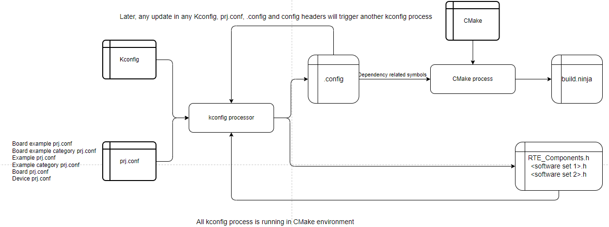

# Configuration System Based on Kconfig

## Overview

[Kconfig](https://www.kernel.org/doc/html/next/kbuild/kconfig-language.html) is a selection-based configuration system originally developed for the Linux kernel which now found more and more use in other projects beyond the Linux kernel.

**In MCUXpresso SDK, Kconfig is used to config the build in run time which includes component selection with dependency resolve, component configuration with feature enable, disable and customization.**

You can interact with Kconfig via a curses or graphical menu interface, usually invoked by running `west build -t guiconfig` after you have already run passed the CMake configuration process. In this interface, the user selects the options and features desired, and saves a configuration file which is then used as an input to the build process.

## Kconfig Usage

1. Please install python3 before installing kconfiglib. For kconfiglib, you can run with the command

   ```bash
   pip install -U kconfiglib
   ```
2. Make sure that MCUXpresso SDK core, devices, boards repositories have been cloned.
3. Run

   Inside Kconfig files, there are board/device variables included in referenced paths, so it cannot be directly run. The Kconfig shall be run during the example cmake build process.

   - Run cmake configuration

     ```bash
     west build -b evkbmimxrt1170 examples/demo_apps/hello_world -Dcore_id=cm7 --cmake-only -p
     ```

     `--cmake-only` only executes build system configuration stage and generation stage. If you omit `--cmake-only`, then the project will be built.
   - Run guiconfig target

     ```bash
     west build -t guiconfig
     ```

     Then you will get the Kconfig GUI launched, like

     

     You can select/deselect and modify to do reconfiguration.

     After you save and close, you can directly run `west build` to do the build.

## Kconfig Process Flow

The input are Kconfig files and prj.conf with priority.
The direct output is the .config and config headers. 
Any updates in input Kconfig, output .config and config header will trigger a Kconfig process in next build cmd.



### prj.conf

prj.conf is the pre set value for Kconfig symbols. It is the input for the Kconfig process. Unlike the cmake files which shall be explicitly included, the proj.conf will be loaded implicitly.

The prj.conf search paths can be provided through 3 ways with priority.

- Default prj.conf search paths

  For all project build, the following path prj.conf will anyway be collected into the build. They are related to device, board and example board specific part. The priority is from low to high. High priority prj.conf data will override low priority prj.conf data.

  ```
  1. devices/prj.conf
  2. devices/<soc_series>/prj.conf
  3. devices/<soc_series>/<device>/prj.conf
  4. devices/<soc_series>/<device>/<core_id>/prj.conf
  5. examples/prj.conf
  6. examples/_boards/prj.conf
  7. examples/_boards/<board>/prj.conf
  8. examples/_boards/<board>/<core_id>/prj.conf
  9. examples/<example_category>/prj.conf
  10. examples/<example_category>/<example>/prj.conf
  11. examples/_boards/<board>/<example_category>/prj.conf
  12. examples/_boards/<board>/<example_category>/<example>/prj.conf
  13. examples/_boards/<board>/<example_category>/<example>/<core_id>/prj.conf
  ```

  For shield case, it is generally the same as board:

  ```
  1. devices/prj.conf
  2. devices/<soc_series>/prj.conf
  3. devices/<soc_series>/<device>/prj.conf
  4. devices/<soc_series>/<device>/<core_id>/prj.conf
  5. examples/prj.conf
  6. examples/_boards/prj.conf
  7. examples/_boards/<board>/prj.conf
  8. examples/_boards/<board>/<core_id>/prj.conf
  9. examples/<shield_example_category>/prj.conf
  10. examples/<shield_example_category>/<example>/prj.conf
  11. examples/_boards/<board>/<shield>/prj.conf
  12. examples/_boards/<board>/<shield>/<shield_example_category>/prj.conf
  13. examples/_boards/<board>/<shield>/<shield_example_category>/<example>/prj.conf
  14. examples/_boards/<board>/<shield>/<shield_example_category>/<example>/<core_id>/prj.conf
  ```

  If the `project` macro is with `NO_DEFAULT_CONFIG` like the following, then build system will skip all the default prj.conf search paths. Since the input prj.conf cannot be empty, so the prj.conf must be provided with `CUSTOM_PRJ_CONF_PATH` or `DCONF_FILE`.

  ```cmake
  project(hello_world LANGUAGES C CXX ASM NO_DEFAULT_CONFIG)
  ```
- Specify customized prj.conf search path(s) in project CMakelists.txt `project` with `CUSTOM_PRJ_CONF_PATH`

  The `CUSTOM_PRJ_CONF_PATH` argument can be used in project CMakelists.txt `project` macro to specify the customized prj.conf search paths and they have higher priority than the default prj.conf search paths.

  It could be either relative path or absolute path. For relative path, the root is the MCUXpresso SDK root.

  Here is one example:

  ```cmake
  project(hello_world LANGUAGES C CXX ASM PROJECT_BOARD_PORT_PATH examples/_boards/${board}/demo_apps/hello_world CUSTOM_PRJ_CONF_PATH subfolder e:/mcuxsdk/subfolder)
  ```

  The `mcuxsdk-root/subfolder/prj.conf` and `e:/mcuxsdk/subfolder/prj.conf` will be added into build if existed.
- -DCONF_FILE=\<customized config file>

  You can directly provide customized prj.conf with `-DCONF_FILE=<customized config file>`, like

  ```bash
  west build -b evkbmimxrt1170 examples/demo_apps/hello_world -Dcore_id=cm4 -DCONF_FILE=./examples/prj.conf
  ```

  The customized project config file has the highest priority over all.

### .config

**.config will be read back by cmake after generated. It has all the resolved device, board, drivers, components, middlewares Kconfig symbols and values. Its contents will be filtered to get the dependency satisfied components and project segments symbols, such symbols will be put into later cmake process so that cmake knows which components and project segments data shall be included into the build process.**

> All the components and project segments Kconfig symbols start with CONFIG_MCUX_COMPONENT_ or CONFIG_MCUX_PRJSEG_. They won't be generated into config header files.

**For example, if `CONFIG_MCUX_COMPONENT_driver.uart` is `y` in .config, then the following sources and includes will be added into the build during cmake process, otherwise not.**

```cmake
if (CONFIG_MCUX_COMPONENT_driver.uart)
    mcux_add_source(
        SOURCES fsl_uart.h 
                fsl_uart.c
    )
    mcux_add_include(
        INCLUDES .
    )
endif()
```

### Config Headers

The Kconfig symbols and the values related to compile and link will be generated into config header files placed in build binary folder.

> Except Kconfig symbols starting with CONFIG_MCUX_, all other Kconfig symbols with their values will be generated into config header files.

If you want your components configuration Kconfig symbols and values to be generated into designated header file, you can set Kconfig menu with header name. Here is an example with Freertos kernel.

```bash
menu "Configuration (FreeRTOSConfig_Gen.h)"  # All freertos kernel Kconfig symbols and values will be generated into FreeRTOSConfig_Gen.h

#******************************************************************************#
#* Hardware description related definitions. **********************************#
#******************************************************************************#
        config configCPU_CLOCK_HZ
            string "configCPU_CLOCK_HZ"
            default "(SystemCoreClock)"
            help
                No prefix in generated macro
```

In this way, all the Kconfig symbols inside `menu "Configuration (FreeRTOSConfig_Gen.h)"` will be generated into `FreeRTOSConfig_Gen.h`.

For such customized header files, there are 2 ways to include them into build tree:

1. The build binary folder is added into search path by default, you just need to include the config headers in the source in advance so that all config header files will be added into build tree. This is the default way.
2. If you run with `-DPREINCLUDE=1`, then all generated header files will be included into build tree in a preinclude way.

**If it is not set, then all Kconfig symbols and values will be generated header named `mcux_config.h` which will be added into project in a preinclude way.**

## MCUXpresso SDK Customized Kconfig Rules

To support MCUXpresso SDK development, we introduce some customized Kconfig rules. These rules could be used together.

### Remove `CONFIG_` Prefix for Macro Name

Kconfig by default will add `CONFIG_` prefix to macros in the generated header files. However, this prefix doesn't work for some middlewares or RTOSes, like fafts and freertos. Their sources complication cannot work with macros with prefix `CONFIG_` . To support such cases, we introduced a mechanism to forbid adding `CONFIG_` prefix in the macros: in the `help` of the Kconfig symbol, `No prefix in generated macro` shall be provided, like

```
config RAM_DISK_ENABLE
    bool "RAM"
    default y if MCUX_COMPONENT_middleware.fatfs.ram
    default n
    help
        No prefix in generated macro
```

Then the generated macro in header file is like

```c
#define RAM_DISK_ENABLE 1
```

### Keep Quotes for String Type Macro Value

If the Kconfig symbol value is string type, for C language it must be wrapped with quotes. This requires value set in Kconfig's default or prj.conf must be escaped from quotes using `\"` which is not convenient, like:

```bash
config CHIP_DEVICE_PRODUCT_NAME
    string "Product name"
    default "\"not-specified\""
    help
        Provides a human-readable product name
```

To get rid of the escape characters, we introduce the mechanism: for string type Kconfig, if `Macro value is in quotes` is provided in `help`, then quotes will be kept in the generated macro. The above CHIP_DEVICE_PRODUCT_NAME can be wrote this way:

```
config CHIP_DEVICE_PRODUCT_NAME
    string "Product name"
    default "not-specified"
    help
        Provides a human-readable product name
        Macro value is in quotes
```

Then the generated macro in header file is like

```c
#define CONFIG_CHIP_DEVICE_PRODUCT_NAME "not-specified"
```

### Keep `U` Suffix for Unsigned Integer Type Macro Value

Unlike C, Kconfig only provides integer data types. If you want to mark data as unsigned integer, please add `type unsigned` keyword in Kconfig `help` information.

Here is an example, the following Kconfig symbol

```
config USB_DEVICE_CONFIG_HID
    int "HID (Human Interface Device) Instance Count"
    default 0
    help
        No prefix in generated macro
        type unsigned
```

will be generated into macro like:

```c
#define USB_DEVICE_CONFIG_HID 0U
```

