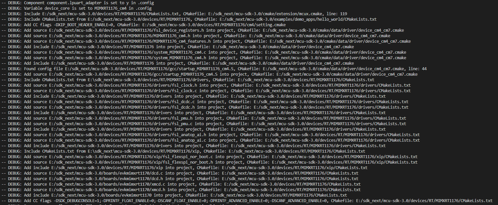
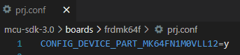
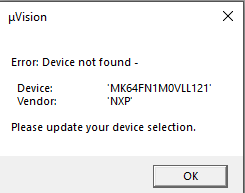
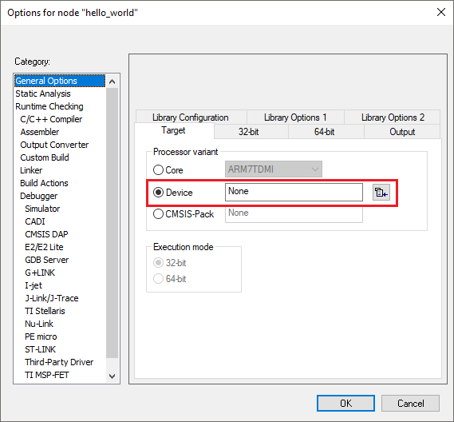
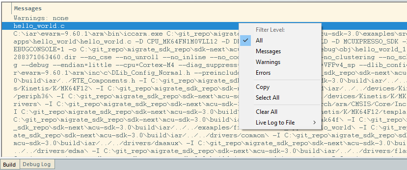
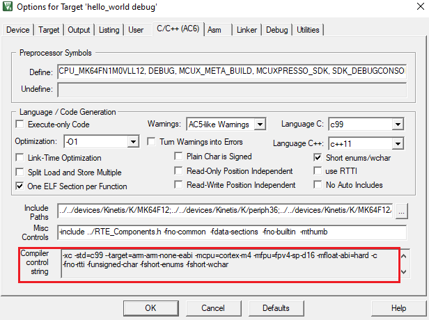

# Frequently Asked Questions

## CMake

1. How to get detailed cmake configuration log about from which cmake files the include/source/configuration is added.

   You can use `--log-level=debug` to get detailed steps of cmake adding source/include/configuration. A cmd example is like

   ```bash
   west build -b evkmimxrt1170 examples/demo_apps/hello_world -Dcore_id=cm4 --log-level=debug
   ```

   The logs look like

   

2. How to replace the default linker file with the customized one?
   
   Generally, when you type "--config=<CMAKE_BUILD_TYPE>" in the command line, the cmake settings inside sdk-next/mcu-sdk-3.0/arch/arm/target folder will take effect. The link file for the corresponding config is then used.
   If running with "--log-level=debug" in the command line, you can find the log, such as:
   ```text
   -- DEBUG: Add -T C:/git_repo/migrate_sdk_repo/sdk-next/mcu-sdk-3.0/devices/Kinetis/MK64F12/gcc/MK64FN1M0xxx12_flash.ld to LD flags, load from CMakefile: C:/git_repo/migrate_sdk_repo/sdk-next/mcu-sdk-3.0/arch/arm/target/flash.cmake
   ```
   
   To replace the default linker file with the customized one, you need to remove the default linker file and add the customized one by `mcux_remove_<toolchain>_linker_script` and `mcux_add_<toolchain>_linker_script` in reconfig.cmake.
   For example:
   ```cmake
   # mcu-sdk-3.0/examples/frdmk64f/demo_apps/hello_world/reconfig.cmake
   mcux_remove_armgcc_linker_script(
       TARGETS debug release
       BASE_PATH ${SdkRootDirPath}
       LINKER devices/${soc_portfolio}/${soc_series}/${device}/gcc/${CONFIG_MCUX_TOOLCHAIN_LINKER_DEVICE_PREFIX}_flash.ld
   )
   
   mcux_add_armgcc_linker_script(
       TARGETS debug release
       BASE_PATH ${SdkRootDirPath}
       LINKER examples/frdmk64f/demo_apps/hello_world/hello_world_flash.ld
   )
   ```
   If running with "--log-level=debug", you can find the log:
   ```text
   -- DEBUG: Add linker flag -T C:/git_repo/migrate_sdk_repo/sdk-next/mcu-sdk-3.0/devices/Kinetis/MK64F12/gcc/MK64FN1M0xxx12_flash.ld into TO_BE_REMOVED_FLAGS list, load from CMakefile: 1171
   -- DEBUG: Remove linker flag -T C:/git_repo/migrate_sdk_repo/sdk-next/mcu-sdk-3.0/devices/Kinetis/MK64F12/gcc/MK64FN1M0xxx12_flash.ld, load from CMakefile: 1182
   -- DEBUG: Add -T C:/git_repo/migrate_sdk_repo/sdk-next/mcu-sdk-3.0/examples/frdmk64f/demo_apps/hello_world/hello_world_flash.ld to LD flags, load from CMakefile: C:/git_repo/migrate_sdk_repo/sdk-next/mcu-sdk-3.0/examples/frdmk64f/demo_apps/hello_world/reconfig.cmake
   ```   

## Kconfig

1. How the kconfig symbols(configurations) are handled and integrated into build?

   1. All kconfig symbols will firstly been generated into .config with kconfig process lib. We do some updates on the kconfig process lib to meet our needs

   2. Symbols starting with `MCUX_` will be got by cmake and determine which components/drivers/project_segments to be included in.

   3. Macro symbols will be generated into config header files

        3.1 In the kconfig menu, if the header is specified, like menu "freertos-kernel(FreeRTOSConfig.h)", the all symbols under this menu will be generated into FreeRTOSConfig.h

        3.2 If there is no specified headers in the menu, then all systems be generated into RTE_Components.h.

        3.3 all generated config headers are generated and placed under the project root path, like boards/frdmk64f/demo_apps/hello_world. These headers are expected to be included

        ​    in the sources/headers in advance.

        3.4 By default, kconfig will put CONFIG_ prefix in the macros, if you need it, then add "No prefix in generated macro" in the help, like

        ```bash
            if MCUX_COMPONENT_middleware.freertos-kernel

                config configUSE_PREEMPTION
                    bool "configUSE_PREEMPTION"
                    default y
                    help
                        No prefix in generated macro
                config configUSE_TICKLESS_IDLE
                    bool "configUSE_TICKLESS_IDLE"
                    default 0
                    help
                        No prefix in generated macro
        ```

2. For board device variant selection, kconfig files will provide default. We also expect in boards/`<board>`/prj.conf, developers can explicitly specify it, like

   

## GUI Project

1. Why do I get an "wrong argument type nil (expected Regexp)" error when running `-t guiproject`?

   That's because you have run west command for armgcc toolchain, so that the script will get build information from cache, but there is no GUI project for armgcc. In this case, you need to add "-p always" to run a pristine build.

   We have updated the script, if you get the latest commit, you will get more explicit error message:

   ```bash
   Currently supported toolchain: ["iar", "mdk"], but script get armgcc, please check --toolchain in west command, or try run with -p always to prevent setting by cache.
   ```

2. Why the IDE can not identify the MCU when I open the project?

    For Keil MDK, if you get build error like:

    
    
    For IAR, if the error like `Fatal Error[Pe035]: #error directive: "Unknown target."` And no device setting:
    
    

    Please check the variable MCUX_TOOLCHAIN_IAR_CPU_IDENTIFIER and MCUX_TOOLCHAIN_MDK_CPU_IDENTIFIER in mcu-sdk-3.0\devices\${soc_series}\${device}\Kconfig.chip, make sure it's a valid device idenditier. 

## BUILD

1. Why does GUI project build pass but fail on the command line?

    To create GUI project, the script parses build.ninja and set them in project template file. There may be some presets in the template file that make your project compile successfully, but they will not be used by CMake. So you need to compare the build options in the GUI project with those in build.ninja and add missing assembler/compiler/linker flags in CMake.
    
    For IAR project, you can check build options by setting log level to `All`.
    
    
    For MDK project, you can check build options in  `C/C++(AC6)`/`Asm`/`Linker`  option tab.
    
