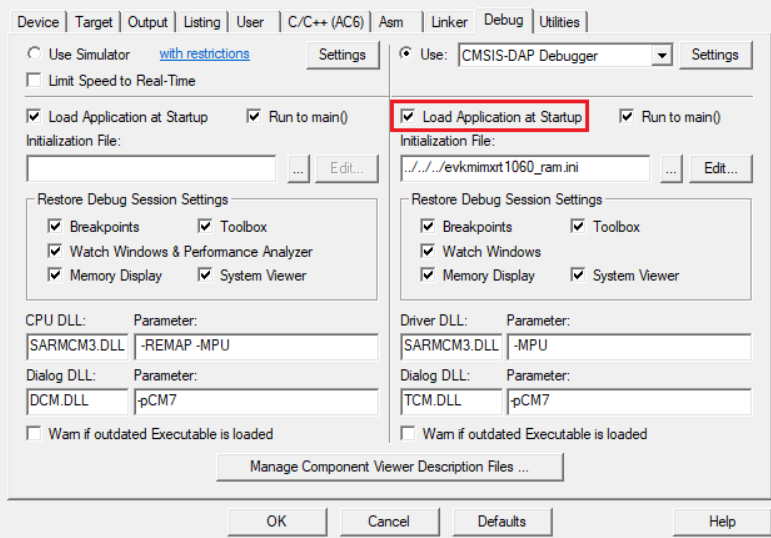
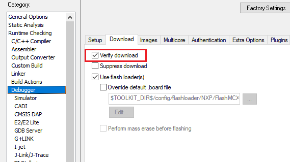
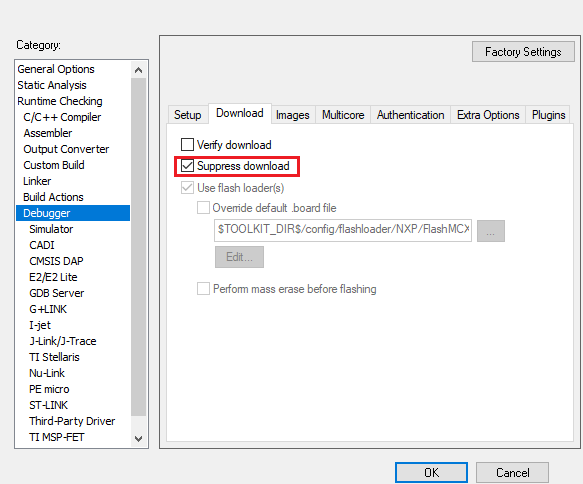
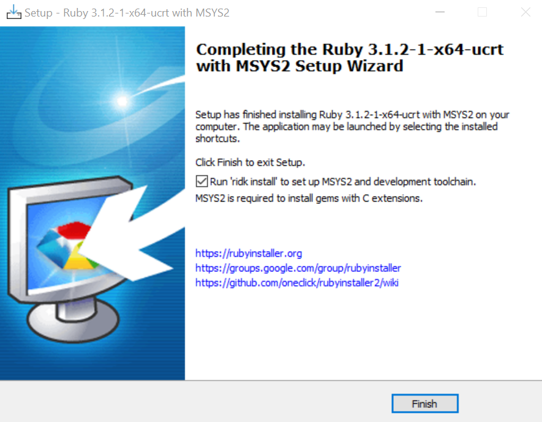
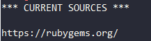

# IDE Project Generation

CMake is a text-oriented tool that uses the command-line. For many developers especially those who get used to working on Windows operating system with IDE such as IAR or MDK, the user experience for coding and debugging is not good. Therefore, we provide CMake targets guiproject and standalone_project to create IDE GUI project which analyzes the `build.ninja` file to get source files, include path, assembler/compiler/linker flags and set them into project 
template files. The build system supports GUI project generation for IAR, MDK, Xtensa and CodeWarrior.

## Usage

### Ruby environment

The IDE GUI project generation is implemented in ruby, please refer [Ruby environment setup](#ruby-environment-setup) to setup environment.

### GUI project

It's quite easy for you to generate a GUI linked project, only `--toolchain [iar|mdk|xtensa] -t guiproject` is required in the west command. It tells CMake to run guiproject target to generate project files for specific toolchain. The GUI project files are located in `build/${toolchain}` folder, it uses relative path to refer source files and include path in repository.

If you are running a pristine build, please specify board/examples/toolchain/core_id on the command line, for example:

```bash
west build -b evkbmimxrt1170 examples/demo_apps/hello_world --toolchain iar -Dcore_id=cm7 --config flexspi_nor_debug -p always -t guiproject
```

If you have run `west build` command, there is a simpler and faster command:

```bash
west build -t guiproject
```

After the command runs, the project files are generated into the compilation directory. You can find it in command line, for example:


### Standalone Example

Please refer [Standalone Example](./../sdk/example_development.md#standalone-examples) chapter.

## IDE Setting Data

### IDE.yml
For GUI project, the build information of assembler/compiler/linker comes from artifacts of CMake configuration, more specifically, the `build.ninja` file. However, it is not enough for build system. Since the IDE will provide rich download debugging capabilities, we need to record this additional information. The IDE related data are recorded in IDE.yml.

#### Load Sequence

The IDE yml files are are automatically loaded and merged by the build system in a certain order and do not need to be manually loaded by the user. The loading sequence is:

    1. devices/IDE.yml
    2. devices/<soc_series>/IDE.yml
    3. devices/<soc_series>/<device>/IDE.yml
    4. devices/<soc_series>/<device>/<core_id>/IDE.yml
    5. examples/IDE.yml
    6. examples/_boards/IDE.yml
    7. examples/_boards/<board>/IDE.yml
    8. examples/_boards/<board>/<core_id>/IDE.yml
    9. examples/<example_category>/IDE.yml
    10. examples/<example_category>/<example>/IDE.yml
    11. examples/_boards/<board>/<example_category>/IDE.yml
    12. examples/_boards/<board>/<example_category>/<example>/IDE.yml
    13. examples/_boards/<board>/<example_category>/<example>/<core_id>/IDE.yml

For shield, it is like

    1. devices/IDE.yml
    2. devices/<soc_series>/IDE.yml
    3. devices/<soc_series>/<device>/IDE.yml
    4. devices/<soc_series>/<device>/<core_id>/IDE.yml
    5. examples/IDE.yml
    6. examples/_boards/IDE.yml
    7. examples/_boards/<board>/IDE.yml
    8. examples/_boards/<board>/<core_id>/IDE.yml
    9. examples/<shield_example_category>/IDE.yml
    10. examples/<shield_example_category>/<example>/IDE.yml
    11. examples/_boards/<board>/<shield>/IDE.yml
    12. examples/_boards/<board>/<shield>/<shield_example_category>/IDE.yml
    13. examples/_boards/<board>/<shield>/<shield_example_category>/<example>/IDE.yml
    14. examples/_boards/<board>/<shield>/<shield_example_category>/<example>/<core_id>/IDE.yml

These IDE.yml files are optional. The higher load sequence, the higher priority. High priority IDE.yml will override low priority IDE.yml data.

There are 3 kinds of IDE data: project templates, IDE option and Special functional files.

#### Project templates

The project template files are the most basic and original IDE definition files for GUI project generation. All IDE settings are set based on these files. We have prepared project template files in advance, which are located in the mcuxsdk/scripts/guigenerator/templates, for example


Currently, only IAR and Keil MDK are supported. For IAR, the `*.ewp` and `*.ewd` are necessary. For Keil MDK, we have provided project template files for each board, you need to set `*.uvprojx` and `*.uvoptx`.

To record such files in CMake, you need to record them under specific toolchain with "project-templates" field.

If you want to replace previous setting, just reset the setting in files loaded later

Here is the example:

```yaml
# mcuxsdk/boards/evkbmimxrt1170/cm7/IDE.yml
mdk:
  project-templates:
    - scripts/guigenerator/templates/mdk/app_evkbmimxrt1170/app_evkbmimxrt1170.uvprojx
    - scripts/guigenerator/templates/mdk/app_evkbmimxrt1170/app_evkbmimxrt1170.uvoptx
iar:
  project-templates:
    - scripts/guigenerator/templates/iar/app_cmsisdap/generic.ewp
    - scripts/guigenerator/templates/iar/app_cmsisdap/generic.ewd
    - scripts/guigenerator/templates/iar/general.eww
# mcuxsdk/boards/evkbmimxrt1170/demo_apps/hello_world/cm7/IDE.yml
iar:
  project-templates: # Accodring to load sequence, this setting will take effect
    - scripts/guigenerator/templates/iar/app_jlinkswd/generic.ewp
    - scripts/guigenerator/templates/iar/app_jlinkswd/generic.ewd
    - scripts/guigenerator/templates/iar/general.eww
```

#### IDE option

In general, IDEs support some special debugging settings, which are not implemented in the native CMake build system. For example, IAR support to selects the reset strategy to be used when the debugger starts, Keil MDK support to load application at startup, etc.

You can set IDE option for specific toolchain and specific target. If the setting is for all targets, please set it under `__common__`

Here is the example:

```yaml
# mcuxsdk/boards/evkbmimxrt1170/cm7/IDE.yml
iar:
  config:
    __common__:
      debugger_setting:
        cmsisdap_resetlist: software
```

Note: If you want to replace the setting with the new one, just reset it in files loaded later.

For details of commonly used option settings, please refer to [IDE Option Setting](#ide-option-setting)

#### Special functional scripts

Some IDEs may use scripts to initialize the compilation environment before and after the compilation phase, or to process the image files generated by the compilation, or to initialize the flash before the start of debugging, etc. So we need to support the recording of these scripts in IDE.yml.

You can set a script in "files" field inside a section with attribute:

- toolchains: The toolchain targeted by the IDE script
- targets: The build configuration targeted by the IDE scripts, such as debug/release/flexspi_nor_debug/flexspi_nor_release, etc.
- source: The relative path of the IDE script
- attribute: The attribute of the script, Represents the function of the script

Here is the example:

```yaml
macro-file: #setction name
  files:
  - source: examples/_boards/${board}/evkbmimxrt1170_cm7.mac
    attribute: macro-file
    toolchains: iar
```

Note: If you want to replace the script with the new one, please record them in files loaded later. To prevent replacing just one script and re-writing all the others, it is not recommended to record all files in one section. It's best to put only one file in a section. For example:

```yaml
macro-file: #setction name
  files:
    - source: examples/_boards/${board}/evkbmimxrt1170_connect_cm7.mac
      attribute: macro-file
      toolchains: iar
```

For details of supported attribute file, please refer to [IDE Script Setting](#ide-script-setting)

### Assembler/Compiler/Linker Flags

The meta build system use CMake to create build artifacts. In general, CMake doesn’t provide abstraction of flags setting for all kinds of toolchains. So that developer should use the flags for assembler/compiler/linker which follows the rule by each toolchain. Here are links for you to refer:

- [IAR][https://wwwfiles.iar.com/AVR/webic/doc/EWAVR_CompilerGuide.pdf]
- [MDK][https://developer.arm.com/documentation/100748/0622/Using-Common-Compiler-Options]
- [ARMGCC][https://gcc.gnu.org/onlinedocs/]

Assembler/Compiler/Linker flags are set with following CMake configuration function in CMake file, please refer to  [Configuration](./Build_System.md#configuration)

For example, the following code sets optimization level for IAR compiler:

```cmake
mcux_add_iar_configuration(
    TARGETS flexspi_nor_debug
    CC "-Ol"
    )
```

In the following sections, the commonly used settings are described.

#### Optimizations flags

- IAR

  IAR supported compiler optimization flags are:

    - -On
    - -Ol
    - -Om
    - -Oh
    - -Ohs
    - -Ohz

  Besides, IAR provides special optimization features:

    - --no_size_constraints
    - --no_cse
    - --no_unroll
    - --no_inline
    - --no_code_motion
    - --no_tbaa
    - --no_clustering
    - --no_scheduling

  These settings are set up in the IAR GUI as shown here

  
- MDK

  For ARM compiler v6, optimization flags are -O0/-O1/-O2/-O3/-Ofast/-Os/-Oz.

  These flags match with IDE settings as below:

  
- ARMGCC

  For ARMGCC, optimization flag are -O0/-O1/-O2/-O3/-Os/-Ofast/-Og.

**Note**: Default optimization level is set in `arch/${arch}/target` and enabled by Kconfig item `MCUX_PRJSEG_module.board.suite`. Here is the default level for each toolchain:

| toolchain\target | debug        | release      |
| ---------------- | ------------ | ------------ |
| IAR              | -On          | -Oh          |
| MDK              | -O1          | -Oz          |
| ARMGCC           | -O0          | -Os          |
| Xtensa           | -O0          | -Os          |
| CodeWarrior      | -opt level=1 | -opt level=4 |

If your project needs different optimization level, please remove the default one and add the new flag.

#### Macro definition

Macro is used to preprocess source files, it is a common setting for assembler/compiler. You can use CMake configuration function defined in  [Configuration](./Build_System.md#configuration) to set macro definition.

The macro definition follow the pattern `-Dname=value`, or `-Dname` if no value provided.

For example:

```cmake
mcux_add_iar_configuration(
    TARGETS flexspi_nor_debug
    AS "-DDEBUG"
    CC "-DDEBUG -DXIP_EXTERNAL_FLASH=1 -DFSL_SDK_DRIVER_QUICK_ACCESS_ENABLE=1"
    CX "-DDEBUG"
    )
```

Furthermore, `mcux_add_macro` can be used to simply the setting  to omit `-D` prefix. For example:

```cmake
mcux_add_macro(
    CC "XIP_BOOT_HEADER_ENABLE=1"
    TARGETS flexspi_nor_debug flexspi_nor_release
    TOOLCHAINS mdk
)
```

#### Heap Stack setting

Heap and stack is setting by linker script. Generally SDK use symbol `__stack_size__`and `__heap_size__` to set the size. To simplify heap stack setting, `mcux_add_linker_symbol` provides an unify way to set linker symbol for different toolchain. For example:

```cmake
mcux_add_linker_symbol(
    SYMBOLS "__stack_size__=0x3000 __heap_size__=0x3000"
)
```

This setting is equivalent to setting with `mcux_add_${toolchain}_configuration` function:

- IAR

  IAR use linker flags `--config_def=__stack_size__=${stack size}` and `--config_def=__heap_size__=${heap size}`

  For example

  ```cmake
  mcux_add_iar_configuration(
      LD "--config_def=__stack_size__=0x3000 --config_def=__heap_size__=0x3000"
  )
  ```
- MDK

  MDK use linker flags `--predefine="-D__stack_size__=${stack size}"` and  `--predefine="-D__heap_size__=${heap size}"`

  For example

  ```cmake
  mcux_add_mdk_configuration(
  	  LD "--predefine=\"-D__stack_size__=0x3000\" --predefine=\"-D__heap_size__=0x3000\""
  )
  ```
- ARMGCC

  ARMGCC use linker flags `-Xlinker --defsym=__stack_size__=${stack size}` and  `-Xlinker --defsym=__heap_size__=${heap size}`

  For example

  ```cmake
  mcux_add_armgcc_configuration(
  	  LD "-Xlinker --defsym=__stack_size__=0x3000 -Xlinker --defsym=__heap_size__=0x3000"
  )
  ```

#### TrustZone

TrustZone feature is enabled by compiler flags. It may be different for each toolchain.

- IAR

  ```cmake
  mcux_add_iar_configuration(CC "--cmse")
  ```
- Keil MDK

  ```cmake
  mcux_add_mdk_configuration(CC "-mcmse")
  ```
- ARMGCC

  ```cmake
  mcux_add_armgcc_configuration(CC "-mcmse")
  ```

#### Multi-projects in one workspace

This feature is used in GUI project generation to put multiple projects into one workspace and is only supported on IAR and KEIL toolchains now. You can use `shared-workspace` filed to name the workspace file, and list the path of the other projects in `sharing-workspace`.
Here is a demo of `tfm_demo_s` and `tfm_demo_ns`, both projects are contained into a shared workspace named `tfm_demo`:

- *IAR*

    ```yaml
    iar:
      shared-workspace: tfm_demo
      sharing-workspace:
      - ../../tfm_demo_ns/iar/tfm_demo_ns
    ```

- *KEIL*

    ```yaml
    mdk:
      shared-workspace: tfm_demo
      sharing-workspace:
      - ../../tfm_demo_ns/mdk/tfm_demo_ns
    ```

Then you can open the project to see both projects:


#### Keil MDK Specific Settings

##### Change C library

Keil use linker flag `--library_type=lib` to select the library to be used at link time.

If you don't specify library, then the linker assumes `--library_type=standardlib`

If you want to use C micro-library (microlib), please set it as:

```cmake
mcux_add_mdk_configuration(LD "--library_type=microlib")
```


#### IAR Specific Settings

##### Change entry symbol

If you need to set the entry symbol for IAR, you can set linker flags in CMake:

```cmake
mcux_add_iar_configuration(LD "--entry Reset_Handler")
```


##### Change C library

C/C++ runtime library configuration can be set with compiler flags, supported library types are:

- --dlib_config none
- --dlib_config normal
- --dlib_config full
- --dlib_config custom

For example:

```cmake
mcux_add_iar_configuration(CC "--dlib_config full")
```


##### Semihosted option

If you need to set semihosted option in IAR, a linker flag `--semihosting` can be set in CMake.

Further more, the default low-level interface is via semihosting, if using implementation with SWO,

an additional linker flag `--redirect __iar_sh_stdout=__iar_sh_stdout_swo` is needed.

Here is an example:

```cmake
mcux_add_iar_configuration(LD "--semihosting --redirect __iar_sh_stdout=__iar_sh_stdout_swo")
```


##### Change I/O option

In IAR Library Options 1 tab, IDE provide configuration for printf formatter and scanf formatter.

For each printf formatting level, you can set ld-flags to configure it. Here are linker flags:

- `--redirect _Printf=_PrintfFull`
- `--redirect _Printf=_PrintfFullNoMb`
- `--redirect _Printf=_PrintfLarge`
- `--redirect _Printf=_PrintfLargeNoMb`
- `--redirect _Printf=_PrintfSmall`
- `--redirect _Printf=_PrintfSmallNoMb`
- `--redirect _Printf=_PrintfTiny`

For each scanf formatting level, you can set ld-flags to configure it. Here are linker flags:

- `--redirect _Scanf=_ScanfFull`
- `--redirect _Scanf=_ScanfFullNoMb`
- `--redirect _Scanf=_ScanfLarge`
- `--redirect _Scanf=_ScanfLargeNoMb`
- `--redirect _Scanf=_ScanfSmall`
- `--redirect _Scanf=_ScanfSmallNoMb`

Further more, you can enable buffered terminal output with ld-flags `--redirect __write=__write_buffered`.

Here is an example:

```cmake
mcux_add_iar_configuration(
	  CC "--dlib_config full"
    LD "--redirect _Printf=_PrintfFull --redirect _Scanf=_ScanfFull --redirect __write=__write_buffered"
)
```


### Source And Include Path

The source and include path setting are set in CMake file, please refer to [Source And Include](./Build_System.md#source-and-include)

### Pre-include File

You can mark the file as pre-include file with `mcux_add_source` CMake function. For example:

```cmake
mcux_add_source(
    PREINCLUDE TRUE
    SOURCES ./app_preinclude.h
)
```

This pre-include file will be prefixed for each compiler automaitcally. Such as `--preinclue ./app_preinclude.h` for IAR, `-inclue ./app_preinclude.h` for mdk and so on.

### Linker file

The Linker file setting are set in CMake file, please refer to [CMake Extension Linker Setting](./Build_System.md#mcux_add_iar_linker_script/mcux_add_mdk_linker_script/mcux_add_armgcc_linker_script)

### Link libraries

The libraries are set in CMake file with CMake extension function `mcux_add_configuration`, please refer to [CMake Extension Configuration Function](./Build_System.md#mcux_add_library)

#### Pre-build/Post-build Command

The pre/post build command can be set by CMake function mcux_add_custom_command, please refer to [CMake Extension Pre/Post Build Command](./Build_System.md#mcux_add_custom_command)

### IDE Option Setting

The IDE option setting is set in IDE.yml. The option is set by the `SETTING: VALUE` hash data structure in yml format. For more details, please refer to  [IDE Option](#ide-option)

#### Keil MDK

Supported option for MDK are:

- Update Target before Debugging for Keil

    - SETTING: update-before-debug
    - VALUE: true or false

      For example:

      ```yaml
      mdk:
        config:
          __common__:
            update-before-debug: true
      ```

      
- Load Application at Startup for Keil

    - SETTING: load_application
    - VALUE: true or false

      For example:

      ```yaml
      mdk:
        config:
          __common__:
            load_application: true
      ```

      
- Set Periodic Window Update for Keil

    - SETTING: periodic_update
    - VALUE: true or false

      For example:

      ```yaml
      mdk:
        config:
          __common__:    
            periodic_update: true
      ```

      

#### IAR

Supported option for IAR are:

- Debugger Extra Options

    - SETTING: debugger_extra_options
    - VALUE: Specific settings

      For example:

      ```yaml
      iar:
        config:
          __common__:
            debugger_extra_options:
              - "--macro_param enable_core=1"
      ```

      

- Download Extra Image

  For multicore project, usually there are extra image needed when debugging, IAR support this setting, you can use `download-extra-image` to configure. For example

  ```yaml
  iar:
    config:
      debug:
        download-extra-image:
        - path: ../../hello_world_ns/iar/debug/hello_world_ns.out
          offset: 0x0
          debug_info_only: false
  ```

  

- Verify download
  If you want to verify the code image with contents read back from target memory, you can set `verify_download` to true. For example:
    ```yaml
    iar:
      config:
        debug:
          debugger_setting:
            verify_download: true
    ```



- Suppress download

    If you want to disable the downloading of the code to preserve the content of the flash, you can set `suppress_download` to true. For example:
    ```yaml
    iar:
      config:
        debug:
          debugger_setting:
            suppress_download: true
    ```
    

### IDE Script Setting

The IDE script is set in IDE.yml. To record a script in yml, you should set at least the following properties:

- source: The path of the script, it should be a path relative to ${SdkRootDirPath}
- attribute: Mark the attribute of the script, help IDE know how to use it
- toolchains: Indicates which toolchain this file should be used by

Besides, if the script is for specific target, like ram_0x1400_debug, you should add "targets" property.

Supported attributes will be introduced in the following sections.

#### Keil MDK

Supported attribute for script files are:

- initialization_file

  For example:

  ```yaml
  initialization_file:
    files:
    - source: boards/${board}/evkbmimxrt1170_ram_cm4_0x1400.ini
      targets: ram_0x1400_debug ram_0x1400_release
      attribute: initialization_file
      toolchains: mdk
  ```

  
- flash_programming_file

  For example

  ```yaml
  flash_programming_file:
    files:
      - source: boards/${board}/trustzone_examples/hello_world/hello_world_s/hello_world_flashdownload_debug.ini
        attribute: flash_programming_file
        toolchains: mdk
        targets: debug
  ```

  

#### IAR

Supported attribute for script files are:

- board-file

  For example:

  ```yaml
  board-file:
    files:
      - source: boards/${board}/mbedtls3x_examples/mbedtls3x_psatest/mbedtls3x_psatest.board
        attribute: board-file
        toolchains: iar
  ```

  
- macro-file

  For example

  ```yaml
  macro-file:
    files:
    - source: boards/${board}/evkmimxrt1064_sdram_init.mac
      targets: sdram_txt_debug sdram_txt_release
      toolchains: iar
      attribute: macro-file

  ```

  
- jlink_script_file

  For example

  ```yaml
  jlink_script_file:
    files:
    - source: boards/${board}/evkbimxrt1050_sdram_init.jlinkscript
      attribute: jlink_script_file
      toolchains: iar
      targets: sdram_debug sdram_release
  ```

  

### IDE language Setting

For GUI project, project language can be set to `c` or `cpp` in IDE.yml with `project_language` field. If not set, the default is `c`. For IAR C++ project, generally you can set project language to `auto` to let the compiler decide how to compile.

For example:

```yaml
iar:
  project_language: auto
mdk:
  project_language: cpp
```

## Ruby Environment Setup

### Use Provided Portable Ruby Environment (recommended)

You can simply run `west install_ruby` to get a portable version of ruby with all required gems. It supports following platforms:

- Windows
- x86_64-LInux with **glibc >= 2.17**, compatible with most modern Linux distributions.
- MacOS Big Sur or later (including M series chip).

```{important}
The west extension `install_ruby` is implemented in core repo `scripts` folder, please refer [Get MCUXpresso SDK Repo](../../gsd/repo_setup.md#workspace-initilization) to setup the repository. After the repository is ready, you should firstly run `west config commands.allow_extensions true` to enable west extensions otherwise you will get error <span style="color:red">unknown command install_ruby</span>.
```

By default, portable_ruby will be extracted to User home directory `~/portable-ruby`. You can use `west install_ruby -o <path>` if you want to extract it to another place.

```{note}
The portable ruby archive already have a top-level directory `portable-ruby`, so you don't need to create an extra directory for extraction.
```

The `bin` dir of portable_ruby will be automatically added to your user PATH in Windows. 
For Linux/macOS, please follow the guide in command line to add it to your shell profile:

```bash
# You have already install the latest portable ruby
# The active ruby is /home/user_name/.rbenv/shims/ruby
# Please append following line in your shell profile like .zshrc or .bashrc:
export PATH=/home/user_name/portable-ruby/3.1.4/bin:$PATH
```

### Install Ruby Environment by Yourself

```{important}
For IDE GUI project generation, ruby version equal or later than `3.1.2` is required.
```

#### For Windows

- Please download Ruby 3.1.x from <https://rubyinstaller.org/downloads/>, choose 32-bit or 64-bit according to your PC OS and **Ruby+Devkit** for simpler MSYS integration.

> ruby installer package **with DEVKIT** can avoid most network issues during the installation of **MSYS2 and MINGW development toolchains**.

- After download, install ruby in your PC:

  

- Please select MSYS2 development toolchain

  

- Tick "Run 'ridk install' to set up MSYS2 and development toolchain."

  

- Choose the 3rd **MSYS2 and MINGW development toolchains**

  

- Ignore the warnings and errors. When finished, it will print successed, then you can close the window.

  

- Till now, ruby together with gem is ready, you can see check by:

  

  You may need to restart/signout your OS to make environment variable work.

#### For Linux/MacOS

Please use the version manager tool [rbenv](https://github.com/rbenv/rbenv). It can help you avoid the complex configuration of package managers of different linux distribution.

If your platform does not support `rbenv`, please refer [ruby-lang.org](https://www.ruby-lang.org/en/documentation/installation/)

#### Install necessary Gems

Before you start install, please make sure you get the proper source for ruby gem. The default source is <https://rubygems.org/> . You can run

```bash
gem source -l
```

to get



It is quite slow for China developers. For China developers, you can add additional source like

```bash
gem sources -r https://rubygems.org
# You can google for the best source according to your network status
gem sources -a https://mirrors.tuna.tsinghua.edu.cn/rubygems/
```

For developers who cannot access the default gem source, please edit the source line of the mcuxsdk/scripts/guigenerator/Gemfile to use an accessible source.

Install the latest RubyGems (This is **critical** to ensure you can get precompiled gems):

```bash
gem update --system
```

Then cd into `mcuxsdk/scripts/guigenerator` and run:

```bash
bundle install
```