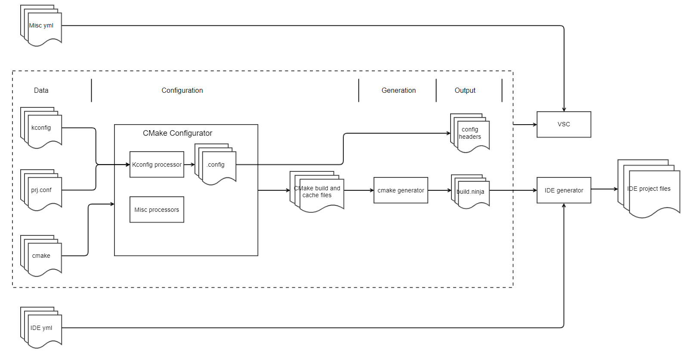

# Overview

## Key Features

MCUXpresso SDK build and configuration system is based on [CMake](https://cmake.org/) and [Kconfig](https://www.kernel.org/doc/html/next/kbuild/kconfig-language.html). Compared with other CMake based build system, it has the following exclusive key features:

- Introduce `Component` concept to improve software integration and portability.
- Provide comprehensive dependency resolve mechanism for software components with cmake and Kconfig.
- Fully support all mainstream embedded toolchains: iar, mdk, armgcc, codewarrior, xtensa and riscvllvm. Easily to extend to support new toolchains.
- Support IDE project generation for iar, mdk, codewarrior and xtensa to provide OOBE from build to debug.
- Support standalone project generation to export designated projects to zip and share.

## Architecture

Here is the system architecture:

[CMake](https://cmake.org/) is used to manage the whole build process. [Kconfig](https://www.kernel.org/doc/html/next/kbuild/kconfig-language.html) is used to do component selection with dependency resolve, component configuration with feature enable, disable and customization. Misc generators can be inserted into CMake configurator to extend features like standalone project generation.

The input files are

- Kconfig files define device/board/shield hardware information, component and example dependency and configuration. 
- [prj.conf](./Configuration_System.md#prj-conf) files provide pre set value for Kconfig symbols. 
- cmake files define the component and example contents.
- [IDE.yml](./IDE_Project.md#ide-yml) files provide download and debug settings for board examples
- Misc yml files provide miscellaneous information for device/board/shield/components/examples mainly used by tools like MCUXpresso VSCode plugin to display SDK contents.

The outputs are 

- Config header files contain configuration macros for device/board/shield/components/examples.
- build.ninja file contains the final compile and link information for example. It is the input for [Ninja](https://ninja-build.org/) to build the example. IDE generator will also take it as input to generate IDE project files like .ewp file for IAR and .uvprojx for MDK. You can refer [IDE Project Generation](./IDE_Project.md) for more details about this feature.

