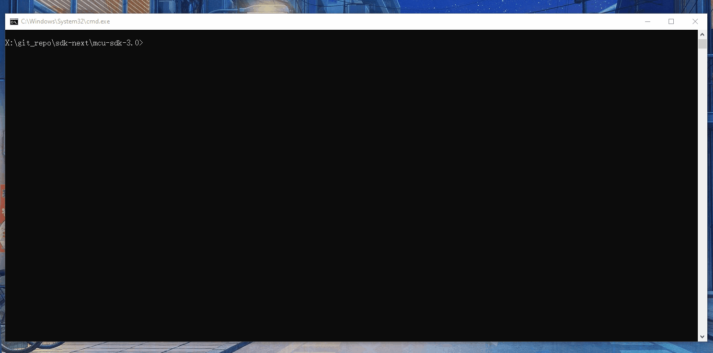

# Sysbuild

Sysbuild is a higher-level build system that can be used to combine multiple other build systems together. It's ported from [Sysbuild (System build) — Zephyr Project](https://docs.zephyrproject.org/latest/build/sysbuild/index.html#sysbuild-zephyr-application). For meta build system, it's mainly used for multi-image build.

## Sysbuild files

To include sub projects into building system, you must prepare `sysbuild.cmake` into main application folder. Sub projects can be located anywhere, which are imported by `ExternalMCUXProject_Add` command inside sysbuild.cmake. For example:

```cmake
# examples/multicore_examples/hello_world/primary/sysbuild.cmake

ExternalMCUXProject_Add(
        APPLICATION hello_world_secondary_core
        SOURCE_DIR  ${APP_DIR}/../secondary
        board ${SB_CONFIG_secondary_board}
        core_id ${SB_CONFIG_secondary_core_id}
        config ${SB_CONFIG_secondary_config}
        toolchain ${SB_CONFIG_secondary_toolchain}
)

# Let's build the secondary application first
add_dependencies(${DEFAULT_IMAGE} hello_world_secondary_core)
```

The `${APP_DIR}` means the build directory of primary project and `${DEFAULT_IMAGE}` indicates the primary project tagret.The build sequence can by determined by [add_dependencies](https://cmake.org/cmake/help/latest/command/add_dependencies.html#add-dependencies) function in sysbuild.cmake.

The variables with `SB_` prefix in sysbuild.cmake can be defined before adding sub projects. Or you can pass them with west command `-D`.

In practice, however, it is more common to set these variables automatically via kconfig to support multiple platforms in a more flexible way. For example, you can prepare a Kconfig.sysbuild in main application folder:

```bash
# examples/middleware/multicore/multicore_examples/hello_world/primary/Kconfig.sysbuild

config secondary_board
    string
    default "$(board)"

config secondary_core_id
    string
    default "cm4" if $(board) = "evkmimxrt1170" && $(core_id) = "cm7"
    default "cm33_core1" if $(board) = "lpcxpresso55s69" && $(core_id) = "cm33_core0"

config secondary_config
    string
    default "debug" if $(config) = "debug"
    default "debug" if $(config) = "flexspi_nor_debug"

config secondary_toolchain
    string
    default "$(toolchain)"
```

One thing to emphasize is that, sysbuild is only used to organize how individual images are compiled, but in reality, how images are linked together is set by the project's own cmakelsist.txt. For example, you must import the secondary core binary in the CMakeLists.txt of primary project:

```cmake
# examples/multicore_examples/hello_world/secondary/CMakeLists.txt
mcux_convert_binary(
        TOOLCHAINS armgcc mdk iar
        BINARY ${APPLICATION_BINARY_DIR}/${CONFIG_TOOLCHAIN}/core1_image.bin
)
# examples/multicore_examples/hello_world/primary/CMakeLists.txt
mcux_add_iar_configuration(
        LD "--image_input=${APPLICATION_BINARY_DIR}/../hello_world_secondary_core/iar/core1_image.bin,_core1_image,__core1_image,4 "
)
```

## Build command

To enable sysbuild, only `--sysbuild` is needed when you run the main application

```bash
west build -b evkmimxrt1170 --sysbuild ./examples/multicore_examples/hello_world/primary -Dcore_id=cm7  --config flexspi_nor_debug --toolchain=armgcc -p always
```

You can find build information from terminal:



### Kconfig Target

The sysbuild projects can be configured with kconfig, just like a normal project in the meta build system. The only difference is the target name, for main application, they're menuconfig or guiconfig, for sub project, you must add project name prefix to differ each target. For example:

```bash
west build -t guiconfig
west build -t hello_world_secondary_core_guiconfig
```