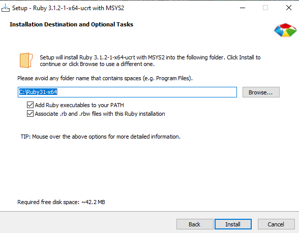
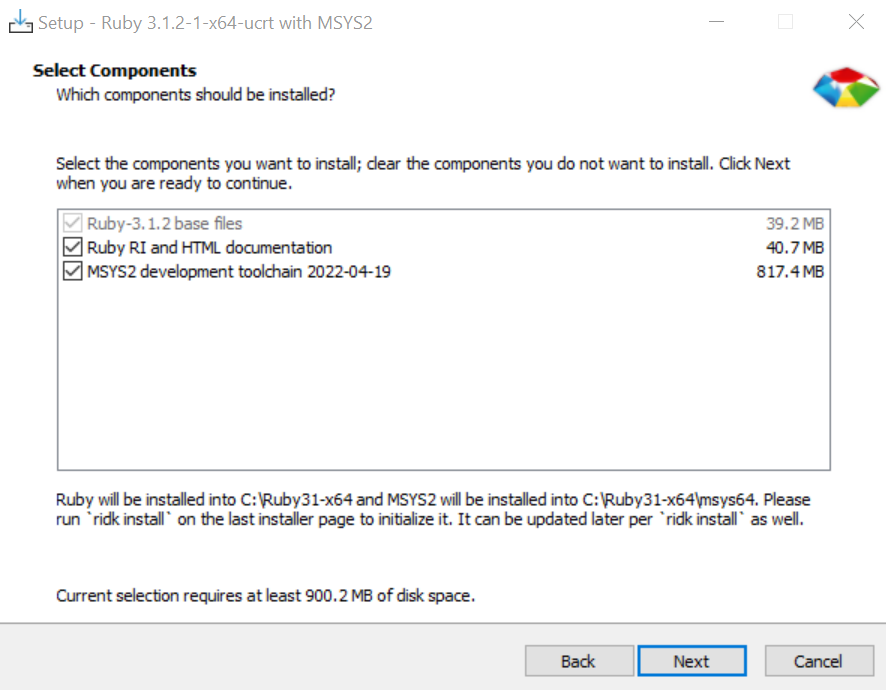
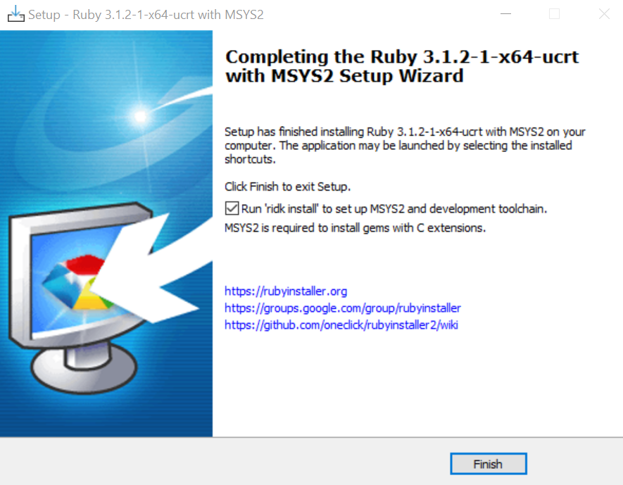
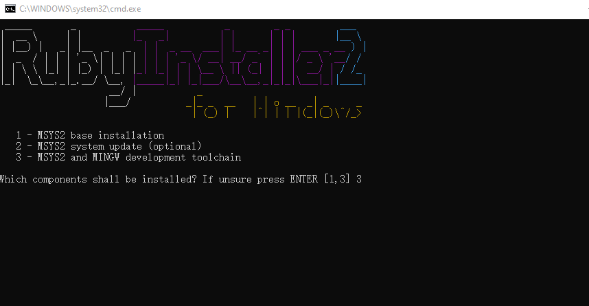
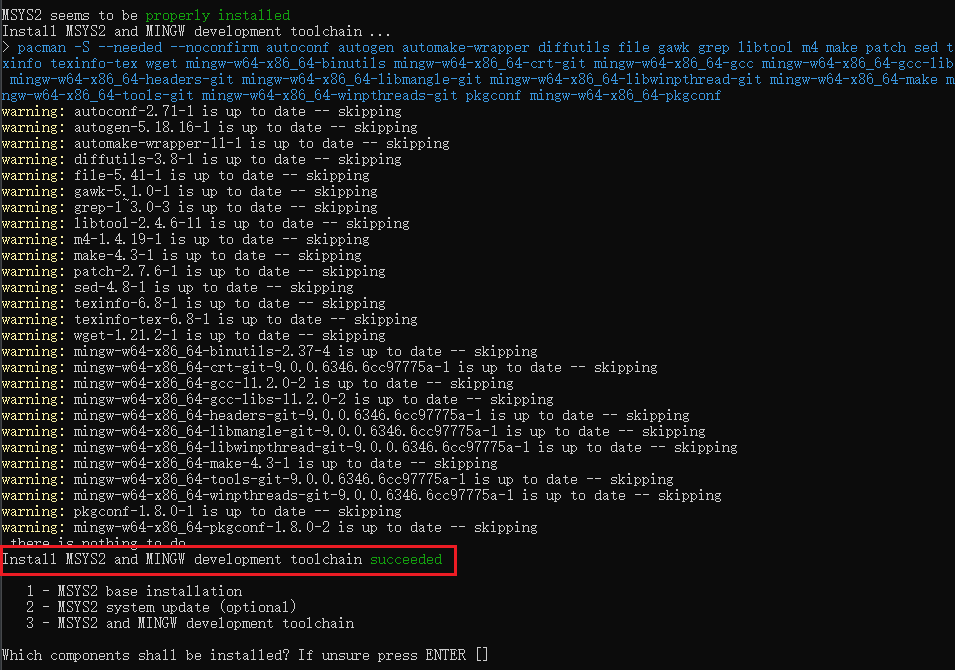
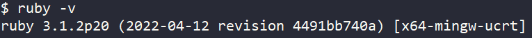
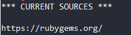

# Ruby Environment Setup

**For IDE GUI project generation, ruby version `3.1.2` is required. Please don't use ruby version other than 3.1.x anymore.**

## Use Provided Portable Ruby Environment

You can simply run `west install_ruby` to get a portable version of ruby with all required gems. It supports following platforms:

- Windows
- x86_64-LInux with **glibc >= 2.17**, compatible with most modern Linux distributions.
- MacOS Big Sur or later (including M series chip).

By default, portable_ruby will be extracted to `~/portable-ruby` for Linux/macOS and `C:\portable_ruby` for Windows. You can use `west install_ruby -o <path>` if you want to extract it to another place.

Then, the `bin` dir of portable_ruby will be automatically added to your user PATH under Windows. For Linux/macOS, please follow the guide in command line to add it to your shell profile:

```bash
You have already install the latest portable ruby
The active ruby is /home/user_name/.rbenv/shims/ruby
Please append following line in your shell profile like .zshrc or .bashrc:
  export PATH=/home/user_name/portable-ruby/3.1.4/bin:$PATH
```

## Install Ruby Environment By Yourself

### For Windows

- Please download Ruby 3.1.x from <https://rubyinstaller.org/downloads/>, choose 32-bit or 64-bit according to your PC OS and **Ruby+Devkit** for simpler MSYS integration.

> ruby installer package **with DEVKIT** can avoid most network issues during the installation of **MSYS2 and MINGW development toolchains**.

- After download, install ruby in your PC:

  

- Please select MSYS2 development toolchain

  

- Tick "Run 'ridk install' to set up MSYS2 and development toolchain."

  

- Choose the 3rd **MSYS2 and MINGW development toolchains**

  

- Ignore the warnings and errors. When finished, it will print successed, then you can close the window.

  

- Till now, ruby together with gem is ready, you can see check by:

  

  You may need to restart/signout your OS to make environment variable work.

### For Linux/MacOS

Please use the version manager tool [rbenv](https://github.com/rbenv/rbenv). It can help you avoid the complex configuration of package managers of different linux distribution.

If your platform does not support `rbenv`, please refer https://www.ruby-lang.org/en/documentation/installation/

### Install necessary Gems

Before you start install, please make sure you get the proper source for ruby gem. The default source is <https://rubygems.org/> . You can run

```bash
gem source -l
```

to get



It is quite slow for China developers. For China developers, you can add additional source like

```bash
gem sources -r https://rubygems.org
# You can google for the best source according to your network status
gem sources -a https://mirrors.tuna.tsinghua.edu.cn/rubygems/
```

For developers cannot access the default gem source, please edit the source line of the mcuxsdk/scripts/guigenerator/Gemfile to use an accessible source.

Install the latest RubyGems (This is **critical** to ensure you can get precompiled gems):

```bash
gem update --system
```

Then cd into "mcuxsdk/scripts/guigenerator" and run:

```bash
bundle install
```
