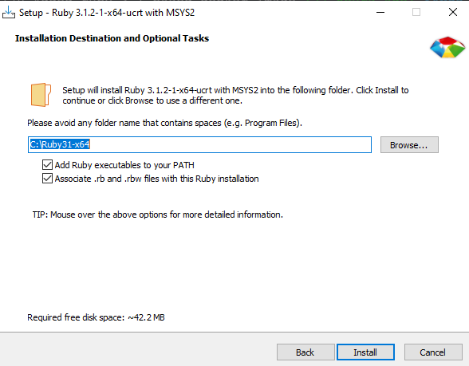
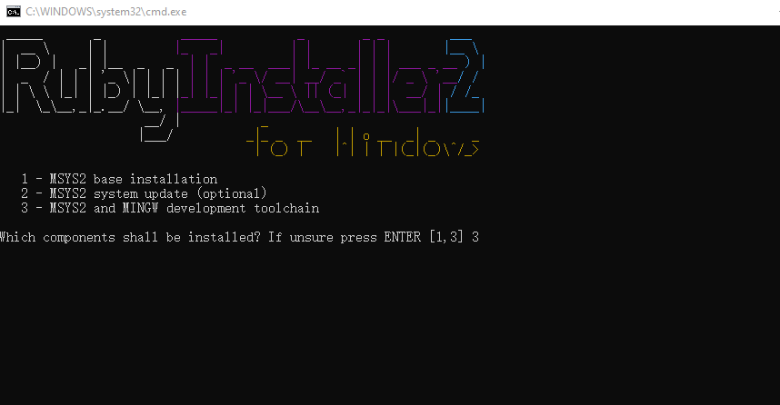

## Environment Setup

**For IDE GUI project generation, ruby version `3.1.2` is required. Please don't use ruby version other than 3.1.x anymore.**

### Use Provided Portable Ruby Environment

For NXP internal developer, a portable version of a stable ruby environment together with all required gems is provided. This way only applies for Windows and we strongly recommend you to use this way for your ruby environment setup in Windows.

```bash
# To make sure you have install_ruby command support. No need to run again if you want to check a update
west update_repo west-command
west install_ruby
```

Re-run `west install_ruby` will automatically check for updates and install if exists.

```bash
$ west install_ruby
md5 of latest portable ruby: d000ac8b376c3cdedafed4775b44eba6
md5 of installed portable ruby: d000ac8b376c3cdedafed4775b44eba6
No update found.
Press any key to continue . . .
```

You can check the installation by following command:

```bash
$ which ruby
/c/portable_ruby/bin/ruby
```

### Install Ruby Environment By Yourself

For external developer, you need to install both ruby and the used gems(ruby libraries are called gems) manually. Please follow the below steps.

#### Install Ruby

Here we take ruby 3.1.x as an example.

##### For Windows

- Please download Ruby 3.1.x from <https://rubyinstaller.org/downloads/>, choose 32-bit or 64-bit according to your PC OS and **Ruby+Devkit** for simpler MSYS integration.

> ruby installer package **with DEVKIT** can avoid most network issues during the installation of **MSYS2 and MINGW development toolchains**.

- After download, install ruby in your PC:

  

- Please select MSYS2 development toolchain

  

- Tick "Run 'ridk install' to set up MSYS2 and development toolchain."

  

- Choose the 3rd **MSYS2 and MINGW development toolchains**

  

- Ignore the warnings and errors. When finished, it will print successed, then you can close the window.

  

- Till now, ruby together with gem is ready, you can see check by:

  

  You may need to restart/signout your OS to make environment variable work.

##### For Linux

For Debian or Ubuntu, please use the version manager tool [rbenv](https://github.com/rbenv/rbenv). It can help you avoid the complex configuration of package managers of different linux distribution.

```bash
sudo apt-get install ruby=3.1.2
```

For other distributions or more details, please refer https://www.ruby-lang.org/en/documentation/installation/

#### Install necessary Gems

Before you start install, please make sure you get the proper source for ruby gem. The default source is <https://rubygems.org/> . You can run

  ```bash
  gem source -l
  ```
to get


It is quite slow for China developers. For China developers, you can add additional source like

```bash
gem sources -r https://rubygems.org
# You can google for the best source according to your network status
gem sources -a https://mirrors.tuna.tsinghua.edu.cn/rubygems/
```
For developers cannot access the default gem source, please edit the source line of the sdk-next/mcu-sdk-3.0/scripts/guigenerator/Gemfile to use an accessible source.

Install bundle:

```bash
gem install bundle
```

Then cd into "sdk-next/mcu-sdk-3.0/scripts/guigenerator" and run:

```bash
bundle install
```